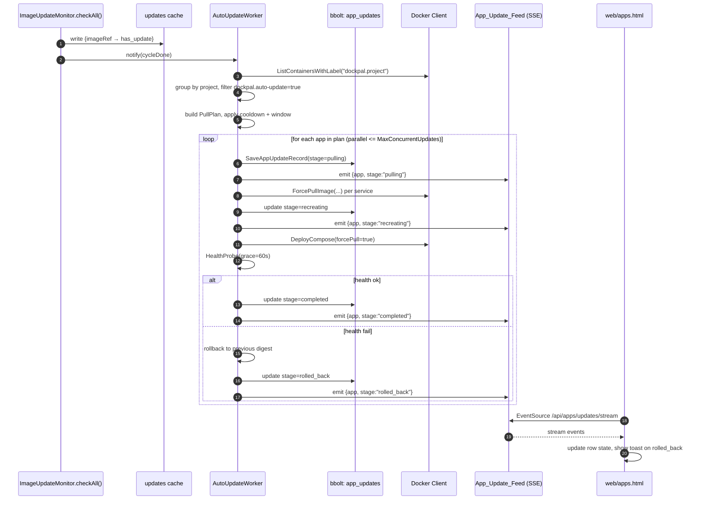
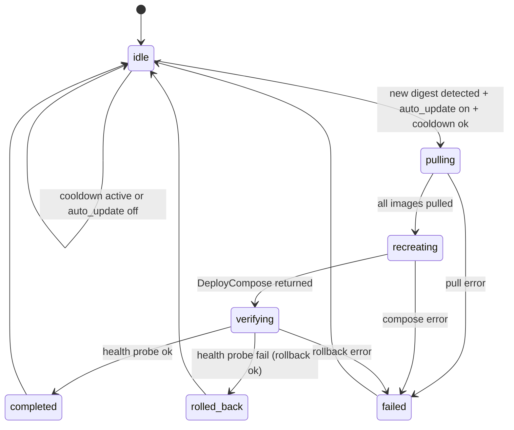
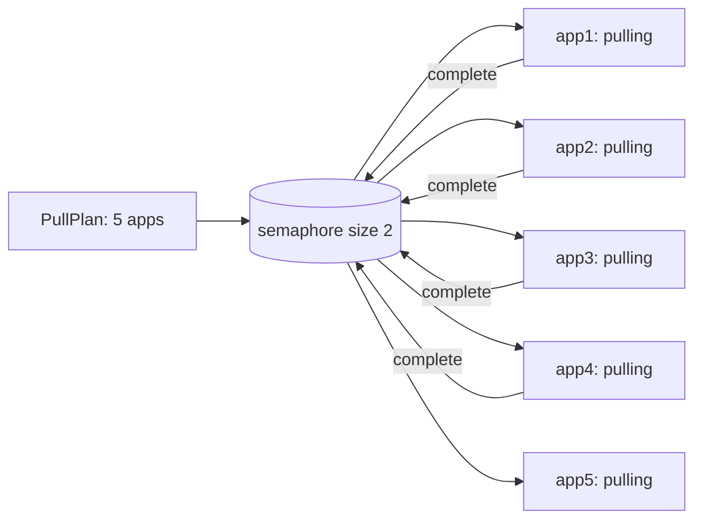

# Design Document: Auto Image Update

## Overview

This design adds an `Auto_Update_Worker` in `internal/docker/auto_updater.go` that uses the existing `Image_Update_Monitor` as the signal for "a new image is available". The worker builds a Pull_Plan per compose project (App), executes pull-and-recreate atomically via `DeployCompose(... forcePull=true)`, runs a health probe, and rolls back to the previous digest if the probe fails. Every attempt is persisted to a new bbolt bucket `app_updates` and broadcast over an SSE channel at `/api/apps/updates/stream`.

The UI gains a new `Apps` page (or extends the existing `Containers` page) that visualizes per-app state. The sidebar shows a numeric badge for apps in flight. The detail panel exposes a timeline and a manual update button.

Scope:

- Backend: `internal/docker/auto_updater.go` (new), `internal/docker/health_probe.go` (new), `internal/db/app_updates.go` (new), new endpoints in `internal/server/routes.go` and `instance_scoped_routes.go`, label integration in `internal/docker/compose.go`.
- Frontend: `web/pages/apps.html` (new), `web/assets/modules/apps.js` (new), sidebar and state updates.
- Multi-instance: the `AgentClient` interface gains `ListAppUpdates`, `TriggerAppUpdate`, `SetAppAutoUpdate`, all delegated to the local docker layer inside each agent process.

Out of scope (matching the existing pattern):

- The dockpal binary update mechanism (`internal/update/`) is not changed.
- No new UI for image registries (already exists under Settings > Registry).
- No rich cron parser. Update_Window supports the simple `HH:MM-HH:MM` form or a 5-field cron expression. Phase 1 implements only `HH:MM-HH:MM`; cron is deferred (see Open Questions).

## Architecture

### Data flow



### State machine per app



`pulling → recreating → verifying` is deterministic. `failed` can come from any stage; the `error_code` distinguishes `pull_error`, `compose_error`, `health_probe_failed`, `rollback_failed`.

### Parallelism



`MaxConcurrentUpdates` defaults to 2 and is enforced with a `chan struct{}` semaphore. A per-app mutex prevents a manual trigger from racing an auto trigger on the same app.

## Components and Interfaces

### `internal/docker/auto_updater.go` (new)

```go
package docker

import (
    "context"
    "log"
    "sync"
    "time"
)

// AutoUpdateWorker reacts to ImageUpdateMonitor cycles, builds a per-app
// pull plan, executes pull-recreate-verify with rollback on failure,
// persists records, and broadcasts events.
type AutoUpdateWorker struct {
    client      *Client
    monitor     *ImageUpdateMonitor
    store       AppUpdateStore        // db.AppUpdateStore (interface)
    feed        *AppUpdateFeed
    getAuth     AuthHeaderFunc
    getCompose  func(project string) (string, error) // pulls compose YAML from db.Service

    cooldown    time.Duration
    grace       time.Duration
    concurrency int
    enabled     bool

    perAppMu    sync.Map // map[appName]*sync.Mutex
    sem         chan struct{}

    instanceID  string // "" for local, set on remote agent
}

// NewAutoUpdateWorker wires the worker with backends. The worker does not
// start until Start() is called. Tests can substitute the AppUpdateStore.
func NewAutoUpdateWorker(
    client *Client, monitor *ImageUpdateMonitor, store AppUpdateStore,
    feed *AppUpdateFeed, getAuth AuthHeaderFunc,
    getCompose func(string) (string, error), instanceID string,
) *AutoUpdateWorker

// Start subscribes to monitor cycle events. The cycle hook is added to
// ImageUpdateMonitor (see "ImageUpdateMonitor changes" below).
func (w *AutoUpdateWorker) Start(ctx context.Context)

// Stop releases resources gracefully.
func (w *AutoUpdateWorker) Stop()

// TriggerApp runs the pipeline for one app immediately. It is used by the
// manual "Update now" button and by the post-cycle scheduler.
// bypassCooldown skips the cooldown check; bypassWindow skips Update_Window.
// triggeredBy records the actor for the App_Update_Record (e.g. "auto" or "user:alice").
func (w *AutoUpdateWorker) TriggerApp(
    ctx context.Context, app string,
    bypassCooldown, bypassWindow bool, triggeredBy string,
) error
```

Internal flow of `TriggerApp`:

1. Acquire the per-app mutex; if already held, return `ErrAppUpdateRunning`.
2. Validate cooldown and window (unless bypassed).
3. Resolve the compose YAML and current container state via `dockerClient.ListContainersWithLabel("dockpal.project=<app>")`.
4. Capture `previous_image` per service (RepoDigest from `ImageInspect`).
5. Persist the record at stage `pulling`, emit a feed event.
6. For each service whose image has `has_update=true` (per the cache), call `ForcePullImage`.
7. Persist stage `recreating`, emit, call `DeployCompose(... forcePull=true)`.
8. Persist stage `verifying`, emit, run `HealthProbe`.
9. On success: stage `completed`, emit, release the mutex.
10. On failure: roll back (rewrite the compose YAML using `repo@<previous_digest>`), call `DeployCompose(... forcePull=false)`. Persist stage `rolled_back` or `failed`, emit, release the mutex.

### `internal/docker/health_probe.go` (new)

```go
package docker

import (
    "context"
    "time"
)

// HealthProbeResult describes one container after a redeploy.
type HealthProbeResult struct {
    ContainerID string
    Name        string
    Healthy     bool
    State       string
    ExitCode    int
    Reason      string
}

// HealthProbe waits up to `grace` for all containers of `project` to reach
// state == "running" and (when HEALTHCHECK is defined) Health.Status == "healthy".
// If a container exits with non-zero code or stays not-running past `grace`,
// returns Healthy=false in the slice and an aggregate error.
func (c *Client) HealthProbe(ctx context.Context, project string, grace time.Duration) ([]HealthProbeResult, error)
```

Implementation: poll `ContainerInspect` every 2 seconds, fail fast when any container has `State.ExitCode != 0` and `!State.Restarting`.

### `internal/docker/image_updater.go` (extend)

Add a hook fired at the end of `checkAll()`:

```go
type cycleListener func(updates []ImageUpdateStatus)

func (m *ImageUpdateMonitor) AddCycleListener(fn cycleListener) {
    m.listenersMu.Lock()
    m.listeners = append(m.listeners, fn)
    m.listenersMu.Unlock()
}

// at the end of checkAll():
m.listenersMu.RLock()
defer m.listenersMu.RUnlock()
for _, fn := range m.listeners {
    fn(m.snapshotLocked()) // new helper that clones the cache map to a slice
}
```

`AutoUpdateWorker.Start` registers a listener that triggers `processPlan(updates)`.

### `internal/db/app_updates.go` (new)

```go
package db

import (
    "encoding/binary"
    "encoding/json"
    "time"

    "go.etcd.io/bbolt"
)

// AppUpdateStage - one of the seven stages from the state machine.
type AppUpdateStage string

const (
    StagePending     AppUpdateStage = "pending"
    StagePulling     AppUpdateStage = "pulling"
    StageRecreating  AppUpdateStage = "recreating"
    StageVerifying   AppUpdateStage = "verifying"
    StageCompleted   AppUpdateStage = "completed"
    StageFailed      AppUpdateStage = "failed"
    StageRolledBack  AppUpdateStage = "rolled_back"
)

// AppUpdateRecord persists one attempt. The key is composite:
//   <app>\x00<reverse_unix_micro>  → newest first when iterating.
type AppUpdateRecord struct {
    AttemptID     string                       `json:"attempt_id"`
    InstanceID    string                       `json:"instance_id"`
    App           string                       `json:"app"`
    Services      map[string]ServiceUpdateInfo `json:"services"`
    Stage         AppUpdateStage               `json:"stage"`
    ErrorCode     string                       `json:"error_code,omitempty"`
    Message       string                       `json:"message,omitempty"`
    TriggeredBy   string                       `json:"triggered_by"`
    StartedAt     int64                        `json:"started_at"`
    UpdatedAt     int64                        `json:"updated_at"`
    CompletedAt   int64                        `json:"completed_at,omitempty"`
    Events        []AppUpdateEvent             `json:"events,omitempty"`
}

type ServiceUpdateInfo struct {
    Image          string `json:"image"`
    PreviousDigest string `json:"previous_digest,omitempty"`
    NewDigest      string `json:"new_digest,omitempty"`
}

type AppUpdateEvent struct {
    At      int64          `json:"at"`
    Stage   AppUpdateStage `json:"stage"`
    Message string         `json:"message,omitempty"`
}

// Store interface (used by AutoUpdateWorker for testability):
type AppUpdateStore interface {
    SaveAppUpdate(rec *AppUpdateRecord) error
    AppendAppUpdateEvent(attemptID string, ev AppUpdateEvent, stage AppUpdateStage) error
    ListAppUpdates(app string, limit int) ([]AppUpdateRecord, error)
    ListAllAppUpdates(instanceID string, limit int) ([]AppUpdateRecord, error)
    GetAppUpdate(attemptID string) (*AppUpdateRecord, error)
    PurgeOlderThan(retainPerApp, retainGlobal int) (int, error)
}
```

Bucket layout:

- `app_updates`: key = `app + 0x00 + reversedTimestampMicro(8 bytes BE)`, value = JSON.
- `app_updates_by_id`: key = `attempt_id`, value = same JSON (for direct lookup).

`reversedTimestampMicro = math.MaxUint64 - uint64(unixMicro)`. With this layout, `Cursor.Seek(prefix=app+0x00).Next()` returns the newest record first without sorting in memory.

`PurgeOlderThan` runs at startup and after each cycle, retaining 100 per app and 1000 globally.

### `internal/server/app_update_feed.go` (new)

```go
package server

import (
    "encoding/json"
    "sync"
)

// AppUpdateFeed is a fan-out broadcaster for App_Update_Feed events.
type AppUpdateFeed struct {
    mu      sync.RWMutex
    subs    map[chan AppUpdateFeedEvent]struct{}
}

type AppUpdateFeedEvent struct {
    AttemptID  string `json:"attempt_id"`
    InstanceID string `json:"instance_id"`
    App        string `json:"app"`
    Stage      string `json:"stage"`
    ErrorCode  string `json:"error_code,omitempty"`
    Message    string `json:"message,omitempty"`
    At         int64  `json:"at"`
}

func (f *AppUpdateFeed) Publish(ev AppUpdateFeedEvent)
func (f *AppUpdateFeed) Subscribe() (<-chan AppUpdateFeedEvent, func())
```

`Publish` is non-blocking: if a subscriber channel is full, the event is dropped for that subscriber (UI clients get the latest state from `GET /apps/:name/updates` when they reopen the panel, and the SSE client auto-retries).

### HTTP endpoints (`internal/server/routes.go`, `instance_scoped_routes.go`)

| Method | Path                                    | Role     | Body / Query                                | Response                              |
|--------|-----------------------------------------|----------|---------------------------------------------|---------------------------------------|
| GET    | `/api/apps`                             | viewer   | `?instance_id=`                             | `[{name, services, autoUpdate, lastUpdate, hasUpdate}]` |
| GET    | `/api/apps/:name/updates`               | viewer   | `?limit=50`                                 | `[AppUpdateRecord]`                   |
| GET    | `/api/apps/:name/updates/:attemptID`    | viewer   | -                                           | `AppUpdateRecord` (with full events)  |
| POST   | `/api/apps/:name/update`                | operator | `{}`                                        | `{attempt_id}` 202, or 409            |
| PATCH  | `/api/apps/:name/auto-update`           | operator | `{enabled: bool}`                           | `{ok: true}`                          |
| GET    | `/api/apps/updates/stream`              | viewer   | -                                           | SSE stream of `AppUpdateFeedEvent`    |

Instance-scoped variants live at `/api/instances/:instance_id/apps/...` and dispatch to the matching `agent.AgentClient`.

`PATCH /apps/:name/auto-update` algorithm:

1. Load `db.Service` by name.
2. Parse the compose YAML via `ParseComposeFile`.
3. For each service map, set or unset `dockpal.auto-update: "true"` in `Labels`.
4. Marshal back to YAML (preserve field order best-effort via `yaml.Node`).
5. Persist the updated YAML on the `db.Service`.
6. Call `DeployCompose(... forcePull=false)` to recreate containers with the new label.

### AgentClient extension

`internal/agent/types.go`:

```go
ListApps(ctx context.Context, instanceID string) ([]docker.AppSummary, error)
ListAppUpdates(ctx context.Context, app string, limit int) ([]db.AppUpdateRecord, error)
GetAppUpdate(ctx context.Context, attemptID string) (*db.AppUpdateRecord, error)
TriggerAppUpdate(ctx context.Context, app string) (string, error) // returns attemptID
SetAppAutoUpdate(ctx context.Context, app string, enabled bool) error
```

`internal/agent/local.go` delegates to `dockerClient` and `database`. `internal/agent/edge.go` and `direct.go` wrap HTTP requests to the remote agent.

### Integration with `compose.go`

`writeComposeFile` is unchanged. Add a helper:

```go
// SetServiceLabel returns updated YAML with `key: value` set or removed
// (when value == "") on every service. Best-effort string manipulation;
// uses yaml.v3 round-trip for correctness.
func SetServiceLabel(composeYAML, key, value string) (string, error)
```

Implementation roundtrips through `yaml.Node` to preserve comments and order. Used by `PATCH /apps/:name/auto-update`.

### Frontend: `web/pages/apps.html`

Layout: a table with columns Name, Services, Auto-update toggle, Update status, Last attempt, Actions.

The status badge maps from `AppUpdateFeedEvent.stage`:

```html
<span class="badge"
      :class="{
          'badge-green': app.update.stage === 'completed' && !app.hasUpdate,
          'badge-yellow': app.hasUpdate && app.update.stage === 'idle',
          'badge-blue': ['pulling','recreating','verifying'].includes(app.update.stage),
          'badge-red': app.update.stage === 'failed',
          'badge-orange': app.update.stage === 'rolled_back'
      }"
      x-text="statusLabel(app.update.stage, app.hasUpdate)"></span>
```

The detail panel opens with `x-show="selectedApp === app.name"` and contains tabs `Overview`, `History`, `Logs (live)`. Live logs come from `appUpdates.eventsByAttempt[attemptID]`, populated by the SSE handler.

### Frontend: `web/assets/modules/apps.js` (new)

```js
window.Dockpal = window.Dockpal || {};

Dockpal.apps = {
  apps: [],
  selectedApp: null,
  eventsByAttempt: {},
  appsUpdating: 0,
  feedConnection: null,

  async loadApps() { /* GET /apps */ },
  async loadAppHistory(name) { /* GET /apps/:name/updates */ },
  async toggleAutoUpdate(app, enabled) { /* PATCH ... */ },
  async triggerUpdate(app) { /* POST /apps/:name/update */ },

  startFeed() {
    if (this.feedConnection) return;
    const url = this.instanceScopedUrl('/apps/updates/stream');
    this.feedConnection = new EventSource(url);
    this.feedConnection.onmessage = (e) => {
      const ev = JSON.parse(e.data);
      this.handleFeedEvent(ev);
    };
    this.feedConnection.onerror = () => {
      // EventSource auto-reconnects with backoff
    };
  },

  handleFeedEvent(ev) {
    const app = this.apps.find(a => a.name === ev.app);
    if (app) {
      app.update = { ...app.update, stage: ev.stage, errorCode: ev.errorCode };
      if (['pulling','recreating','verifying'].includes(ev.stage)) {
        this.appsUpdating = this.apps.filter(a => ['pulling','recreating','verifying'].includes(a.update.stage)).length;
      }
    }
    if (!this.eventsByAttempt[ev.attempt_id]) this.eventsByAttempt[ev.attempt_id] = [];
    this.eventsByAttempt[ev.attempt_id].push(ev);
    if (ev.stage === 'rolled_back') {
      this.toast(`${ev.app}: rolled back to previous version`, 'warning', 6000);
    } else if (ev.stage === 'failed') {
      this.toast(`${ev.app}: update failed (${ev.error_code})`, 'error', 6000);
    } else if (ev.stage === 'completed') {
      this.toast(`${ev.app}: updated`, 'success', 3000);
    }
  }
};
```

The sidebar badge counts `appsUpdating` (computed) plus `imagesWithUpdatesCount` from the existing module (for apps with available updates that are not yet updating).

## Data Models

### Compose label contract

| Label                          | Required | Description                                              |
|--------------------------------|----------|----------------------------------------------------------|
| `dockpal.project`              | yes      | already used, project name                               |
| `dockpal.service`              | yes      | already used, service name                               |
| `dockpal.auto-update`          | no       | `"true"` opts in to auto-update                          |
| `dockpal.auto-update.window`   | no       | `"22:00-04:00"` or 5-field cron                          |
| `dockpal.auto-update.grace`    | no       | seconds, overrides health probe grace                    |

The `window` parser is minimal in phase 1: it accepts the `HH:MM-HH:MM` form (host local time). Other formats return an error like "unsupported window spec". Cron 5-field is deferred to phase 2.

### AppSummary (response of `GET /apps`)

```go
type AppSummary struct {
    Name        string                       `json:"name"`
    InstanceID  string                       `json:"instance_id,omitempty"`
    Services    []AppServiceSummary          `json:"services"`
    AutoUpdate  bool                         `json:"auto_update"`
    HasUpdate   bool                         `json:"has_update"`
    LastUpdate  *AppUpdateRecord             `json:"last_update,omitempty"`
}

type AppServiceSummary struct {
    Name         string `json:"name"`
    Image        string `json:"image"`
    State        string `json:"state"`
    HasUpdate    bool   `json:"has_update"`
    LocalDigest  string `json:"local_digest,omitempty"`
    RemoteDigest string `json:"remote_digest,omitempty"`
}
```

## Error Handling

| Stage      | Error source                          | error_code             | Action                                  |
|------------|---------------------------------------|------------------------|-----------------------------------------|
| pulling    | `ForcePullImage` returns error        | `pull_error`           | mark `failed`; no rollback (prod intact) |
| pulling    | auth header missing for private repo  | `auth_missing`         | mark `failed`                           |
| recreating | `DeployCompose` returns error         | `compose_error`        | rollback by previous_digest             |
| verifying  | `HealthProbe` returns unhealthy       | `health_probe_failed`  | rollback                                |
| rollback   | rollback `DeployCompose` fails        | `rollback_failed`      | mark `failed`; webhook notification     |
| any        | per-app mutex held                    | `update_already_running` | HTTP 409                              |
| any        | cooldown active (auto only)           | `skipped_cooldown`     | feed event only, no record              |
| any        | window closed                         | `skipped_window`       | feed event only, no record              |

`error_code` is always lowercase snake_case, defined in `internal/docker/auto_updater_errors.go`.

## Concurrency

- Worker scheduler: a single goroutine listening for cycle events.
- Per-app: `sync.Map[appName] *sync.Mutex`. Manual triggers and the auto trigger from the listener share the same mutex, so there is no double execution.
- Plan execution: bounded with `chan struct{}` semaphore of size `MaxConcurrentUpdates`.
- Feed: each subscriber has a `chan AppUpdateFeedEvent` of buffer 16; dropped events are not retried by the feed (the UI fetches the full state via `GET /apps/:name/updates` when the panel opens).
- Health probe: timeout-context based, polling every 2 seconds.

## Testing Strategy

### Unit tests

- `auto_updater_test.go`:
  - cooldown enforcement, window enforcement, opt-in label filter
  - happy path with mock client
  - pull failure → no rollback
  - compose failure → rollback called
  - health probe failure → rollback called
  - rollback failure → final state `failed`
  - per-app mutex blocks parallel manual triggers
- `health_probe_test.go`: container running ok, container exits non-zero, container restart loop, timeout
- `app_updates_test.go`: store retention, list ordering, attempt-by-id lookup
- `compose_label_test.go`: SetServiceLabel adds and removes label preserving comments and other labels

### Property-based tests (`pgregory.net/rapid`, per repo standard)

- P1: For any update plan `[apps]`, after `processPlan` no app holds its mutex (deadlock-free).
- P2: For any sequence of feed events, subscribers receive a strictly ordered subset of the per-app state machine.
- P3: For any record set, after `PurgeOlderThan(perApp, global)` no app exceeds `perApp` and total ≤ `global`, and the newest are kept.

### Integration tests (gated by `-tags integration`)

- `integration_test.go`:
  - Spin up a Docker test container with a simple nginx, label `auto-update=true`, fake "new digest", verify recreate happens.
  - Manual trigger via HTTP, verify the SSE event arrives.

### Frontend smoke (Playwright)

- Open `/apps`, verify the table renders.
- Toggle auto-update, verify the PATCH is called and the badge updates.
- Click `Update now`, verify feed events update the visual state.

## Migration / Rollout

- New buckets `app_updates` and `app_updates_by_id` are created on startup via the existing `bdb.Update` block in `internal/db/db.go`.
- No schema migration is needed for the existing `services` bucket.
- Existing apps deployed before this feature do not carry the `dockpal.auto-update` label and remain opt-out by default. The UI panel shows them with status `Up to date / Update available` for information; toggling adds them to auto-update.
- Feature flag: `DOCKPAL_AUTO_UPDATE_ENABLED=false` disables the worker and hides the toggle in the UI (the UI calls `/api/config` once at boot to learn whether the feature is disabled).

## Correctness Properties

These properties must hold for the implementation to be correct. They are enforced via property-based tests (PBT) and code review.

### Property 1: No deadlock

For any plan `[apps]`, after `processPlan` finishes every per-app mutex is released. Test: run a plan with a random number of apps (1..50) and random services per app, assert `len(mutexHeld) == 0` at the end.

**Validates: Requirements 2.6, 6.2**

### Property 2: Stage monotonicity per attempt

The sequence of events published for one `attempt_id` is an ordered subset of `pulling → recreating → verifying → (completed | rolled_back | failed)`. There is no backward transition (for example `verifying → pulling`).

**Validates: Requirements 2.6, 4.4**

### Property 3: Retention bounded

After `PurgeOlderThan(perApp, global)`: for every app `count(records[app]) <= perApp`; total record count `<= global`; the records that remain are always the most recent by `StartedAt`.

**Validates: Requirements 5.4**

### Property 4: Opt-in only

For any update cache input, only apps with at least one container that has the label `dockpal.auto-update=true` appear in the auto Pull_Plan. Manual `TriggerApp` ignores this property by design.

**Validates: Requirements 1.1, 1.2**

### Property 5: Rollback preserves prod

On the `pull_error` path, the running container and the local image are unchanged (no-op rollback). On `compose_error` or `health_probe_failed`, the container returns to the image with digest `previous_digest`.

**Validates: Requirements 3.1, 3.3, 3.5**

### Property 6: Cooldown invariant

For auto-triggered runs (not manual), `next.StartedAt - last.StartedAt >= cooldown` always holds per app, except when manually overridden.

**Validates: Requirements 2.4, 6.1**

### Property 7: Feed non-blocking

A slow subscriber does not block the publisher. Test: spin up N=50 subscribers with one that does not consume, publish 100 events, assert the publisher returns within a bounded time (<100ms).

**Validates: Requirements 4.4**

### Property 8: Single-flight per app

For concurrent `TriggerApp(app=X)` calls from N goroutines, exactly one enters the pipeline and `N-1` receive `ErrUpdateAlreadyRunning`. The filesystem and compose state stay consistent.

**Validates: Requirements 6.2**

### Property 9: No credential leakage

For every log line and persisted record, no substring matches the regex `(?i)(token|auth|password|bearer)\s*[:=]\s*\S+`. Verified by capturing stdout and inspecting bucket contents.

**Validates: Requirements 8.5, 10.5**

### Property 10: Idempotent recreate

Calling `DeployCompose(... forcePull=true)` with the same compose YAML twice in a row produces the same container state (image digest, port mapping, env). Verified via integration test.

**Validates: Requirements 2.3, 2.6**

## Open Questions / Future Work

1. The cron 5-field parser is deferred to phase 2; phase 1 supports `HH:MM-HH:MM` only.
2. Webhook notifications on `rolled_back` reuse the existing `internal/db/webhooks.go` schema. Phase 1 emits a synthetic webhook payload `{type: "app_update", ...}`; phase 2 may add typed configuration.
3. Authoritative state when a remote agent restarts mid-update: agent persistence is out of scope. If the agent restarts during `recreating`, the next cycle observes inconsistent state and the operator must manually retrigger.
4. The rollback strategy currently rewrites the compose YAML by digest pinning. An alternative is to keep `previous_image_id` and `docker run` it directly; that is more intrusive and is rejected for phase 1.
