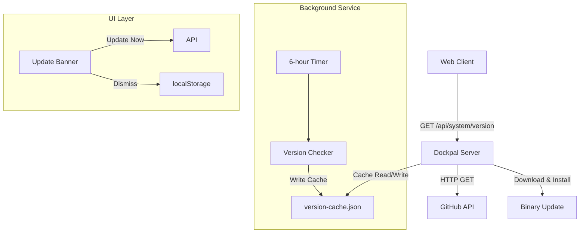

# Design Document: Auto-Update Notification

## Overview

This feature enables Dockpal users to receive notifications when a new version is available and perform updates directly from the UI without using the command line. The system checks GitHub releases, caches version information, displays UI notifications, and securely executes binary updates with proper authentication and privilege verification.

## Architecture



## Components and Interfaces

### Component 1: VersionService

**Purpose**: Handles version checking, caching, and GitHub API interaction

**Interface**:
```go
type VersionService interface {
    GetVersionInfo(ctx context.Context) (*VersionInfo, error)
    CheckForUpdates(ctx context.Context) (*VersionCheckResult, error)
    GetCachedVersion() (*CachedVersion, error)
}

type VersionInfo struct {
    CurrentVersion  string `json:"currentVersion"`
    LatestVersion   string `json:"latestVersion"`
    UpdateAvailable bool   `json:"updateAvailable"`
    ReleaseNotes    string `json:"releaseNotes"`
    DownloadURL     string `json:"downloadUrl"`
}

type CachedVersion struct {
    LastChecked  time.Time `json:"lastChecked"`
    LatestVersion string   `json:"latestVersion"`
    ReleaseNotes  string   `json:"releaseNotes"`
    DownloadURL   string   `json:"downloadUrl"`
}
```

**Responsibilities**:
- Fetch latest version from GitHub API
- Cache version info to prevent rate limiting
- Compare semantic versions to determine if update is available
- Serve cached data when network requests fail

### Component 2: UpdateService

**Purpose**: Handles binary download, verification, and installation

**Interface**:
```go
type UpdateService interface {
    DownloadUpdate(ctx context.Context, url string) (string, error)
    VerifyBinary(path string) error
    InstallBinary(ctx context.Context, binaryPath string) error
    RestartService() error
    CheckSudoAccess() (bool, error)
}

type UpdateProgress struct {
    Status    string `json:"status"`    // "downloading", "installing", "restarting", "complete", "error"
    Message   string `json:"message"`
    Percentage int   `json:"percentage"`
}
```

**Responsibilities**:
- Download binary from GitHub release
- Verify downloaded binary (size, executable bit)
- Replace existing binary at `/usr/local/bin/dockpal`
- Restart dockpal service via systemctl
- Verify sudo privileges before execution

### Component 3: VersionCheckScheduler

**Purpose**: Runs periodic background version checks

**Interface**:
```go
type VersionCheckScheduler interface {
    Start(ctx context.Context)
    Stop()
    GetInterval() time.Duration
}
```

**Responsibilities**:
- Run version check every 6 hours
- Write results to cache file
- Handle graceful shutdown

### Component 4: UpdateBanner (UI Component)

**Purpose**: Display update notification in the UI

**Interface**:
```typescript
interface UpdateBannerState {
    isVisible: boolean;
    latestVersion: string;
    releaseNotes: string;
    downloadUrl: string;
    isUpdating: boolean;
    progress: UpdateProgress;
}
```

**Responsibilities**:
- Show banner when update is available
- Handle "Update Now" and "Dismiss" actions
- Persist dismiss state to localStorage
- Show update progress

## Data Models

### VersionInfo API Response

```go
type VersionInfo struct {
    CurrentVersion  string `json:"currentVersion"`   // e.g., "v0.2.0"
    LatestVersion   string `json:"latestVersion"`    // e.g., "v0.2.1"
    UpdateAvailable bool   `json:"updateAvailable"`  // true if latest > current
    ReleaseNotes    string `json:"releaseNotes"`     // Markdown from GitHub
    DownloadURL     string `json:"downloadUrl"`      // Direct binary URL
}
```

**Validation Rules**:
- All string fields must be non-empty when UpdateAvailable is true
- Version strings must match semver format (vX.Y.Z)
- DownloadURL must be valid HTTPS URL

### Cache File Format

```json
{
    "lastChecked": "2026-05-19T12:00:00Z",
    "latestVersion": "v0.2.1",
    "releaseNotes": "Bug fixes and improvements",
    "downloadUrl": "https://github.com/sdldev/dockpal/releases/download/v0.2.1/dockpal-linux-amd64"
}
```

**Validation Rules**:
- lastChecked must be valid ISO 8601 timestamp
- latestVersion must be valid semver
- Cache expires after 1 hour

### Update Request

```go
type UpdateRequest struct {
    DownloadURL string `json:"downloadUrl" binding:"required"`
}
```

### Update Response

```go
type UpdateResponse struct {
    Status    string `json:"status"`    // "downloading", "installing", "restarting", "complete", "error"
    Message   string `json:"message"`
    Percentage int   `json:"percentage"`
}
```

## Core Algorithms

### Algorithm 1: Version Comparison

```go
func compareVersions(current, latest string) (bool, error)
```

**Preconditions**:
- `current` is non-empty string in format vX.Y.Z
- `latest` is non-empty string in format vX.Y.Z

**Postconditions**:
- Returns true if latest > current (semver comparison)
- Returns false if latest <= current
- Returns error if either version string is invalid

**Loop Invariants**: N/A (no loops)

### Algorithm 2: Version Check Workflow

```go
func (s *VersionService) CheckForUpdates(ctx context.Context) (*VersionInfo, error)
```

**Preconditions**:
- Context is valid and not cancelled

**Postconditions**:
- Returns VersionInfo with all fields populated
- If GitHub API fails, returns cached data with UpdateAvailable: null (unknown)
- Cache is updated on successful API call

```go
BEGIN
    // Step 1: Get current version from binary
    currentVersion ← readVersionFromBinary()
    
    // Step 2: Try cache first
    cached ← readCache()
    IF cached IS NOT NULL AND cached.isValid() THEN
        RETURN formatVersionInfo(currentVersion, cached)
    END IF
    
    // Step 3: Fetch from GitHub
    latestData ← fetchFromGitHub(GITHUB_API_URL)
    IF latestData IS ERROR THEN
        IF cached IS NOT NULL THEN
            RETURN formatVersionInfo(currentVersion, cached) with UpdateAvailable: null
        END IF
        RETURN error
    END IF
    
    // Step 4: Compare versions
    updateAvailable ← compareVersions(currentVersion, latestData.version)
    
    // Step 5: Update cache
    writeCache(latestData)
    
    RETURN formatVersionInfo(currentVersion, latestData, updateAvailable)
END
```

### Algorithm 3: Binary Update Process

```go
func (s *UpdateService) PerformUpdate(ctx context.Context, downloadURL string) error
```

**Preconditions**:
- User is authenticated as admin
- User has sudo privileges
- downloadURL is valid HTTPS URL

**Postconditions**:
- Binary is downloaded to /tmp/dockpal-new
- Old binary is replaced at /usr/local/bin/dockpal
- Service is restarted successfully
- Returns error if any step fails (with cleanup)

```go
BEGIN
    // Step 1: Verify sudo access
    hasSudo ← checkSudoAccess()
    IF NOT hasSudo THEN
        RETURN Error("Update requires root privileges")
    END IF
    
    // Step 2: Download binary
    statusUpdate("downloading", 10)
    tempPath ← "/tmp/dockpal-new"
    downloadedPath ← downloadFile(downloadURL, tempPath)
    
    // Step 3: Verify binary
    statusUpdate("installing", 50)
    err ← verifyBinary(downloadedPath)
    IF err THEN
        cleanup(downloadedPath)
        RETURN Error("Binary verification failed")
    END IF
    
    // Step 4: Stop service
    statusUpdate("installing", 70)
    err ← systemctl("stop", "dockpal")
    IF err THEN
        cleanup(downloadedPath)
        RETURN Error("Failed to stop service")
    END IF
    
    // Step 5: Replace binary
    err ← move(downloadedPath, "/usr/local/bin/dockpal")
    IF err THEN
        systemctl("start", "dockpal")  // Attempt restore
        RETURN Error("Failed to install binary")
    END IF
    
    // Step 6: Set executable
    chmod("/usr/local/bin/dockpal", 0755)
    
    // Step 7: Restart service
    statusUpdate("restarting", 90)
    err ← systemctl("start", "dockpal")
    IF err THEN
        RETURN Error("Failed to restart service")
    END IF
    
    // Step 8: Cleanup temp files
    cleanup(downloadedPath)
    
    statusUpdate("complete", 100)
    RETURN success
END
```

## Key Functions with Formal Specifications

### Function 1: GET /api/system/version

```go
func HandleGetVersion(c *gin.Context)
```

**Preconditions**:
- User is authenticated (or endpoint is public for version check)

**Postconditions**:
- Returns JSON with currentVersion, latestVersion, updateAvailable, releaseNotes, downloadUrl
- If GitHub API fails, returns cached data with updateAvailable: null
- Cache is used if available and valid (1 hour TTL)

### Function 2: POST /api/system/update

```go
func HandleUpdate(c *gin.Context)
```

**Preconditions**:
- User is authenticated as admin
- Request body contains valid downloadUrl

**Postconditions**:
- Returns streaming progress updates
- Downloads, verifies, installs binary
- Restarts dockpal service
- Returns error if any step fails

### Function 3: Background Version Checker

```go
func StartVersionChecker(ctx context.Context, interval time.Duration)
```

**Preconditions**:
- Server is starting

**Postconditions**:
- Runs every 6 hours
- Writes results to version-cache.json
- Handles graceful shutdown

## Error Handling

### Error Scenario 1: GitHub API Rate Limit

**Condition**: GitHub API returns 403 rate limit exceeded
**Response**: Return cached version info with `updateAvailable: null`
**Recovery**: Use cached data until rate limit resets

### Error Scenario 2: Network Failure

**Condition**: Cannot connect to GitHub API
**Response**: Return cached version info if available, else return error
**Recovery**: Retry on next scheduled check

### Error Scenario 3: Update Binary Verification Fails

**Condition**: Downloaded binary is too small or not executable
**Response**: Return error "Binary verification failed", do not install
**Recovery**: Delete temp file, allow user to retry

### Error Scenario 4: Permission Denied

**Condition**: User does not have sudo privileges
**Response**: Return error "Update requires root privileges"
**Recovery**: User must run with sudo or contact administrator

### Error Scenario 5: Service Restart Failure

**Condition**: systemctl start dockpal fails after update
**Response**: Return error "Failed to restart service"
**Recovery**: Log error, service remains stopped for manual intervention

## Testing Strategy

### Unit Testing Approach

- Test version comparison logic with various semver inputs
- Test cache read/write operations
- Test binary verification (size check, executable bit)
- Test sudo access detection

### Property-Based Testing Approach

**Property Test Library**: go-exproptest or custom generation

**Property 1: Version comparison consistency**
- For any valid semver strings a, b: compare(a, b) = -compare(b, a) (negation property)

**Property 2: Cache validity**
- For any cached data: if cache.lastChecked is within 1 hour, cache is valid

**Property 3: Update available is monotonic**
- If version A < version B < version C, then updateAvailable(A,B) = true, updateAvailable(B,C) = true implies updateAvailable(A,C) = true

### Integration Testing Approach

- Test full version check flow with mocked GitHub API
- Test update process with test binary
- Test UI banner visibility state machine

## Performance Considerations

- Cache GitHub API responses for 1 hour to prevent rate limiting
- Background version check runs every 6 hours (not on every request)
- Download timeout: 5 minutes max
- Memory usage: Minimal (just version strings)

## Security Considerations

### Authentication & Authorization
- Update endpoint requires valid JWT token
- Only admin users can perform updates
- Sudo access verified before any privileged operation

### Binary Verification
- Minimum file size check (must be > 1MB)
- Executable bit verification before install
- SHA256 checksum verification (optional, future enhancement)

### Download Security
- Only HTTPS URLs allowed
- Temp file stored in /tmp with restricted permissions
- Cleanup on failure

## Dependencies

- **GitHub API**: `https://api.github.com/repos/sdldev/dockpal/releases/latest`
- **Semver parsing**: github.com/blang/semver or custom implementation
- **Cache storage**: `<DATA_DIR>/version-cache.json`
- **System commands**: systemctl, chmod, cp (via exec.Command)
- **Current binary path**: `/usr/local/bin/dockpal`
- **Temp download path**: `/tmp/dockpal-new`

## Correctness Properties

### Property 1: Version Check Returns Valid Data

*For any* call to the version endpoint, the response SHALL contain a valid currentVersion string and either a complete versionInfo object or an error with appropriate status code

**Validates: Requirements 1.1, 1.2**

### Property 2: Cache Is Used on Network Failure

*For any* GitHub API failure, if cached data exists and is less than 1 hour old, the system SHALL return the cached data with updateAvailable: null to indicate uncertainty

**Validates: Requirements 1.3, 1.4**

### Property 3: Background Checker Runs Every 6 Hours

*For any* running Dockpal server, the background version checker SHALL execute at intervals of approximately 6 hours (360 minutes ± 1 minute tolerance)

**Validates: Requirements 2.1**

### Property 4: Cache File Format Persists

*For any* successful version check, the cache file SHALL be written with all required fields (lastChecked, latestVersion, releaseNotes, downloadUrl)

**Validates: Requirements 2.2**

### Property 5: UI Banner Shows on Update Available

*For any* user session where updateAvailable is true, the UI SHALL display the update banner with both "Update Now" and "Dismiss" options visible

**Validates: Requirements 3.1, 3.2**

### Property 6: Dismiss Persists for Session

*For any* user who clicks "Dismiss", the notification SHALL remain hidden for that browser session (until page is closed or localStorage is cleared)

**Validates: Requirements 3.3**

### Property 7: Update Requires Authentication

*For any* POST request to /api/system/update without valid JWT token, the system SHALL return 401 Unauthorized

**Validates: Requirements 5.1**

### Property 8: Update Requires Sudo

*For any* update attempt by a user without sudo privileges, the system SHALL return error "Update requires root privileges" and not modify any files

**Validates: Requirements 5.2**

### Property 9: Binary Verification Prevents Installation of Invalid Binaries

*For any* downloaded file that is less than 1MB or lacks executable permissions, the system SHALL reject installation and return an error

**Validates: Requirements 5.3**

### Property 10: Version Comparison Uses Semver

*For any* two valid semver version strings vX.Y.Z, the comparison SHALL correctly identify which is greater according to semantic versioning rules (major > minor > patch)

**Validates: Requirements 1.1, 1.2**