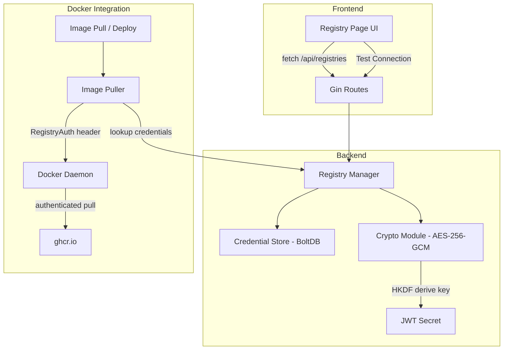
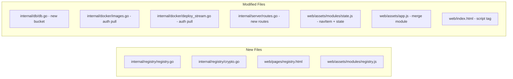
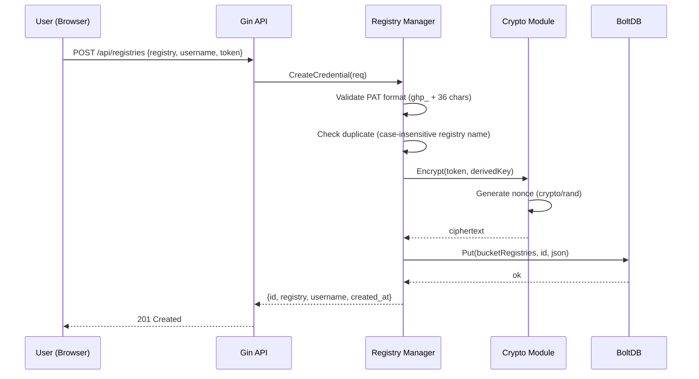
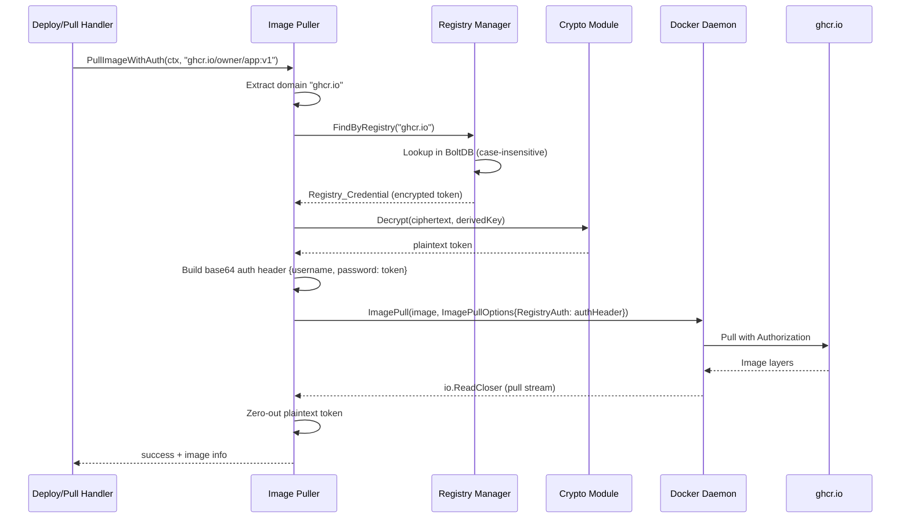
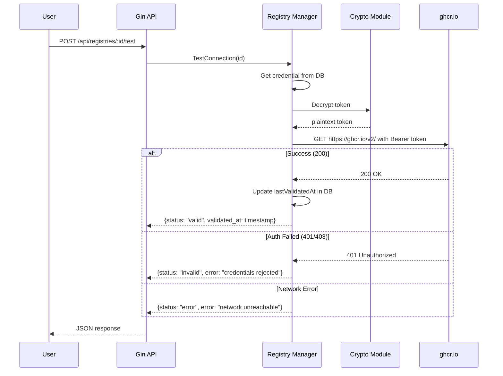

# Design Document: GHCR Private Registry Authentication

## Overview

This feature adds the ability to store encrypted GitHub Personal Access Tokens (PATs) and use them to authenticate when pulling images from private GitHub Container Registry (ghcr.io). The implementation follows DockPal's existing patterns: a new BoltDB bucket for credential storage, a new `internal/registry` package for business logic and encryption, new API routes under `/api/registries`, a new frontend module (`registry.js`) and page (`registry.html`), and integration into the existing image pull flow via `ImagePullOptions.RegistryAuth`.

The design prioritizes security (AES-256-GCM encryption with HKDF-derived keys), simplicity (single new package, no external dependencies beyond stdlib), and consistency with existing DockPal patterns (Gin handlers, BoltDB CRUD, Alpine.js modules).

## Architecture





## Sequence Diagrams

### Add Registry Credential



### Pull Image with Auto-Auth



### Test Connection



## Components and Interfaces

### Component 1: Registry Manager (`internal/registry/registry.go`)

**Purpose**: Business logic for CRUD operations on registry credentials, validation, and connection testing.

**Interface**:
```go
package registry

// Manager handles registry credential operations.
type Manager struct {
    db        *db.DB
    cryptoKey []byte
}

// NewManager creates a registry manager with an encryption key derived from the JWT secret.
func NewManager(database *db.DB, jwtSecret string) *Manager

// Create stores a new registry credential. Returns error if validation fails or registry already exists.
func (m *Manager) Create(req CreateRequest) (*Credential, error)

// List returns all credentials with masked tokens.
func (m *Manager) List() ([]CredentialSummary, error)

// Get returns a single credential by ID with masked token.
func (m *Manager) Get(id string) (*CredentialSummary, error)

// Update modifies the token and/or username for an existing credential.
func (m *Manager) Update(id string, req UpdateRequest) error

// Delete permanently removes a credential.
func (m *Manager) Delete(id string) error

// TestConnection validates credentials against the registry's /v2/ endpoint.
func (m *Manager) TestConnection(id string) (*TestResult, error)

// FindByDomain looks up credentials matching a registry domain (case-insensitive).
// Returns nil if no match found.
func (m *Manager) FindByDomain(domain string) (*Credential, error)

// GetAuthHeader returns the base64-encoded Docker auth header for a given image reference.
// Returns empty string if no matching credentials found.
func (m *Manager) GetAuthHeader(imageRef string) (string, error)
```

### Component 2: Crypto Module (`internal/registry/crypto.go`)

**Purpose**: Handles AES-256-GCM encryption/decryption and HKDF key derivation.

**Interface**:
```go
package registry

// DeriveKey derives a 32-byte encryption key from the JWT secret using HKDF-SHA256.
func DeriveKey(jwtSecret string) ([]byte, error)

// Encrypt encrypts plaintext using AES-256-GCM with a random nonce.
// Returns nonce prepended to ciphertext.
func Encrypt(plaintext []byte, key []byte) ([]byte, error)

// Decrypt decrypts ciphertext (with prepended nonce) using AES-256-GCM.
func Decrypt(ciphertext []byte, key []byte) ([]byte, error)
```

### Component 3: Database Extension (`internal/db/db.go`)

**Purpose**: New bucket and CRUD methods for registry credentials.

**Interface**:
```go
// Added to existing db.go

// Registry credential stored in BoltDB
type RegistryCredential struct {
    ID              string `json:"id"`
    Registry        string `json:"registry"`         // e.g., "ghcr.io"
    Username        string `json:"username"`
    EncryptedToken  []byte `json:"encrypted_token"`
    CreatedAt       int64  `json:"created_at"`
    UpdatedAt       int64  `json:"updated_at"`
    LastValidatedAt int64  `json:"last_validated_at,omitempty"`
}

func (d *DB) SaveRegistryCredential(cred RegistryCredential) error
func (d *DB) GetRegistryCredential(id string) (*RegistryCredential, error)
func (d *DB) ListRegistryCredentials() ([]RegistryCredential, error)
func (d *DB) DeleteRegistryCredential(id string) error
func (d *DB) FindRegistryCredentialByDomain(domain string) (*RegistryCredential, error)
```

### Component 4: API Routes (added to `internal/server/routes.go`)

**Purpose**: REST endpoints for registry credential management.

**Endpoints**:
| Method | Path | Description |
|--------|------|-------------|
| GET | `/api/registries` | List all credentials (masked tokens) |
| POST | `/api/registries` | Create new credential |
| GET | `/api/registries/:id` | Get single credential detail |
| PUT | `/api/registries/:id` | Update credential |
| DELETE | `/api/registries/:id` | Delete credential |
| POST | `/api/registries/:id/test` | Test connection |

### Component 5: Frontend Module (`web/assets/modules/registry.js`)

**Purpose**: Alpine.js module for registry page interactions.

**Interface**:
```javascript
Dockpal.registry = {
    registries: [],
    registryForm: { registry: 'ghcr.io', username: '', token: '' },
    registryFormVisible: false,
    registryTestResult: null,
    registryLoading: false,

    loadRegistries() { /* GET /api/registries */ },
    addRegistry() { /* POST /api/registries */ },
    deleteRegistry(id) { /* DELETE /api/registries/:id */ },
    testRegistryConnection() { /* POST /api/registries/:id/test or inline test */ },
};
```

### Component 6: Image Pull Integration (modified `internal/docker/images.go`)

**Purpose**: Enhanced `PullImage` that accepts optional auth credentials.

**Interface**:
```go
// PullImageWithAuth pulls an image with optional registry authentication.
func (c *Client) PullImageWithAuth(ctx context.Context, image string, registryAuth string) error
```

## Data Models

### RegistryCredential (stored in BoltDB)

```go
type RegistryCredential struct {
    ID              string `json:"id"`               // "reg-<unix_nano>"
    Registry        string `json:"registry"`         // "ghcr.io" (max 253 chars)
    Username        string `json:"username"`         // GitHub username (max 100 chars)
    EncryptedToken  []byte `json:"encrypted_token"`  // AES-256-GCM(nonce + ciphertext)
    CreatedAt       int64  `json:"created_at"`       // Unix epoch
    UpdatedAt       int64  `json:"updated_at"`       // Unix epoch
    LastValidatedAt int64  `json:"last_validated_at"`// Unix epoch, 0 if never validated
}
```

### API Request/Response Models

```go
// CreateRequest - POST /api/registries
type CreateRequest struct {
    Registry string `json:"registry" binding:"required,max=253"`
    Username string `json:"username" binding:"required,max=100"`
    Token    string `json:"token" binding:"required,max=255"`
}

// UpdateRequest - PUT /api/registries/:id
type UpdateRequest struct {
    Username string `json:"username,omitempty"`
    Token    string `json:"token,omitempty"`
}

// CredentialSummary - returned in list/get (token masked)
type CredentialSummary struct {
    ID              string `json:"id"`
    Registry        string `json:"registry"`
    Username        string `json:"username"`
    MaskedToken     string `json:"masked_token"`     // "****...abcd"
    Status          string `json:"status"`           // "valid", "invalid", "unknown"
    CreatedAt       int64  `json:"created_at"`
    UpdatedAt       int64  `json:"updated_at"`
    LastValidatedAt int64  `json:"last_validated_at"`
}

// TestResult - POST /api/registries/:id/test
type TestResult struct {
    Status      string `json:"status"`       // "valid", "invalid", "error"
    Message     string `json:"message"`
    ValidatedAt int64  `json:"validated_at"`
}
```

### Docker Auth Header Format

```go
// Docker registry auth is base64-encoded JSON:
type DockerAuthConfig struct {
    Username string `json:"username"`
    Password string `json:"password"`
}
// Encoded: base64(json.Marshal(DockerAuthConfig{Username: "x", Password: "ghp_xxx"}))
```

## Algorithmic Pseudocode

### Key Derivation (HKDF)

```go
func DeriveKey(jwtSecret string) ([]byte, error) {
    // Use HKDF-SHA256 to derive a 32-byte key
    // Salt: fixed application-specific salt
    // Info: "dockpal-registry-encryption" (context separation)
    salt := []byte("dockpal-registry-v1")
    info := []byte("dockpal-registry-encryption")
    
    hkdf := hkdf.New(sha256.New, []byte(jwtSecret), salt, info)
    key := make([]byte, 32) // 256 bits for AES-256
    _, err := io.ReadFull(hkdf, key)
    return key, err
}
```

### Token Encryption

```go
func Encrypt(plaintext []byte, key []byte) ([]byte, error) {
    block, err := aes.NewCipher(key)
    gcm, err := cipher.NewGCM(block)
    
    nonce := make([]byte, gcm.NonceSize()) // 12 bytes
    io.ReadFull(rand.Reader, nonce)
    
    // Prepend nonce to ciphertext for storage
    ciphertext := gcm.Seal(nonce, nonce, plaintext, nil)
    return ciphertext, nil
}

func Decrypt(data []byte, key []byte) ([]byte, error) {
    block, err := aes.NewCipher(key)
    gcm, err := cipher.NewGCM(block)
    
    nonceSize := gcm.NonceSize()
    nonce, ciphertext := data[:nonceSize], data[nonceSize:]
    
    plaintext, err := gcm.Open(nil, nonce, ciphertext, nil)
    return plaintext, err
}
```

### PAT Validation

```go
func ValidatePAT(token string) error {
    // GitHub PAT format: ghp_ + 36 alphanumeric chars = 40 total
    // Also support fine-grained tokens: github_pat_* (variable length)
    if strings.HasPrefix(token, "ghp_") {
        if len(token) != 40 {
            return fmt.Errorf("classic PAT must be 40 characters (ghp_ + 36)")
        }
        if !isAlphanumeric(token[4:]) {
            return fmt.Errorf("PAT must contain only alphanumeric characters after prefix")
        }
        return nil
    }
    if strings.HasPrefix(token, "github_pat_") {
        if len(token) < 20 {
            return fmt.Errorf("fine-grained PAT too short")
        }
        return nil
    }
    return fmt.Errorf("token must start with 'ghp_' or 'github_pat_'")
}
```

### Domain Extraction from Image Reference

```go
func ExtractDomain(imageRef string) string {
    // Docker image format: [registry/]owner/image[:tag]
    // If first segment contains a dot, it's a registry domain
    parts := strings.SplitN(imageRef, "/", 2)
    if len(parts) < 2 {
        return "" // no domain, e.g., "nginx:latest"
    }
    if strings.Contains(parts[0], ".") {
        return strings.ToLower(parts[0])
    }
    return "" // e.g., "library/nginx" - Docker Hub
}
```

### GetAuthHeader (used during pull)

```go
func (m *Manager) GetAuthHeader(imageRef string) (string, error) {
    domain := ExtractDomain(imageRef)
    if domain == "" {
        return "", nil // no auth needed for Docker Hub public
    }
    
    cred, err := m.db.FindRegistryCredentialByDomain(domain)
    if err != nil || cred == nil {
        return "", nil // no credentials stored, pull without auth
    }
    
    // Decrypt token
    token, err := Decrypt(cred.EncryptedToken, m.cryptoKey)
    if err != nil {
        return "", fmt.Errorf("failed to decrypt credentials for %s: %w", domain, err)
    }
    defer zeroBytes(token) // security: clear from memory
    
    // Build Docker auth config
    authConfig := DockerAuthConfig{
        Username: cred.Username,
        Password: string(token),
    }
    jsonBytes, _ := json.Marshal(authConfig)
    return base64.URLEncoding.EncodeToString(jsonBytes), nil
}
```

### Test Connection

```go
func (m *Manager) TestConnection(id string) (*TestResult, error) {
    cred, err := m.db.GetRegistryCredential(id)
    if err != nil {
        return nil, fmt.Errorf("credential not found")
    }
    
    token, err := Decrypt(cred.EncryptedToken, m.cryptoKey)
    if err != nil {
        return &TestResult{Status: "error", Message: "failed to decrypt token"}, nil
    }
    defer zeroBytes(token)
    
    // Test against registry v2 API
    url := fmt.Sprintf("https://%s/v2/", cred.Registry)
    ctx, cancel := context.WithTimeout(context.Background(), 30*time.Second)
    defer cancel()
    
    req, _ := http.NewRequestWithContext(ctx, "GET", url, nil)
    req.SetBasicAuth(cred.Username, string(token))
    
    resp, err := http.DefaultClient.Do(req)
    if err != nil {
        if ctx.Err() != nil {
            return &TestResult{Status: "error", Message: "connection timeout"}, nil
        }
        return &TestResult{Status: "error", Message: "network error: " + err.Error()}, nil
    }
    defer resp.Body.Close()
    
    now := time.Now().Unix()
    switch {
    case resp.StatusCode == 200:
        // Update last validated timestamp
        cred.LastValidatedAt = now
        m.db.SaveRegistryCredential(*cred)
        return &TestResult{Status: "valid", Message: "connection successful", ValidatedAt: now}, nil
    case resp.StatusCode == 401 || resp.StatusCode == 403:
        return &TestResult{Status: "invalid", Message: "credentials rejected by registry"}, nil
    default:
        return &TestResult{Status: "error", Message: fmt.Sprintf("registry returned %d", resp.StatusCode)}, nil
    }
}
```

## Key Functions with Formal Specifications

### Function: Manager.Create

```go
func (m *Manager) Create(req CreateRequest) (*Credential, error)
```

**Preconditions:**
- `req.Registry` is non-empty, max 253 characters
- `req.Username` is non-empty, max 100 characters
- `req.Token` is non-empty, max 255 characters
- `m.cryptoKey` is a valid 32-byte AES key

**Postconditions:**
- If token format is invalid → returns validation error, no DB write
- If registry already exists (case-insensitive) → updates existing record
- If new → creates record with encrypted token, returns credential with ID
- Token is never stored in plaintext in DB

### Function: Manager.GetAuthHeader

```go
func (m *Manager) GetAuthHeader(imageRef string) (string, error)
```

**Preconditions:**
- `imageRef` is a non-empty Docker image reference string

**Postconditions:**
- If image has no registry domain → returns empty string (no auth)
- If no credential matches the domain → returns empty string (no auth)
- If credential found → returns base64-encoded Docker auth JSON
- Plaintext token is zeroed from memory after use
- If decryption fails → returns error

### Function: Encrypt

```go
func Encrypt(plaintext []byte, key []byte) ([]byte, error)
```

**Preconditions:**
- `key` is exactly 32 bytes
- `plaintext` is non-empty

**Postconditions:**
- Returns `nonce (12 bytes) || ciphertext || tag (16 bytes)`
- Each call produces different output (random nonce)
- Output can be decrypted with same key via `Decrypt`

## Error Handling

### Error Scenario 1: Invalid PAT Format

**Condition**: Token doesn't match `ghp_*` or `github_pat_*` pattern
**Response**: HTTP 400 with `{"error": "invalid token format: must start with 'ghp_' or 'github_pat_'"}`
**Recovery**: User corrects the token in the form

### Error Scenario 2: Encryption Key Unavailable

**Condition**: JWT secret is empty or HKDF derivation fails
**Response**: All registry operations return HTTP 500 with `{"error": "encryption configuration error"}`
**Recovery**: Admin ensures JWT_SECRET is set or secret file exists

### Error Scenario 3: Token Decryption Failure

**Condition**: Stored ciphertext is corrupted or key has changed
**Response**: HTTP 500 with `{"error": "stored credential cannot be decrypted, please re-save"}`
**Recovery**: User deletes and re-creates the credential with a new token

### Error Scenario 4: Registry Connection Timeout

**Condition**: ghcr.io unreachable within 30 seconds
**Response**: `{"status": "error", "message": "connection timeout"}`
**Recovery**: User retries when network is available

### Error Scenario 5: Pull with Expired Token

**Condition**: Token was valid but has been revoked on GitHub
**Response**: Deploy stream emits error event: "Authentication failed for ghcr.io — credentials may be expired. Update them in Settings > Registry."
**Recovery**: User updates the token in the Registry page

## Testing Strategy

### Unit Testing

- `crypto.go`: Test encrypt/decrypt round-trip, test with wrong key fails, test nonce uniqueness
- `registry.go`: Test PAT validation (valid ghp_, valid github_pat_, invalid formats)
- `registry.go`: Test domain extraction from various image refs
- `registry.go`: Test mask token function
- `db.go`: Test CRUD operations on registry credentials bucket

### Property-Based Testing (using `rapid`)

- **Encrypt/Decrypt round-trip**: For any random plaintext and valid key, `Decrypt(Encrypt(pt, key), key) == pt`
- **Domain extraction**: For any image ref with format `domain.tld/owner/image:tag`, `ExtractDomain` returns `domain.tld`
- **PAT validation**: All strings starting with `ghp_` + exactly 36 alnum chars pass validation

### Integration Testing

- Test full flow: create credential → pull private image → verify auth header sent
- Test connection validation against mock HTTP server
- Test deploy stream with authenticated pull

## Performance Considerations

- Encryption/decryption is fast (AES-GCM is hardware-accelerated on modern CPUs)
- HKDF key derivation happens once at startup (cached in Manager)
- BoltDB lookup by domain is O(n) scan of credentials bucket — acceptable for typical use (< 10 registries)
- Token is held in memory only for the duration of the pull operation

## Dependencies

### New (stdlib only)
- `crypto/aes` — AES block cipher
- `crypto/cipher` — GCM mode
- `crypto/rand` — Nonce generation
- `crypto/sha256` — HKDF hash function
- `golang.org/x/crypto/hkdf` — Key derivation (already in go.sum via existing x/crypto dependency)
- `encoding/base64` — Docker auth encoding

### Existing (no new external deps)
- `go.etcd.io/bbolt` — Database
- `github.com/gin-gonic/gin` — HTTP framework
- `github.com/moby/moby/client` — Docker client (ImagePullOptions.RegistryAuth)


## Correctness Properties

### Property 1: Encryption Round-Trip

For any valid plaintext token and derived key, `Decrypt(Encrypt(token, key), key)` produces the original token. No data loss or corruption occurs during the encryption cycle.

**Validates: Requirements 1.1, 5.1**

### Property 2: Token Never Stored in Plaintext

At no point does the BoltDB database contain a plaintext token value. All stored `EncryptedToken` fields are AES-256-GCM ciphertext that cannot be read without the derived key.

**Validates: Requirements 5.1, 5.2**

### Property 3: Domain Matching Consistency

For any image reference `ghcr.io/owner/image:tag`, `ExtractDomain` always returns `ghcr.io`. The matching is case-insensitive: `GHCR.IO/owner/image` matches a credential stored as `ghcr.io`.

**Validates: Requirements 3.1, 7.1**

### Property 4: Masked Token Irreversibility

The masked token format (`****...` + last 4 chars) cannot be used to reconstruct the original token. The API never returns the full token value after initial storage.

**Validates: Requirements 2.1, 2.2**

### Property 5: Key Isolation

The encryption key derived via HKDF with context string `"dockpal-registry-encryption"` is cryptographically independent from the JWT signing key, even though both derive from the same secret. Compromising one does not compromise the other.

**Validates: Requirements 5.4**

### Property 6: Fallback to Public Pull

When no credential matches an image's domain, the pull operation proceeds without authentication (identical to current behavior). The feature is purely additive — it never blocks pulls that would otherwise succeed.

**Validates: Requirements 3.2, 7.1**
