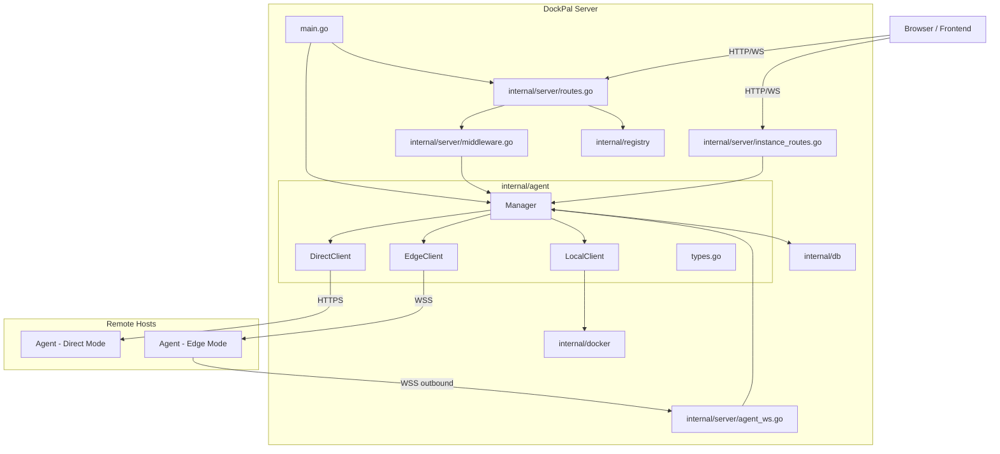
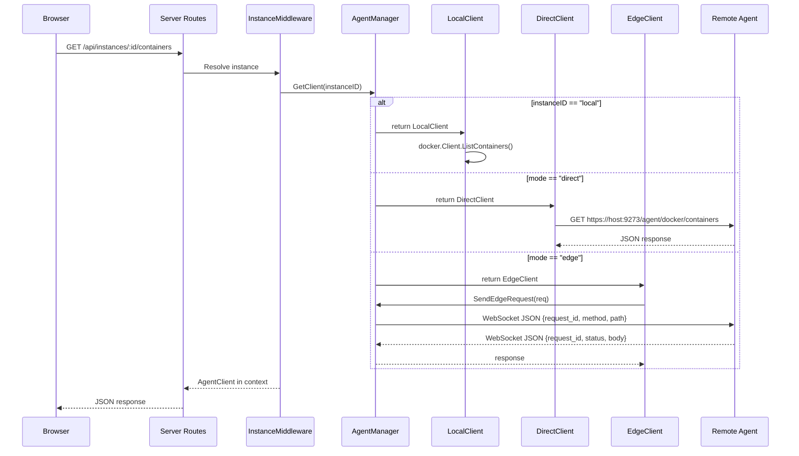
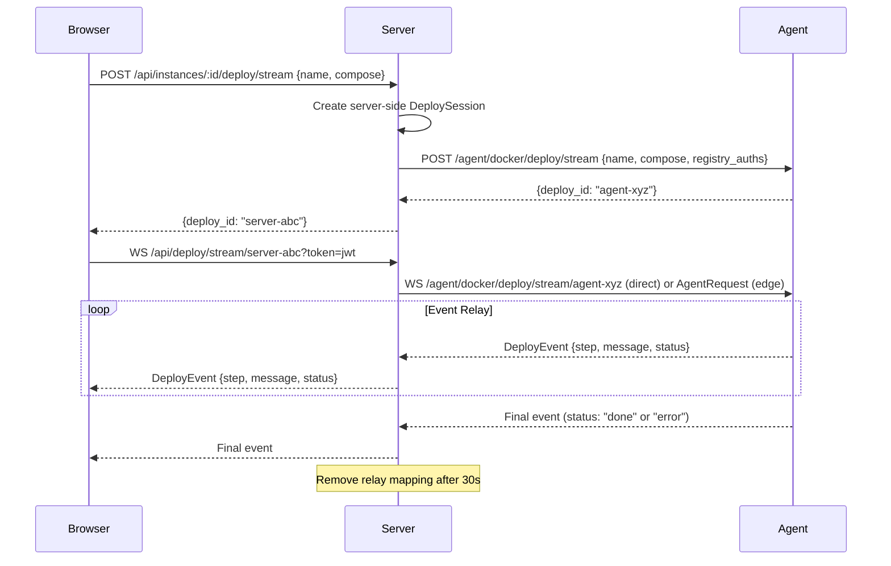

# Design Document: Multi-Instance Server

## Overview

This design extends the DockPal Server to manage Docker containers across multiple remote hosts from a single dashboard. The core change introduces an **agent abstraction layer** (`internal/agent` package) that provides a uniform `AgentClient` interface for Docker operations, regardless of whether the target is the local Docker daemon, a directly reachable remote agent, or an agent connected via an outbound WebSocket (edge mode).

The design maintains full backward compatibility — existing single-host deployments continue working unchanged, with all current routes delegating through the new abstraction to the local Docker socket.

### Key Design Decisions

1. **Interface-based abstraction**: A single `AgentClient` interface hides connection mode differences from route handlers
2. **Dual token storage**: Agent tokens stored as both bcrypt hash (for verification) and AES-256-GCM encrypted (for DirectClient use)
3. **Server-side git clone**: Git deploys to remote instances clone on the Server, sending only compose YAML to agents
4. **Local-only features**: Traefik, Cloudflare Tunnel, and auto-recovery remain Server-local for this phase
5. **Event relay for streaming**: Deploy streams to remote instances use a Server-side relay that forwards agent events to the browser WebSocket

## Architecture

### High-Level Component Diagram



### Request Flow



## Components and Interfaces

### Package: `internal/agent`

This new package contains the abstraction layer for communicating with Docker hosts.

#### File: `internal/agent/types.go`

```go
package agent

import (
    "context"
    "io"

    "github.com/sdldev/dockpal/internal/docker"
)

// HostInfo contains static host information reported by an agent or read locally.
type HostInfo struct {
    Hostname      string `json:"hostname"`
    OS            string `json:"os"`
    CPUCores      int    `json:"cpu_cores"`
    TotalMemory   uint64 `json:"total_memory"`
    DockerVersion string `json:"docker_version"`
}

// HostStats contains real-time resource usage statistics.
type HostStats struct {
    CPUPercent float64 `json:"cpu_percent"`
    UsedRAM    uint64  `json:"used_ram"`
    TotalRAM   uint64  `json:"total_ram"`
    UsedDisk   uint64  `json:"used_disk"`
    TotalDisk  uint64  `json:"total_disk"`
}

// AgentClient is the uniform interface for Docker operations on any instance.
// Route handlers use this interface without knowing the underlying connection mode.
type AgentClient interface {
    // Container operations
    ListContainers(ctx context.Context, all bool) ([]docker.ContainerInfo, error)
    InspectContainer(ctx context.Context, id string) (*docker.ContainerDetail, error)
    StartContainer(ctx context.Context, id string) error
    StopContainer(ctx context.Context, id string) error
    RestartContainer(ctx context.Context, id string) error
    RemoveContainer(ctx context.Context, id string, force bool) error
    EditContainer(ctx context.Context, id string, req docker.ContainerEditRequest) (*docker.ContainerDetail, error)
    GetContainerStats(ctx context.Context, id string) (*docker.ContainerStats, error)
    ContainerLogs(ctx context.Context, id string, tail string) (io.ReadCloser, error)

    // Deploy operations
    DeployCompose(ctx context.Context, name, composeYAML string, registryAuths map[string]string) error
    DeployComposeStreamed(ctx context.Context, name, composeYAML string, session *docker.DeploySession, registryAuths map[string]string) error

    // Image operations
    ListImages(ctx context.Context) ([]docker.ImageInfo, error)
    PullImage(ctx context.Context, image string) error
    PullImageWithAuth(ctx context.Context, image, registryAuth string) error
    RemoveImage(ctx context.Context, id string) error

    // Host operations
    GetHostInfo(ctx context.Context) (*HostInfo, error)
    GetHostStats(ctx context.Context) (*HostStats, error)

    // Lifecycle
    Ping(ctx context.Context) error
    Close() error
}

// AgentRequest is the JSON message sent to an edge agent via WebSocket.
type AgentRequest struct {
    RequestID string            `json:"request_id"`
    Method    string            `json:"method"`    // GET, POST, PUT, DELETE, WS
    Path      string            `json:"path"`
    Query     map[string]string `json:"query,omitempty"`
    Body      json.RawMessage   `json:"body,omitempty"`
}

// AgentResponse is the JSON message received from an edge agent via WebSocket.
type AgentResponse struct {
    RequestID string          `json:"request_id"`
    Status    int             `json:"status"`
    Body      json.RawMessage `json:"body,omitempty"`
    Stream    bool            `json:"stream,omitempty"`
    Chunk     int             `json:"chunk,omitempty"`
    Data      string          `json:"data,omitempty"`
}
```

#### File: `internal/agent/local.go`

```go
package agent

import (
    "context"
    "io"

    "github.com/sdldev/dockpal/internal/docker"
)

// LocalClient wraps the existing docker.Client to implement AgentClient.
// Zero overhead — direct method delegation with no network serialization.
type LocalClient struct {
    client *docker.Client
}

func NewLocalClient(client *docker.Client) *LocalClient {
    return &LocalClient{client: client}
}

// Container operations delegate directly to docker.Client
func (l *LocalClient) ListContainers(ctx context.Context, all bool) ([]docker.ContainerInfo, error) {
    return l.client.ListContainers(ctx, all)
}

func (l *LocalClient) DeployCompose(ctx context.Context, name, composeYAML string, registryAuths map[string]string) error {
    // Build getAuthHeader function from the registryAuths map
    getAuthHeader := func(imageRef string) (string, error) {
        domain := registry.ExtractDomain(imageRef)
        if auth, ok := registryAuths[domain]; ok {
            return auth, nil
        }
        return "", nil
    }
    return l.client.DeployCompose(ctx, name, composeYAML, getAuthHeader)
}

func (l *LocalClient) DeployComposeStreamed(ctx context.Context, name, composeYAML string, session *docker.DeploySession, registryAuths map[string]string) error {
    getAuthHeader := func(imageRef string) (string, error) {
        domain := registry.ExtractDomain(imageRef)
        if auth, ok := registryAuths[domain]; ok {
            return auth, nil
        }
        return "", nil
    }
    return l.client.DeployComposeStreamed(ctx, name, composeYAML, session, getAuthHeader)
}

// GetHostInfo reads system information from /proc and OS APIs.
// Moved from routes.go getSystemInfo/getHostname functions.
func (l *LocalClient) GetHostInfo(ctx context.Context) (*HostInfo, error) {
    // os.Hostname(), runtime.GOOS, runtime.NumCPU()
    // Total memory from cgroup or /proc/meminfo
    // Docker version from l.client.ServerVersion()
}

// GetHostStats computes real-time resource usage.
// Moved from routes.go getCPUPercent/getMemoryInfo functions.
func (l *LocalClient) GetHostStats(ctx context.Context) (*HostStats, error) {
    // CPU: two /proc/stat readings 200ms apart
    // Memory: cgroup or /proc/meminfo
    // Disk: syscall.Statfs on "/"
}

func (l *LocalClient) Ping(ctx context.Context) error {
    return l.client.Ping(ctx)
}

func (l *LocalClient) Close() error {
    return nil // Local client lifecycle managed by main.go
}
```

#### File: `internal/agent/direct.go`

```go
package agent

import (
    "context"
    "crypto/tls"
    "net/http"
    "time"
)

// DirectClient communicates with a remote agent via HTTP/HTTPS.
type DirectClient struct {
    instanceID string
    baseURL    string       // https://203.0.113.50:9273
    httpClient *http.Client // TLS client accepting self-signed certs
    authToken  string       // plaintext agent token for Authorization header
}

func NewDirectClient(instanceID, host string, port int, authToken string) *DirectClient {
    return &DirectClient{
        instanceID: instanceID,
        baseURL:    fmt.Sprintf("https://%s:%d", host, port),
        httpClient: &http.Client{
            Timeout: 30 * time.Second,
            Transport: &http.Transport{
                TLSClientConfig: &tls.Config{
                    InsecureSkipVerify: true, // Accept self-signed certs for MVP
                },
            },
        },
        authToken: authToken,
    }
}

// All methods make HTTP requests to the agent REST API.
// Each request includes: Authorization: Bearer {authToken}
func (d *DirectClient) ListContainers(ctx context.Context, all bool) ([]docker.ContainerInfo, error) {
    // GET {baseURL}/agent/docker/containers?all={all}
    // Decode JSON response into []docker.ContainerInfo
}

func (d *DirectClient) DeployComposeStreamed(ctx context.Context, name, composeYAML string, session *docker.DeploySession, registryAuths map[string]string) error {
    // 1. POST {baseURL}/agent/docker/deploy/stream with {name, compose, registry_auths}
    // 2. Get agent deploy_id from response
    // 3. Open WebSocket to {baseURL}/agent/docker/deploy/stream/{deploy_id}
    // 4. Read events from agent WebSocket, write to session.Events channel
}

func (d *DirectClient) Ping(ctx context.Context) error {
    // GET {baseURL}/agent/ping
}

func (d *DirectClient) Close() error {
    d.httpClient.CloseIdleConnections()
    return nil
}
```

#### File: `internal/agent/edge.go`

```go
package agent

import (
    "context"
    "time"
)

// EdgeClient communicates through a multiplexed WebSocket managed by the Manager.
type EdgeClient struct {
    instanceID string
    manager    *Manager // back-reference to send requests via Manager's WS
}

func NewEdgeClient(instanceID string, manager *Manager) *EdgeClient {
    return &EdgeClient{instanceID: instanceID, manager: manager}
}

// All methods send AgentRequest through the Manager's edge connection
// and wait for a matching AgentResponse by request_id.
func (e *EdgeClient) ListContainers(ctx context.Context, all bool) ([]docker.ContainerInfo, error) {
    req := &AgentRequest{
        RequestID: uuid.NewString(),
        Method:    "GET",
        Path:      "/docker/containers",
        Query:     map[string]string{"all": strconv.FormatBool(all)},
    }
    resp, err := e.manager.SendEdgeRequest(e.instanceID, req)
    if err != nil {
        return nil, err
    }
    var containers []docker.ContainerInfo
    json.Unmarshal(resp.Body, &containers)
    return containers, nil
}

func (e *EdgeClient) DeployComposeStreamed(ctx context.Context, name, composeYAML string, session *docker.DeploySession, registryAuths map[string]string) error {
    // 1. Send AgentRequest{Method: "POST", Path: "/docker/deploy/stream", Body: {name, compose, registry_auths}}
    // 2. Receive deploy_id in response
    // 3. Send AgentRequest{Method: "WS", Path: "/docker/deploy/stream/{deploy_id}"}
    // 4. Receive streaming AgentResponse messages (Stream: true) until Stream: false
    // 5. Forward each chunk as DeployEvent to session.Events
}

func (e *EdgeClient) Ping(ctx context.Context) error {
    req := &AgentRequest{
        RequestID: uuid.NewString(),
        Method:    "GET",
        Path:      "/ping",
    }
    _, err := e.manager.SendEdgeRequest(e.instanceID, req)
    return err
}

func (e *EdgeClient) Close() error {
    return nil // Connection lifecycle managed by Manager
}
```

#### File: `internal/agent/manager.go`

```go
package agent

import (
    "fmt"
    "sync"
    "time"

    "github.com/gorilla/websocket"
    "github.com/sdldev/dockpal/internal/db"
    "github.com/sdldev/dockpal/internal/docker"
    "github.com/sdldev/dockpal/internal/registry"
)

// Manager maintains connections to all registered agents.
// It provides a uniform GetClient interface for route handlers.
type Manager struct {
    db        *db.DB
    cryptoKey []byte // For decrypting agent tokens (same key as registry encryption)
    mu        sync.RWMutex
    local     *LocalClient
    edge      map[string]*EdgeConnection // instance_id → active WebSocket
}

// EdgeConnection represents an active WebSocket connection from an edge-mode agent.
type EdgeConnection struct {
    instanceID string
    conn       *websocket.Conn
    pending    map[string]chan *AgentResponse // request_id → response channel
    mu         sync.Mutex
    done       chan struct{}
}

func NewManager(database *db.DB, localDocker *docker.Client, jwtSecret string) *Manager {
    cryptoKey, _ := registry.DeriveKey(jwtSecret)
    return &Manager{
        db:        database,
        cryptoKey: cryptoKey,
        local:     NewLocalClient(localDocker),
        edge:      make(map[string]*EdgeConnection),
    }
}

// GetClient returns the appropriate AgentClient for an instance.
// Returns error if instance not found or offline (for edge mode without connection).
func (m *Manager) GetClient(instanceID string) (AgentClient, error) {
    if instanceID == "local" {
        return m.local, nil
    }

    inst, err := m.db.GetInstance(instanceID)
    if err != nil {
        return nil, fmt.Errorf("instance not found: %s", instanceID)
    }

    switch inst.Mode {
    case "direct":
        // Decrypt agent token from AES-256-GCM encrypted storage
        token, err := registry.Decrypt(inst.AgentTokenEncrypted, m.cryptoKey)
        if err != nil {
            return nil, fmt.Errorf("failed to decrypt agent token: %w", err)
        }
        return NewDirectClient(instanceID, inst.Host, inst.Port, string(token)), nil

    case "edge":
        m.mu.RLock()
        _, connected := m.edge[instanceID]
        m.mu.RUnlock()
        if !connected {
            return nil, fmt.Errorf("instance offline: %s", instanceID)
        }
        return NewEdgeClient(instanceID, m), nil

    default:
        return nil, fmt.Errorf("unknown instance mode: %s", inst.Mode)
    }
}

// RegisterEdgeConnection stores a WebSocket connection for an edge-mode agent.
// Replaces any existing connection for the same instance.
func (m *Manager) RegisterEdgeConnection(instanceID string, conn *websocket.Conn) {
    m.mu.Lock()
    defer m.mu.Unlock()

    // Close existing connection if any
    if existing, ok := m.edge[instanceID]; ok {
        close(existing.done)
        existing.conn.Close()
    }

    ec := &EdgeConnection{
        instanceID: instanceID,
        conn:       conn,
        pending:    make(map[string]chan *AgentResponse),
        done:       make(chan struct{}),
    }
    m.edge[instanceID] = ec

    // Start read loop for this connection
    go m.edgeReadLoop(ec)
}

// UnregisterEdgeConnection removes an edge connection and marks instance offline.
func (m *Manager) UnregisterEdgeConnection(instanceID string) {
    m.mu.Lock()
    defer m.mu.Unlock()

    if ec, ok := m.edge[instanceID]; ok {
        close(ec.done)
        ec.conn.Close()
        delete(m.edge, instanceID)
    }
    m.db.UpdateInstanceStatus(instanceID, "offline")
}

// SendEdgeRequest sends a JSON request through an edge WebSocket and waits for response.
// Returns error if no response within 60 seconds.
func (m *Manager) SendEdgeRequest(instanceID string, req *AgentRequest) (*AgentResponse, error) {
    m.mu.RLock()
    ec, ok := m.edge[instanceID]
    m.mu.RUnlock()
    if !ok {
        return nil, fmt.Errorf("no edge connection for instance: %s", instanceID)
    }

    // Create response channel
    respCh := make(chan *AgentResponse, 1)
    ec.mu.Lock()
    ec.pending[req.RequestID] = respCh
    ec.mu.Unlock()

    defer func() {
        ec.mu.Lock()
        delete(ec.pending, req.RequestID)
        ec.mu.Unlock()
    }()

    // Send request
    ec.mu.Lock()
    err := ec.conn.WriteJSON(req)
    ec.mu.Unlock()
    if err != nil {
        return nil, fmt.Errorf("failed to send edge request: %w", err)
    }

    // Wait for response with timeout
    select {
    case resp := <-respCh:
        return resp, nil
    case <-time.After(60 * time.Second):
        return nil, fmt.Errorf("edge request timeout for instance: %s", instanceID)
    }
}

// edgeReadLoop reads messages from an edge WebSocket and routes them to pending requests.
func (m *Manager) edgeReadLoop(ec *EdgeConnection) {
    for {
        var resp AgentResponse
        err := ec.conn.ReadJSON(&resp)
        if err != nil {
            // Connection closed or read error
            m.UnregisterEdgeConnection(ec.instanceID)
            return
        }

        ec.mu.Lock()
        if ch, ok := ec.pending[resp.RequestID]; ok {
            ch <- &resp
        }
        ec.mu.Unlock()
    }
}

// Close shuts down all active connections.
func (m *Manager) Close() {
    m.mu.Lock()
    defer m.mu.Unlock()

    for id, ec := range m.edge {
        close(ec.done)
        ec.conn.Close()
        delete(m.edge, id)
    }
}
```

### Route Registration Changes

#### Modified: `internal/server/routes.go`

```go
// New signature — adds agentMgr parameter, retains dockerClient for backward compat
func RegisterRoutes(r *gin.Engine, dockerClient *docker.Client, jwtSecret string,
    database *db.DB, versionService *update.VersionService,
    updateService *update.UpdateService, agentMgr *agent.Manager) {

    // ... existing auth setup ...

    // Instance management routes (new)
    RegisterInstanceRoutes(protected, database, agentMgr, jwtSecret)

    // Agent WebSocket endpoint (unauthenticated — agent uses token in message)
    r.GET("/api/agent/connect", HandleAgentConnect(database, agentMgr))

    // Instance-scoped operations (new route group)
    instances := protected.Group("/instances/:instance_id")
    instances.Use(InstanceMiddleware(agentMgr))
    RegisterInstanceScopedRoutes(instances, database, agentMgr, jwtSecret)

    // Existing routes — now delegate through LocalClient via agentMgr
    // (same response format, zero breaking changes)
    protected.GET("/containers", func(c *gin.Context) {
        client, _ := agentMgr.GetClient("local")
        containers, err := client.ListContainers(c.Request.Context(), true)
        // ... same response handling ...
    })
    // ... all other existing routes follow same pattern ...
}
```

#### New: `internal/server/instance_routes.go`

```go
// RegisterInstanceRoutes adds instance CRUD and enrollment endpoints.
func RegisterInstanceRoutes(g *gin.RouterGroup, database *db.DB, agentMgr *agent.Manager, jwtSecret string) {
    g.POST("/instances", handleCreateInstance(database, jwtSecret))
    g.GET("/instances", handleListInstances(database))
    g.GET("/instances/:id", handleGetInstance(database))
    g.PUT("/instances/:id", handleUpdateInstance(database))
    g.DELETE("/instances/:id", handleDeleteInstance(database, agentMgr))
    g.POST("/instances/:id/test", handleTestInstance(agentMgr))
    g.POST("/instances/:id/rotate-token", handleRotateToken(database, jwtSecret))
}

// RegisterInstanceScopedRoutes adds per-instance container/deploy/host routes.
func RegisterInstanceScopedRoutes(g *gin.RouterGroup, database *db.DB, agentMgr *agent.Manager, jwtSecret string) {
    // Containers
    g.GET("/containers", handleListContainers)
    g.GET("/containers/:id", handleInspectContainer)
    g.POST("/containers/:id/start", handleStartContainer)
    g.POST("/containers/:id/stop", handleStopContainer)
    g.POST("/containers/:id/restart", handleRestartContainer)
    g.DELETE("/containers/:id", handleRemoveContainer)
    g.PUT("/containers/:id", handleEditContainer)
    g.GET("/containers/:id/stats", handleGetContainerStats)
    g.GET("/containers/:id/logs", handleContainerLogs)

    // Deploy
    g.POST("/deploy/stream", handleDeployStream)
    g.POST("/deploy/compose", handleDeployCompose)
    g.POST("/deploy/git", handleDeployGit)

    // Images
    g.GET("/images", handleListImages)
    g.POST("/images/pull", handlePullImage)
    g.DELETE("/images/:id", handleRemoveImage)

    // Host & System
    g.GET("/host/info", handleHostInfo)
    g.GET("/host/stats", handleHostStats)
    g.GET("/system/info", handleSystemInfo)

    // Services, Domains, Registries (instance-scoped)
    g.GET("/services", handleListServices)
    g.DELETE("/services/:id", handleDeleteService)
    g.GET("/domains", handleListDomains)
    g.POST("/domains", handleCreateDomain)
    g.DELETE("/domains/:id", handleDeleteDomain)
    g.GET("/registries", handleListRegistries)
    g.POST("/registries", handleCreateRegistry)
    g.GET("/registries/:id", handleGetRegistry)
    g.PUT("/registries/:id", handleUpdateRegistry)
    g.DELETE("/registries/:id", handleDeleteRegistry)
    g.POST("/registries/:id/test", handleTestRegistry)
}
```

#### New: `internal/server/middleware.go` (addition)

```go
// InstanceMiddleware resolves the AgentClient for the requested instance.
// Sets "instance_id" and "agent_client" in the Gin context.
// Returns 404 if instance not found, 503 if instance offline.
func InstanceMiddleware(agentMgr *agent.Manager) gin.HandlerFunc {
    return func(c *gin.Context) {
        instanceID := c.Param("instance_id")
        if instanceID == "" {
            instanceID = "local"
        }

        client, err := agentMgr.GetClient(instanceID)
        if err != nil {
            if strings.Contains(err.Error(), "not found") {
                c.JSON(http.StatusNotFound, gin.H{"error": "instance not found"})
                c.Abort()
                return
            }
            // Instance exists but is offline
            c.JSON(http.StatusServiceUnavailable, gin.H{"error": "instance offline"})
            c.Abort()
            return
        }

        c.Set("instance_id", instanceID)
        c.Set("agent_client", client)
        c.Next()
    }
}
```

#### New: `internal/server/agent_ws.go`

```go
// HandleAgentConnect handles WebSocket connections from edge-mode agents.
func HandleAgentConnect(database *db.DB, agentMgr *agent.Manager) gin.HandlerFunc {
    return func(c *gin.Context) {
        conn, err := upgrader.Upgrade(c.Writer, c.Request, nil)
        if err != nil {
            return
        }

        // Wait for authentication message (10-second deadline)
        conn.SetReadDeadline(time.Now().Add(10 * time.Second))
        var authMsg struct {
            Token string `json:"token"`
        }
        if err := conn.ReadJSON(&authMsg); err != nil {
            conn.WriteJSON(gin.H{"error": "authentication timeout"})
            conn.Close()
            return
        }
        conn.SetReadDeadline(time.Time{}) // Clear deadline

        // Verify token against stored bcrypt hashes
        instance, err := verifyAgentToken(database, authMsg.Token)
        if err != nil {
            conn.WriteMessage(websocket.CloseMessage,
                websocket.FormatCloseMessage(4001, "authentication failed"))
            conn.Close()
            return
        }

        // Register connection and update status
        agentMgr.RegisterEdgeConnection(instance.ID, conn)
        database.UpdateInstanceStatus(instance.ID, "online")
        database.UpdateInstanceLastSeen(instance.ID, time.Now().Unix())

        // Request host info from agent
        // ... store in instance record ...

        // Keep connection alive until agent disconnects
        // The edgeReadLoop in Manager handles message routing
        <-agentMgr.EdgeConnectionDone(instance.ID)
    }
}

// verifyAgentToken checks the token against all instances in "enrolling" or "offline" status.
func verifyAgentToken(database *db.DB, token string) (*db.Instance, error) {
    instances, _ := database.ListInstances()
    for _, inst := range instances {
        if inst.Mode != "edge" && inst.Mode != "direct" {
            continue
        }
        if inst.Status != "enrolling" && inst.Status != "offline" && inst.Status != "online" {
            continue
        }
        if err := bcrypt.CompareHashAndPassword([]byte(inst.AgentTokenHash), []byte(token)); err == nil {
            return &inst, nil
        }
    }
    return nil, fmt.Errorf("no matching instance for token")
}
```

### Deploy Stream Relay

For remote instances, the Server acts as a relay between the browser WebSocket and the agent deploy stream.



```go
// DeployRelay tracks the mapping between server and agent deploy sessions.
type DeployRelay struct {
    ServerSessionID string
    AgentSessionID  string
    InstanceID      string
    Mode            string // "direct" or "edge"
    CreatedAt       time.Time
    cancel          context.CancelFunc
}

// In the instance-scoped deploy/stream handler:
func handleDeployStream(c *gin.Context) {
    client := c.MustGet("agent_client").(agent.AgentClient)
    instanceID := c.MustGet("instance_id").(string)

    // ... validate request ...

    session := deployManager.CreateSession()

    // Resolve registry credentials for all images in compose
    registryAuths := resolveRegistryAuths(req.Compose, instanceID, registryManager)

    go func() {
        err := client.DeployComposeStreamed(context.Background(), req.Name, req.Compose, session, registryAuths)
        if err == nil {
            database.SaveService(db.Service{
                ID:         generateID("svc"),
                InstanceID: instanceID,
                Name:       req.Name,
                Type:       "compose",
                Compose:    req.Compose,
                CreatedAt:  time.Now().Unix(),
            })
        }
        time.AfterFunc(30*time.Second, func() {
            deployManager.RemoveSession(session.ID)
        })
    }()

    c.JSON(http.StatusOK, gin.H{"deploy_id": session.ID})
}
```

### Credential Scoping Logic

```go
// resolveRegistryAuths resolves credentials for all registries referenced in a compose file.
// Uses instance-specific → global fallback for each domain.
func resolveRegistryAuths(composeYAML, instanceID string, regMgr *registry.Manager) map[string]string {
    cf, _ := docker.ParseComposeFile(composeYAML)
    auths := make(map[string]string)

    for _, svc := range cf.Services {
        domain := registry.ExtractDomain(svc.Image)
        if domain == "" || auths[domain] != "" {
            continue // Docker Hub or already resolved
        }
        auth, _ := regMgr.GetAuthHeaderForInstance(svc.Image, instanceID)
        if auth != "" {
            auths[domain] = auth
        }
    }
    return auths
}
```

The `GetAuthHeaderForInstance` method in the registry package follows this lookup order:

1. Instance-specific credential matching the registry domain (case-insensitive)
2. Instance-specific credential matching a registry alias (e.g., `ghcr.io` → `github.com`)
3. Global credential (empty InstanceID) matching the registry domain
4. Global credential matching a registry alias
5. No credential found → proceed without auth (public images)

### Frontend State Management

```js
// In state.js — new instance-related state
{
    instances: [],
    selectedInstance: localStorage.getItem('selectedInstance') || 'local',

    // Helper to build instance-scoped API paths
    instanceApi(method, path, body) {
        return this.api(method, '/api/instances/' + this.selectedInstance + path, body);
    },

    async selectInstance(id) {
        this.selectedInstance = id;
        localStorage.setItem('selectedInstance', id);
        // Reset instance-specific state
        this.currentPage = 'dashboard';
        this.selectedContainer = null;
        this.containerEditMode = false;
        this.logs = [];
        // Reload data for new instance
        await this.loadPageData('dashboard');
    },

    // Feature visibility based on selected instance
    get isLocalInstance() {
        return this.selectedInstance === 'local';
    }
}
```

All existing page modules (`dashboard.js`, `containers.js`, `services.js`, `images.js`, etc.) are modified to use `this.instanceApi()` instead of `this.api()` for Docker/deploy/host operations.

## Data Models

### New: Instance (BBolt bucket: `instances`)

```go
type Instance struct {
    ID                  string `json:"id"`                              // "local", "inst-abc123", etc.
    Name                string `json:"name"`                            // max 64 chars
    Host                string `json:"host,omitempty"`                  // IP or hostname (direct mode)
    Port                int    `json:"port,omitempty"`                  // agent port, default 9273
    Mode                string `json:"mode"`                            // "local" | "direct" | "edge"
    AgentTokenHash      string `json:"agent_token_hash,omitempty"`      // bcrypt hash for verification
    AgentTokenEncrypted []byte `json:"agent_token_encrypted,omitempty"` // AES-256-GCM for DirectClient
    AgentVersion        string `json:"agent_version,omitempty"`
    Status              string `json:"status"`                          // "online" | "offline" | "enrolling"
    DockerVersion       string `json:"docker_version,omitempty"`
    OS                  string `json:"os,omitempty"`
    CPUCores            int    `json:"cpu_cores,omitempty"`
    TotalMemory         uint64 `json:"total_memory,omitempty"`
    LastSeen            int64  `json:"last_seen,omitempty"`
    CreatedAt           int64  `json:"created_at"`
}
```

### Modified: Service

```go
type Service struct {
    ID         string `json:"id"`
    InstanceID string `json:"instance_id,omitempty"` // NEW: empty = local instance
    Name       string `json:"name"`
    Type       string `json:"type"`
    Domain     string `json:"domain,omitempty"`
    Compose    string `json:"compose,omitempty"`
    Repo       string `json:"repo,omitempty"`
    CreatedAt  int64  `json:"created_at"`
}
```

### Modified: Domain

```go
type Domain struct {
    ID         string `json:"id"`
    InstanceID string `json:"instance_id,omitempty"` // NEW: empty = local instance
    Domain     string `json:"domain"`
    Service    string `json:"service"`
    Port       int    `json:"port"`
}
```

### Modified: RegistryCredential

```go
type RegistryCredential struct {
    ID              string `json:"id"`
    InstanceID      string `json:"instance_id,omitempty"` // NEW: empty = global scope
    Registry        string `json:"registry"`
    Username        string `json:"username"`
    EncryptedToken  []byte `json:"encrypted_token"`
    CreatedAt       int64  `json:"created_at"`
    UpdatedAt       int64  `json:"updated_at"`
    LastValidatedAt int64  `json:"last_validated_at,omitempty"`
}
```

### Scoping Rules Summary

| Struct | InstanceID = "" | InstanceID = "inst-xxx" |
|--------|----------------|------------------------|
| Service | Belongs to local instance | Belongs to specified instance |
| Domain | Belongs to local instance | Belongs to specified instance |
| RegistryCredential | **Global scope** (all instances) | Instance-specific |

### New DB Methods

```go
// Instance CRUD
func (d *DB) SaveInstance(inst Instance) error
func (d *DB) GetInstance(id string) (*Instance, error)
func (d *DB) ListInstances() ([]Instance, error)
func (d *DB) DeleteInstance(id string) error
func (d *DB) UpdateInstanceStatus(id, status string) error
func (d *DB) UpdateInstanceLastSeen(id string, lastSeen int64) error
func (d *DB) UpdateInstanceInfo(id string, dockerVersion, os string, cpuCores int, totalMemory uint64) error
func (d *DB) EnsureLocalInstance() error

// Instance-scoped queries
func (d *DB) ListServicesByInstance(instanceID string) ([]Service, error)
func (d *DB) ListDomainsByInstance(instanceID string) ([]Domain, error)
func (d *DB) FindRegistryCredentialByDomainAndInstance(domain, instanceID string) (*RegistryCredential, error)
```

## Correctness Properties

*A property is a characteristic or behavior that should hold true across all valid executions of a system — essentially, a formal statement about what the system should do. Properties serve as the bridge between human-readable specifications and machine-verifiable correctness guarantees.*

### Property 1: Instance persistence round-trip

*For any* valid Instance struct (with ID 1–64 chars, Name 1–64 chars, Mode in {"direct","edge","local"}, Port 1–65535, Status in {"online","offline","enrolling"}), saving it to the database and then retrieving it by ID SHALL produce a struct with identical field values.

**Validates: Requirements 1.1, 1.7**

### Property 2: Instance-scoped service filtering

*For any* set of Service records with varying InstanceID values, calling ListServicesByInstance with a specific instance ID SHALL return exactly the services whose InstanceID matches that ID; when the instance ID is "local", it SHALL return exactly the services whose InstanceID is empty string.

**Validates: Requirements 1.4, 1.10, 1.11**

### Property 3: Credential scoping lookup order

*For any* registry domain and instance ID, when both an instance-specific credential (InstanceID == instanceID) and a global credential (InstanceID == "") exist for the same domain, FindRegistryCredentialByDomainAndInstance SHALL return the instance-specific credential. When only a global credential exists, it SHALL return the global credential. The domain comparison SHALL be case-insensitive, and alias resolution (e.g., "ghcr.io" → "github.com") SHALL be applied.

**Validates: Requirements 9.1, 9.2, 9.3, 9.5**

### Property 4: GetClient routing by mode

*For any* instance stored in the database, calling Manager.GetClient SHALL return a LocalClient when the ID is "local", a DirectClient when the mode is "direct", and an EdgeClient when the mode is "edge" and an active connection exists. For edge-mode instances without an active connection, it SHALL return an offline error. For non-existent instance IDs, it SHALL return a not-found error.

**Validates: Requirements 2.11, 3.2, 3.3, 3.4, 3.5, 3.6**

### Property 5: Install command generation correctness

*For any* valid instance configuration (name, host, port, mode, token), the generated install command SHALL contain: the agent Docker image reference, a volume mount for `/var/run/docker.sock`, the correct DOCKPAL_MODE value matching the instance mode, and the DOCKPAL_TOKEN value matching the plaintext token. For direct mode, it SHALL include a port mapping (`-p {port}:{port}`). For edge mode, it SHALL include DOCKPAL_SERVER with the server WebSocket URL and SHALL NOT include any port mapping.

**Validates: Requirements 5.1, 5.2**

### Property 6: Agent token verification

*For any* cryptographically random 32-byte token, storing its bcrypt hash in an Instance record and then calling verifyAgentToken with the original plaintext token SHALL successfully match that instance. Calling verifyAgentToken with any different token (even one byte changed) SHALL fail to match.

**Validates: Requirements 5.3, 5.4**

### Property 7: Edge request/response multiplexing

*For any* set of N concurrent requests sent through an edge WebSocket connection, each with a unique UUID v4 request_id, when the agent responds with matching request_ids, each caller SHALL receive exactly its own response (matched by request_id) and no other caller's response.

**Validates: Requirements 6.4, 6.7, 3.9**

### Property 8: Instance input validation

*For any* instance creation request where the mode is not "direct" or "edge", or the port is outside 1–65535, or the name exceeds 100 characters or is empty, the Server SHALL reject the request with HTTP 400. For any request where all fields are valid, the Server SHALL accept it with HTTP 200/201.

**Validates: Requirements 4.11**

### Property 9: Multi-registry credential resolution

*For any* compose YAML containing images from N distinct registry domains, resolveRegistryAuths SHALL independently resolve credentials for each domain using the instance-then-global fallback, producing a map with at most N entries where each key is a registry domain and each value is the auth header for the highest-priority matching credential.

**Validates: Requirements 9.4**

### Property 10: Deploy event relay preserves order

*For any* sequence of DeployEvent messages received from an agent during a streamed deploy, the Server relay SHALL forward them to the browser-facing DeploySession in the same order they were received, with identical step, message, and status field values.

**Validates: Requirements 14.1**

### Property 11: Backward-compatible route equivalence

*For any* valid request to an existing route (e.g., GET /api/containers, POST /api/deploy/compose), the response body JSON structure and HTTP status code SHALL be identical to the response from the equivalent instance-scoped route with instance_id "local" (e.g., GET /api/instances/local/containers), given the same Docker daemon state.

**Validates: Requirements 8.1, 8.4**

### Property 12: Local instance deletion protection

*For any* sequence of API operations, attempting to DELETE the instance with ID "local" SHALL always return HTTP 403 and the local instance record SHALL remain in the database unchanged.

**Validates: Requirements 4.9, 1.9**

### Property 13: Token rotation produces distinct credentials

*For any* instance, after calling rotate-token, the new AgentTokenHash SHALL differ from the previous AgentTokenHash, and the new AgentTokenEncrypted SHALL decrypt to a different plaintext than the previous AgentTokenEncrypted.

**Validates: Requirements 4.8**

### Property 14: SystemInfo merge completeness

*For any* HostInfo and HostStats values returned by an AgentClient, the merged SystemInfo response SHALL contain all fields: hostname, os, cpu_cores, cpu_percent, total_ram, used_ram, total_disk, used_disk, docker_version — with values matching the source HostInfo and HostStats fields.

**Validates: Requirements 7.9, 13.5**

## Error Handling

### Connection Errors

| Scenario | Behavior |
|----------|----------|
| DirectClient HTTP timeout (30s) | Return timeout error to route handler → HTTP 504 to browser |
| EdgeClient response timeout (60s) | Return timeout error → HTTP 504 to browser |
| Edge agent disconnects | Mark instance "offline", close pending requests with error |
| Edge agent sends invalid JSON | Discard message, continue listening |
| Agent auth fails (invalid token) | Close WebSocket with code 4001, do not register connection |
| Agent auth timeout (10s) | Close WebSocket, log warning |
| Instance not found in middleware | HTTP 404 |
| Instance offline in middleware | HTTP 503 |
| LocalClient Docker daemon unreachable | Return error → HTTP 500 (same as current behavior) |

### Deploy Relay Errors

| Scenario | Behavior |
|----------|----------|
| Agent doesn't send first event within 60s | Terminate relay, send error DeployEvent to browser |
| Agent WebSocket drops mid-relay | Send error DeployEvent to browser, cleanup after 30s |
| Browser disconnects mid-relay | Stop reading from agent, cleanup after 30s |
| Invalid instance mode for deploy | HTTP 400 immediately |

### Database Errors

| Scenario | Behavior |
|----------|----------|
| GetInstance for non-existent ID | Return "not found" error |
| DeleteInstance for "local" | Return error, do not delete |
| SaveInstance with duplicate ID | Overwrite (upsert behavior, same as existing patterns) |
| BBolt transaction failure | Return wrapped error to caller |

### Credential Errors

| Scenario | Behavior |
|----------|----------|
| Cannot decrypt agent token | Return error from GetClient (DirectClient cannot be created) |
| Cannot decrypt registry credential | Skip credential, proceed without auth for that registry |
| No credential found for registry | Proceed without auth (public image pull) |

## Testing Strategy

### Property-Based Tests (pgregory.net/rapid)

The project already uses `pgregory.net/rapid` for property-based testing. Each correctness property maps to a property test with minimum 100 iterations.

**Test files:**
- `internal/db/db_instance_prop_test.go` — Properties 1, 2, 12
- `internal/agent/manager_prop_test.go` — Properties 4, 7
- `internal/agent/credential_prop_test.go` — Properties 3, 9
- `internal/server/instance_routes_prop_test.go` — Properties 5, 6, 8, 13
- `internal/server/deploy_relay_prop_test.go` — Property 10
- `internal/server/system_info_prop_test.go` — Property 14
- `internal/server/backward_compat_prop_test.go` — Property 11

**Configuration:**
- Each test runs minimum 100 iterations via rapid's default
- Each test tagged with: `// Feature: multi-instance-server, Property N: {title}`

### Unit Tests (Example-Based)

| Area | Test Cases |
|------|-----------|
| EnsureLocalInstance | Creates record on first call, no-op on subsequent calls |
| DeleteInstance("local") | Returns error, record unchanged |
| Agent auth timeout | Connection closed after 10s without token |
| Edge heartbeat timeout | Instance marked offline after 60s without ping |
| DirectClient self-signed TLS | Connection succeeds with self-signed cert |
| Deploy relay cleanup | Relay mapping removed 30s after terminal state |
| Frontend instanceApi helper | Builds correct path for various instance IDs |

### Integration Tests

| Area | Test Cases |
|------|-----------|
| LocalClient → docker.Client | All AgentClient methods delegate correctly |
| DirectClient → mock HTTP server | Requests formatted correctly, responses parsed |
| EdgeClient → mock WebSocket | Request/response multiplexing works |
| Full route flow | Instance-scoped route → middleware → client → response |
| Enrollment flow | Create instance → agent connects → status "online" |
| Credential scoping in deploy | Correct credentials sent to agent per registry |

### Test Approach for Each Layer

1. **Database layer**: Property tests for CRUD round-trips and filtering logic
2. **Agent Manager**: Property tests for routing logic, unit tests for connection lifecycle
3. **Route handlers**: Property tests for validation and response format, integration tests for full flow
4. **Frontend**: Manual testing for UI interactions, E2E tests for critical flows

