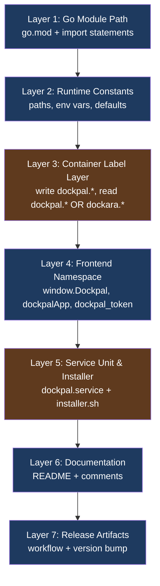
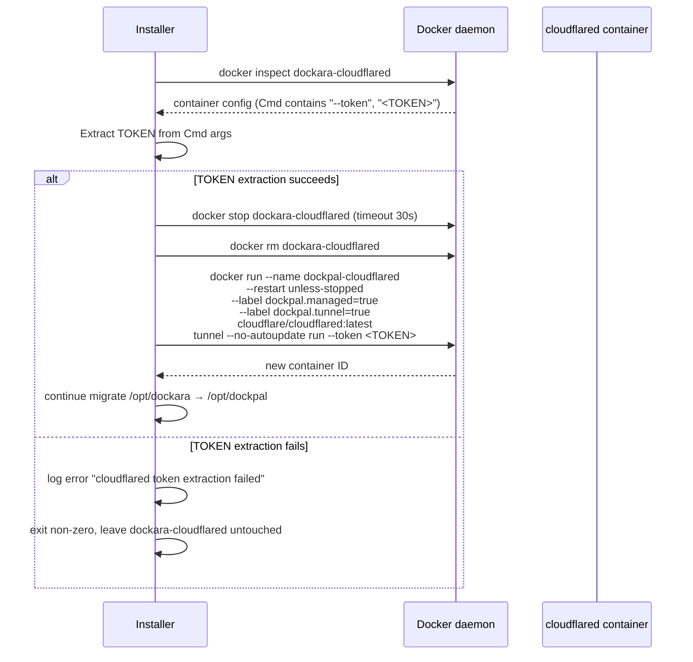
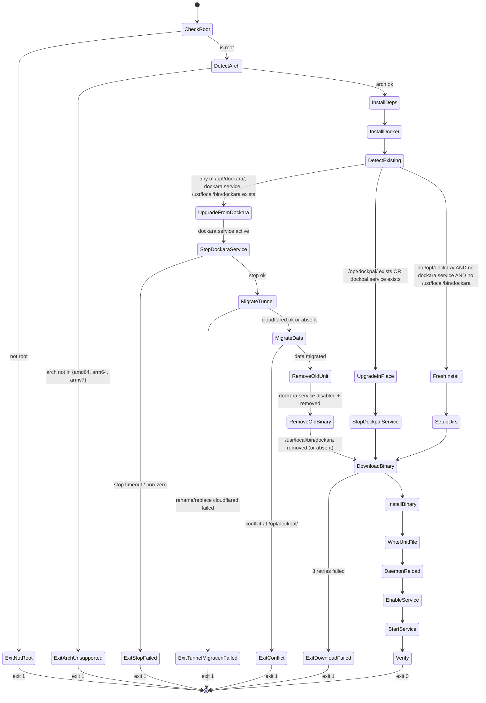
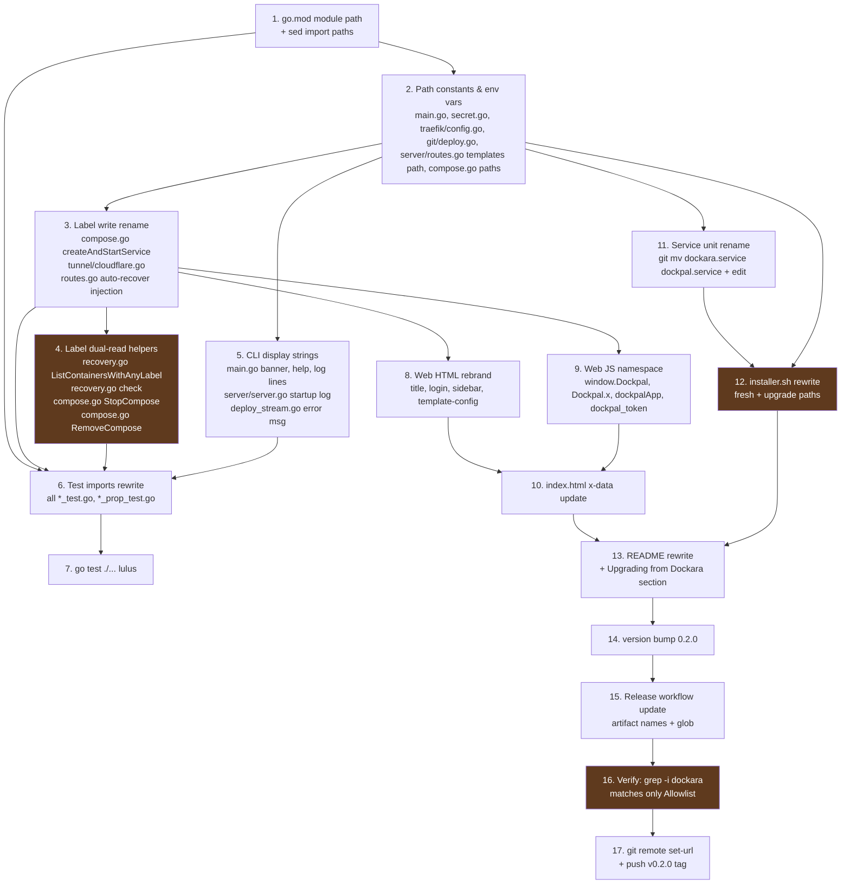

# Design Document

## Overview

Rebrand ini adalah **rename mekanikal yang luas** terhadap Codebase, dengan **satu jalur backward-compat yang sempit dan terdokumentasi** untuk mendukung Upgrade_Path tanpa kehilangan kontrol atas container yang sudah ter-deploy oleh Dockara.

Kompleksitas teknis tidak terletak pada tiap penggantian string secara individual, melainkan pada:

1. **Konsistensi**: 14 requirement saling bergantung — sebuah string `dockara` yang tertinggal di satu tempat dapat membatalkan kelulusan Requirement 12 (verifikasi bersih).
2. **Dual-read tanpa dual-write**: HealthMonitor dan operasi compose harus menemukan container yang berlabel `dockpal.*` ATAU `dockara.*`, tetapi container baru ditulis dengan label `dockpal.*` saja. Set semantics (gabungan unik) wajib dipertahankan untuk mencegah evaluasi/operasi ganda.
3. **Migrasi data yang aman dan reversibel-dengan-deteksi**: Installer pada Upgrade_Path harus memindahkan `/opt/dockara/` ke `/opt/dockpal/`, me-rename file kunci (`dockara.db` → `dockpal.db`, `dockara.log` → `dockpal.log`), dan menangani container Cloudflared yang sudah berjalan tanpa kehilangan tunnel token. Setiap kegagalan harus berhenti dengan exit code non-zero dan pesan error yang menunjuk path konflik.
4. **Urutan eksekusi rebrand** (lihat §Migration Order): module path → konstanta path/env → label dual-read di Go → web/JS → unit file & installer → README → versioning. Urutan ini menjaga build tetap lulus pada setiap titik commit yang masuk akal.

Output yang dijanjikan: kompilasi `go build ./...` lulus, `go test ./...` lulus dengan jumlah iterasi PBT minimal sama dengan baseline pra-rebrand, biner `dockpal-linux-{amd64,arm64,armv7}` ter-publish di GitHub Release `v0.2.0`, dan `git grep -i dockara` di Production_Source hanya memunculkan match yang ada di Allowlist (Requirement 12).

## Architecture

### High-Level Migration Layers

Rebrand memodifikasi tujuh lapisan ortogonal dari sistem. Lapisan-lapisan ini diurutkan sesuai dependency dan jalur eksekusi rebrand:



Box berwarna oranye (Layer 3 dan Layer 5) adalah lapisan yang **bukan rename mekanikal murni** — mereka memerlukan logika baru (dual-read, migrasi data, deteksi instalasi lama).

### Replacement Strategy by File Category

Rebrand menggunakan strategi penggantian berbeda per kategori file. Strategi ini mengoptimalkan keseimbangan antara otomasi dan kontrol manual untuk konteks yang sensitif.

| Kategori file | Strategi penggantian | Tools | Catatan |
|---|---|---|---|
| `go.mod` | Manual edit + `go mod tidy` | `go mod edit -module github.com/sdldev/dockpal` | Satu file, satu perubahan. |
| `*.go` import path | Mass `sed` di seluruh file Go | `find . -name '*.go' -print0 \| xargs -0 sed -i 's\|github.com/dockara/dockara\|github.com/sdldev/dockpal\|g'` | Pola `github.com/dockara/dockara` aman karena tidak ambigu. Verifikasi: `grep -r 'github.com/dockara' --include='*.go'` mengembalikan kosong. |
| `*.go` string literal & komentar | **Manual review per occurrence** | `grep -rn 'dockara\|Dockara\|DOCKARA' --include='*.go'` | Beberapa lokasi di Allowlist (lihat Requirement 12) — wajib pertahankan + tambahkan komentar `// LEGACY-DOCKARA: <alasan>`. Lokasi non-Allowlist diganti menyeluruh. |
| `web/*.html`, `web/**/*.html` | `sed` global, lalu spot-check tag `<title>`, heading | `find web -name '*.html' -print0 \| xargs -0 sed -i 's/Dockara/Dockpal/g; s/dockara/dockpal/g'` | Verifikasi: `grep -ri dockara web/` mengembalikan kosong. |
| `web/assets/**/*.js` | `sed` per-token (case-sensitive) | Tiga substitusi: `window.Dockara` → `window.Dockpal`, `Dockara.` → `Dockpal.`, `dockara_token` → `dockpal_token`, `dockaraApp` → `dockpalApp` | Setelah `sed`, fungsi entry point di `app.js` tetap konsisten karena pola `window.Dockara` dan `Dockara.x` ter-cover. |
| `installer.sh` | **Rewrite mayor** | Manual editor | Skrip lama men-target `dockara/dockara` repo dan `/opt/dockara`. Skrip baru harus mendukung dual mode (Fresh + Upgrade). Lihat §Installer State Machine. |
| `dockara.service` | Rename file + edit konten | `git mv dockara.service dockpal.service` lalu `sed -i 's/dockara/dockpal/g; s/Dockara/Dockpal/g'` | File baru wajib memenuhi Requirement 7.3-7.6 secara verbatim. |
| `README.md` | **Rewrite mayor** | Manual editor | Tambah section `## Upgrading from Dockara`. Verifikasi: pencarian `(?i)dockara` di luar section migrasi mengembalikan kosong (Requirement 10.9). |
| `.github/workflows/release.yml` | Manual edit | Editor | Ganti tiga nama artefak biner dan glob upload. |

### Module Path Migration

`go.mod` hanya berisi satu direktif yang berubah: `module github.com/dockara/dockara` → `module github.com/sdldev/dockpal`. Urutan operasi:

1. **`go mod edit -module github.com/sdldev/dockpal`** — tool resmi Go yang memodifikasi direktif `module` dan menjaga formatting. Tidak menyentuh import statement di file `.go`.
2. **`find . -type f \( -name '*.go' \) -print0 | xargs -0 sed -i 's|github.com/dockara/dockara|github.com/sdldev/dockpal|g'`** — mengganti semua import path di file Go termasuk `*_test.go`, `*_prop_test.go`, `*_property_test.go`. Pola pencarian unik (mengandung dua segmen `github.com/dockara/dockara`) sehingga `sed` aman tanpa false positive.
3. **`gofmt -w .`** — re-format file untuk memastikan import block tetap terurut sesuai konvensi Go.
4. **`go mod tidy`** — sinkronkan `go.sum`. Karena hanya import internal yang berubah, dependencies tidak terpengaruh.
5. **`go build ./...`** — verifikasi bahwa kompilasi lulus (Requirement 1.5).

`gomvpkg` tidak digunakan karena package layout tidak berubah, hanya prefix module path.

### Path & Env Var Resolution Layer

Konstanta path tersebar di lima file Go dan satu file template (lihat §Components and Interfaces untuk lokasi presis). Pendekatan: **konsolidasi tetap minimal, ganti literal tanpa abstraksi baru**, agar diff rebrand mudah di-review dan tidak mencampur perubahan struktural.

Konstanta yang berubah:

| File | Konstanta lama | Konstanta baru |
|---|---|---|
| `main.go` | `defaultDataDir = "/opt/dockara/data"` | `"/opt/dockpal/data"` |
| `main.go` | `defaultDBPath = "/opt/dockara/data/dockara.db"` | `"/opt/dockpal/data/dockpal.db"` |
| `main.go` | `defaultLogPath = "/opt/dockara/data/dockara.log"` | `"/opt/dockpal/data/dockpal.log"` |
| `main.go` | `version = "0.1.0"` | `"0.2.0"` |
| `internal/auth/secret.go` | `defaultSecretFilePath = "/opt/dockara/data/.secret"` | `"/opt/dockpal/data/.secret"` |
| `internal/traefik/config.go` | `configPath = "/opt/dockara/traefik/dynamic.yml"` | `"/opt/dockpal/traefik/dynamic.yml"` |
| `internal/git/deploy.go` | `filepath.Join("/opt/dockara/repos", repoName)` | `filepath.Join("/opt/dockpal/repos", repoName)` |
| `internal/docker/compose.go` (3 lokasi) | `"/opt/dockara/compose"` | `"/opt/dockpal/compose"` |
| `internal/server/routes.go` | `os.ReadFile("/opt/dockara/templates.json")` | `os.ReadFile("/opt/dockpal/templates.json")` |

Env var yang berubah (di `main.go`):

| Lookup lama | Lookup baru |
|---|---|
| `os.Getenv("DOCKARA_DATA_DIR")` | `os.Getenv("DOCKPAL_DATA_DIR")` |
| `os.Getenv("DOCKARA_DB_PATH")` (2 lokasi: runServer + resetPassword) | `os.Getenv("DOCKPAL_DB_PATH")` |
| `os.Getenv("DOCKARA_LOG_PATH")` | `os.Getenv("DOCKPAL_LOG_PATH")` |

Env var di `installer.sh`: `${DOCKARA_VERSION:-latest}` → `${DOCKPAL_VERSION:-latest}` (Requirement 3.4, 3.10).

**Validasi absolute path** (Requirement 3.9): Tambahkan helper kecil di `main.go`:

```go
func mustAbs(name, value string) string {
    if !strings.HasPrefix(value, "/") {
        log.Fatalf("env var %s must be an absolute path, got %q", name, value)
    }
    return value
}
```

Helper ini dipanggil setelah resolusi default. Karena defaults selalu absolute, validasi hanya gagal jika user secara eksplisit men-set nilai relatif.

**Pengabaian env var lama `DOCKARA_*`** (Requirement 3.8): Tidak diperlukan kode tambahan — setelah penggantian `os.Getenv("DOCKARA_*")` → `os.Getenv("DOCKPAL_*")`, server berhenti membaca prefix lama. Migrasi env var pengguna dilakukan oleh installer melalui penulisan ulang unit file `dockpal.service` (yang tidak mereferensikan `DOCKARA_*`).

### Container Label Namespace dengan Backward-Compat Read

Ini adalah satu-satunya area yang memperkenalkan **logika baru** dibandingkan rename mekanikal. Desainnya: **dual-read, single-write**.

#### Write side (single namespace)

Semua container yang dibuat oleh Dockpal pasca-rebrand menulis hanya label `dockpal.*`:

- `internal/docker/compose.go::createAndStartService` — empat label: `dockpal.managed=true`, `dockpal.project=<projectName>`, `dockpal.compose=<composePath>`, `dockpal.service=<svcName>`.
- `internal/tunnel/cloudflare.go::Deploy` — dua label: `dockpal.managed=true`, `dockpal.tunnel=true`. (Label `dockpal.tunnel=true` adalah penambahan baru sesuai Requirement 5.2.)
- `internal/server/routes.go` (auto-recover injection di `deploy from compose` flow, baris 527) — label string literal `dockara.auto-recover` → `dockpal.auto-recover`.

#### Read side (dual namespace dengan set semantics)

Tiga lokasi melakukan read berdasarkan label:

1. **`internal/docker/recovery.go::HealthMonitor.check`** — saat ini `ListContainersWithLabel(ctx, "dockara.auto-recover=true")`. Harus diubah menjadi membaca gabungan unik dari `dockpal.auto-recover=true` ATAU `dockara.auto-recover=true`.
2. **`internal/docker/compose.go::StopCompose`** — saat ini filter tunggal `dockara.project=<projectName>`. Harus dual-read.
3. **`internal/docker/compose.go::RemoveCompose`** — sama, dual-read.

Docker label filter mendukung satu key pada satu waktu; gabungan dua filter berbeda adalah AND, bukan OR. Solusi: **dua panggilan terpisah, lalu deduplikasi by container ID**. Helper baru:

```go
// File: internal/docker/recovery.go (helper baru)
//
// listContainersByAnyLabel returns the union (deduplicated by container ID)
// of containers matching any of the provided labels. The returned slice is
// stable: each container appears exactly once regardless of how many input
// labels it matches.
//
// Used to support dual-namespace reads (dockpal.* OR dockara.*) while the
// dockara.* legacy namespace is in deprecation.
func (c *Client) ListContainersWithAnyLabel(ctx context.Context, labels []string) ([]ContainerInfo, error) {
    seen := make(map[string]struct{})
    var combined []ContainerInfo
    for _, label := range labels {
        items, err := c.ListContainersWithLabel(ctx, label)
        if err != nil {
            return nil, err
        }
        for _, item := range items {
            if _, dup := seen[item.ID]; dup {
                continue
            }
            seen[item.ID] = struct{}{}
            combined = append(combined, item)
        }
    }
    return combined, nil
}
```

Pemanggilan baru di tiap site:

- `recovery.go`: `c.ListContainersWithAnyLabel(ctx, []string{"dockpal.auto-recover=true", "dockara.auto-recover=true"})`
- `compose.go::StopCompose`: dua filter terpisah pada `ContainerList` lalu deduplikasi by `ID`. Catatan: implementasi compose menggunakan `client.Filters` langsung (bukan `ListContainersWithLabel`), maka tetap pakai dua panggilan `ContainerList` lalu merge.
- `compose.go::RemoveCompose`: sama dengan StopCompose.

Contoh implementasi `StopCompose` baru:

```go
// File: internal/docker/compose.go
func (c *Client) StopCompose(ctx context.Context, projectName string) error {
    seen := make(map[string]struct{})
    timeout := 10
    // LEGACY-DOCKARA: dual-read mendukung container yang dibuat oleh Dockara pra-rebrand
    for _, labelKey := range []string{"dockpal.project", "dockara.project"} {
        f := make(client.Filters)
        f = f.Add("label", fmt.Sprintf("%s=%s", labelKey, projectName))
        result, err := c.cli.ContainerList(ctx, client.ContainerListOptions{All: true, Filters: f})
        if err != nil {
            return err
        }
        for _, ctr := range result.Items {
            if _, dup := seen[ctr.ID]; dup {
                continue
            }
            seen[ctr.ID] = struct{}{}
            c.cli.ContainerStop(ctx, ctr.ID, client.ContainerStopOptions{Timeout: &timeout})
        }
    }
    return nil
}
```

#### Allowlist marker

Setiap string literal `dockara` yang tertinggal di Production_Source untuk backward-compat WAJIB diiringi komentar `// LEGACY-DOCKARA: <alasan>` (Requirement 12.2). Lokasi yang pasti mengandung marker:

- `internal/docker/recovery.go` — komentar di atas literal `"dockara.auto-recover=true"` di pemanggilan `ListContainersWithAnyLabel`.
- `internal/docker/compose.go` — tiga lokasi: dual-filter di `StopCompose`, dual-filter di `RemoveCompose`, dan komentar penjelas di top of `compose.go` jika perlu.
- `installer.sh` — empat-enam lokasi (deteksi `dockara.service`, path `/opt/dockara`, biner `/usr/local/bin/dockara`, container `dockara-cloudflared`).

Komentar `<alasan>` 1–200 karakter, contoh: `// LEGACY-DOCKARA: dual-read untuk container yang ter-deploy oleh Dockara pra-rebrand; akan dihapus pada v0.3.0`.

### Cloudflared Tunnel Rename Strategy

Pada Upgrade_Path, container `dockara-cloudflared` mungkin sudah berjalan dengan tunnel token aktif. Token disimpan sebagai argument di `Cmd` container (`--token <token>`). Strategi:

#### Approach: Stop + Inspect + Remove + Recreate (replace)

Daripada mengandalkan Docker rename API (yang ada tetapi memerlukan stop → rename → start dan tidak menyelesaikan masalah label), installer melakukan **replace**:



Token extraction menggunakan `docker inspect --format '{{json .Config.Cmd}}'` lalu parse JSON dengan helper Bash + `jq` (atau dependency `lsof` yang sudah diinstal — tetapi `jq` lebih andal; tambahkan ke daftar `install_dependencies` jika belum).

**Mengapa replace, bukan rename murni**: Docker `ContainerRename` mengubah nama tetapi label container tetap `dockara.managed=true`. Pendekatan replace memberi keuntungan: container baru langsung berlabel `dockpal.managed=true`, sehingga Dockpal pasca-migrasi mengelolanya melalui jalur normal tanpa bergantung pada legacy label.

**Failure path** (Requirement 5.8): Jika langkah `docker rm` atau `docker run` gagal, installer berhenti dengan exit code non-zero, tidak men-start `dockpal.service`, dan container lama tetap di state semula. Karena urutan adalah stop → rm → recreate, jika gagal di step recreate, container lama sudah hilang — ini diterima karena token sudah ter-ekstrak dan installer menulis token ke file recovery `/opt/dockpal/.tunnel-token-recovery` yang dapat di-pakai operator manual.

### Frontend Namespace Migration

Tujuh belas occurrence `window.Dockara` dan turunannya tersebar di 11 modul JS (`web/assets/modules/*.js`) plus orchestrator `web/assets/app.js`. Strategi: **mass sed dengan urutan substitusi yang aman**.

Urutan substitusi (penting karena `window.Dockara` dan `Dockara.` overlap):

1. `window.Dockara` → `window.Dockpal` (paling spesifik, lakukan duluan)
2. `Dockara._charts` → `Dockpal._charts`
3. `Dockara.<name>` → `Dockpal.<name>` untuk setiap nama modul (auth, charts, computed, containers, dashboard, domains, files, images, initialState, services, templates, ui)
4. `dockaraApp()` → `dockpalApp()` (definisi di `app.js` + pemanggilan di `index.html` `x-data`)
5. `'dockara_token'` → `'dockpal_token'` (3 occurrence di `auth.js`: getItem, setItem, removeItem)

Karena substitusi 1-3 tidak overlap dengan substitusi 4-5 dan 4 tidak overlap dengan 5, dapat dilakukan dengan satu `sed` multi-expression:

```bash
find web -name '*.js' -print0 | xargs -0 sed -i \
    -e 's/window\.Dockara/window.Dockpal/g' \
    -e 's/Dockara\./Dockpal./g' \
    -e "s/'dockara_token'/'dockpal_token'/g" \
    -e 's/dockaraApp/dockpalApp/g'
```

Pemanggilan `dockpalApp()` di `web/index.html` (`x-data="dockaraApp()"`) ditangani oleh substitusi `dockaraApp` → `dockpalApp` saat memproses HTML.

#### Force-logout untuk sesi lama

Requirement 6.8: "key `dockara_token` tidak dibaca; tidak ada migrasi token sisi browser". Setelah substitusi 5 di atas, `auth.js` hanya memanggil `localStorage.getItem('dockpal_token')` saat `init()`. Browser yang `localStorage`-nya hanya berisi `dockara_token` akan menerima `null` dari getItem, sehingga `view` tetap `'login'`. Tidak ada kode migrasi token diperlukan — perilaku ini emergent dari rename key.

Tidak ada cleanup eksplisit terhadap `dockara_token` lama; key tersebut tetap di localStorage tetapi tidak terpakai. Browser quota tidak ke-impact (string token < 2KB).

### Service Unit & Installer

#### `dockpal.service` (file unit baru)

`dockara.service` di root repository di-`git mv` menjadi `dockpal.service`, lalu konten diganti agar memenuhi Requirement 7.3-7.6:

```ini
[Unit]
Description=Dockpal — Docker Management Platform
After=network.target docker.service
Requires=docker.service

[Service]
Type=simple
User=root
Group=root
WorkingDirectory=/opt/dockpal
ExecStart=/usr/local/bin/dockpal server
Restart=always
RestartSec=5
Environment="PORT=3012"

[Install]
WantedBy=multi-user.target
```

#### Installer state machine

Installer `installer.sh` di-rewrite agar menangani Fresh + Upgrade dalam satu skrip. Diagram alur:



#### Detection logic

```bash
# Pseudocode
is_dockara_install() {
    [[ -d /opt/dockara ]] || \
    systemctl list-unit-files dockara.service &>/dev/null || \
    [[ -x /usr/local/bin/dockara ]]
}

is_dockpal_install() {
    [[ -d /opt/dockpal ]] || \
    systemctl list-unit-files dockpal.service &>/dev/null || \
    [[ -x /usr/local/bin/dockpal ]]
}
```

Prioritas: Jika BOTH adalah true (operator pernah install Dockpal lalu install ulang Dockara), perlakukan sebagai UpgradeInPlace dan abaikan jejak Dockara — operator harus secara manual bersihkan jika diperlukan. Catatan ini didokumentasikan di pesan log installer.

#### Migration order detail (Upgrade from Dockara)

Operasi migrasi data berurutan sesuai Requirement 9. Setiap langkah hanya dijalankan jika langkah sebelumnya berhasil; kegagalan mana saja menghentikan installer dengan exit code non-zero:

1. **Stop dockara service** (Req 9.1): `systemctl stop dockara` dengan timeout 30 detik. Gunakan `timeout 30 systemctl stop dockara` agar timeout dapat ditegakkan. Exit code non-zero dari `systemctl` atau exit code 124 dari `timeout` → `exit 1` dengan pesan.

2. **Migrate cloudflared container** (Req 5.7-5.8): lihat §Cloudflared Tunnel Rename Strategy.

3. **Migrate `/opt/dockara/` → `/opt/dockpal/`** (Req 9.3-9.5):
   - Jika `/opt/dockpal/` belum ada: `mv /opt/dockara /opt/dockpal`. Operasi `mv` antar path di filesystem yang sama bersifat atomic-rename dan mempertahankan ownership + mode (Requirement 9.3).
   - Jika `/opt/dockpal/` sudah ada: lakukan deteksi konflik per file (lihat §Conflict Detection), jika tidak ada konflik gunakan `rsync -a --ignore-existing /opt/dockara/ /opt/dockpal/` untuk merge, lalu hapus `/opt/dockara/`.
   - Setelah merge: rename file kunci di tujuan:
     - `/opt/dockpal/data/dockara.db` → `/opt/dockpal/data/dockpal.db` (jika ada)
     - `/opt/dockpal/data/dockara.log` → `/opt/dockpal/data/dockpal.log` (jika ada; jika tidak, lanjut tanpa error per Req 9.5)
     - File rotated log seperti `dockara.log.1`, `dockara.log.2`, dst (output dari `LogRotator`) — rename pattern `dockara.log.*` → `dockpal.log.*`.

4. **Remove old binary** (Req 9.6): `rm -f /usr/local/bin/dockara`. Aman karena binary baru akan diunduh sebagai `/usr/local/bin/dockpal`.

5. **Disable & remove old unit** (Req 9.7): `systemctl disable dockara` → `rm /etc/systemd/system/dockara.service` → `systemctl daemon-reload`. Sequential: setiap step hanya jalan jika exit code 0 dari step sebelumnya.

#### Conflict detection

Konflik di `/opt/dockpal/` (Req 9.9) didefinisikan secara presis sebagai salah satu dari:

- **Type mismatch**: `/opt/dockara/X` adalah file regular tetapi `/opt/dockpal/X` adalah direktori (atau sebaliknya).
- **Content mismatch pada file regular**: file dengan nama yang sama ada di kedua sisi DAN `cmp -s /opt/dockara/X /opt/dockpal/X` mengembalikan non-zero.

Implementasi: function `detect_conflicts` di installer melakukan walk dengan `find /opt/dockara -type f` dan untuk setiap file mengecek counterpart di `/opt/dockpal`. Konflik pertama yang ditemukan menyebabkan exit non-zero dengan pesan menyebut path konflik.

**Cleanup policy pada konflik** (catatan Req 9.9): Installer **diizinkan** meninggalkan hasil cleanup parsial dari langkah-langkah sebelumnya (mis. `dockara.service` sudah di-stop, container `dockara-cloudflared` sudah di-replace) selama exit code akhir non-zero. Operator yang mengalami konflik harus me-resolve manual, lalu menjalankan ulang installer.

#### Exit codes

| Exit code | Kondisi |
|---|---|
| 0 | Sukses (Fresh, UpgradeFromDockara, atau UpgradeInPlace) |
| 1 | Generic failure (root check, arch check, dependency install, dst) |
| 2 | (reserved) |
| 3 | Stop dockara service failed (Req 9.2) |
| 4 | Cloudflared migration failed (Req 5.8) |
| 5 | Conflict at /opt/dockpal/ (Req 9.9) |
| 6 | Binary download failed after 3 retries (Req 8.9) |
| 7 | Architecture not supported (Req 8.10) |
| 8 | Not running as root (Req 8.11) |

Penomoran ini digunakan internal oleh installer dan didokumentasikan di komentar header `installer.sh` agar memudahkan debugging. Requirement tidak mengikat exit code spesifik selain "non-zero", sehingga skema di atas adalah keputusan implementasi.

### Release Workflow Update

`.github/workflows/release.yml` mengalami tiga perubahan:

1. **Nama artefak**: `dockara-linux-amd64` → `dockpal-linux-amd64` (dan dua varian arsitektur lainnya).
2. **Glob upload**: `files: dockara-linux-*` → `files: dockpal-linux-*`.
3. **Go version**: dari `1.22` ke `1.25` agar konsisten dengan `go.mod` `go 1.25.0`. (Saat ini ada mismatch — bukan bagian rebrand, tetapi diperbaiki sekalian agar build pipeline tidak berbeda dari `go.mod`.)

File hasil:

```yaml
name: Build & Release

on:
  push:
    tags:
      - 'v*'

jobs:
  build:
    runs-on: ubuntu-latest
    steps:
      - uses: actions/checkout@v4

      - uses: actions/setup-go@v5
        with:
          go-version: '1.25'

      - name: Build binaries
        run: |
          GOOS=linux GOARCH=amd64 go build -ldflags="-s -w" -o dockpal-linux-amd64 .
          GOOS=linux GOARCH=arm64 go build -ldflags="-s -w" -o dockpal-linux-arm64 .
          GOOS=linux GOARCH=arm  GOARM=7 go build -ldflags="-s -w" -o dockpal-linux-armv7 .

      - name: Create GitHub Release
        uses: softprops/action-gh-release@v1
        with:
          files: dockpal-linux-*
          generate_release_notes: true
```

Verifikasi Req 7.9 (no partial release): `softprops/action-gh-release` secara default tidak mempublikasikan release jika step build gagal — workflow GitHub Actions menghentikan eksekusi pada non-zero exit dari `go build`. Tidak diperlukan logic tambahan.

## Components and Interfaces

Komponen di bawah ini adalah lokasi presis yang harus dimodifikasi. Setiap entry mencantumkan file, simbol/baris, perubahan, dan requirement yang dipenuhi.

### Go Source Components

| Komponen | File | Simbol/Baris | Perubahan | Validates |
|---|---|---|---|---|
| Module declaration | `go.mod` | line 1 | `module github.com/sdldev/dockpal` | Req 1.1 |
| Main entry imports | `main.go` | lines 13-18 | semua import path `github.com/dockara/dockara/...` → `github.com/sdldev/dockpal/...` | Req 1.2 |
| Path constants | `main.go` | lines 24-27 | tiga konstanta path + version `0.2.0` | Req 4.1, 4.3, 4.4, 13.1 |
| CLI banner & help | `main.go` | lines 33-58 | semua occurrence `Dockara` / `dockara` di string literal output → `Dockpal` / `dockpal` (kecuali nama subcommand `dockara <cmd>` di banner — di-rename ke `dockpal`) | Req 2.1, 2.2, 2.3 |
| Env var lookups | `main.go` | lines 66, 76, 87, 163 | `DOCKARA_*` → `DOCKPAL_*` | Req 3.1-3.4 |
| Path validation | `main.go` | new helper | `mustAbs` (lihat §Architecture) dan pemanggilan setelah env resolution | Req 3.9 |
| Server startup log | `main.go` line 152, `internal/server/server.go` line 46 | `Dockara` → `Dockpal` | | Req 2.4, 6 (negatif) |
| JWT secret default path | `internal/auth/secret.go` | line 12, line 16 | `/opt/dockara/data/.secret` → `/opt/dockpal/data/.secret` | Req 4.2 |
| BBolt DB default path | (via `main.go`) | konstanta di main | sudah covered di "Path constants" | Req 4.3 |
| Log rotator default path | (via `main.go`) | konstanta di main | sudah covered | Req 4.4 |
| Compose write & label | `internal/docker/compose.go` | `writeComposeFile` line 258, `createAndStartService` lines 271-282, `StopCompose` lines 399-403, `RemoveCompose` lines 417-429 | path `/opt/dockara/compose` → `/opt/dockpal/compose`; label keys `dockara.*` → `dockpal.*` di write site; **dual-read di StopCompose & RemoveCompose** dengan helper deduplikasi (lihat §Architecture) | Req 4.6, 5.1, 5.5 |
| HealthMonitor read | `internal/docker/recovery.go` | line 13 (komentar), line 57 (read) | komentar diupdate; read pakai `ListContainersWithAnyLabel(ctx, []string{"dockpal.auto-recover=true", "dockara.auto-recover=true"})` dengan komentar `// LEGACY-DOCKARA: ...` | Req 5.4 |
| HealthMonitor helper | `internal/docker/recovery.go` | new function | `ListContainersWithAnyLabel(ctx, labels []string)` (lihat §Architecture) | Req 5.4, 5.5 |
| Cloudflared container name & label | `internal/tunnel/cloudflare.go` | line 16, line 53 | `CloudflaredContainer = "dockpal-cloudflared"`; tambah label `dockpal.tunnel=true` (Req 5.2) | Req 5.2, 5.6 |
| Auto-recover label injection | `internal/server/routes.go` | line 527 | `dockara.auto-recover` → `dockpal.auto-recover` di string substitusi compose | Req 5.3 |
| Templates fallback path | `internal/server/routes.go` | line 71 | `/opt/dockara/templates.json` → `/opt/dockpal/templates.json` | Req 4.8 |
| Traefik config path | `internal/traefik/config.go` | line 43 | `/opt/dockara/traefik/dynamic.yml` → `/opt/dockpal/traefik/dynamic.yml` | Req 4.7 |
| Git repo clone path | `internal/git/deploy.go` | line 21 | `/opt/dockara/repos` → `/opt/dockpal/repos` | Req 4.5 |
| Deploy stream error msg | `internal/docker/deploy_stream.go` | line 176 | `Dockara may need elevated privileges` → `Dockpal may need elevated privileges` | Req 12.1 (no leftover) |
| Test imports | `internal/auth/jwt_prop_test.go`, `internal/auth/secret_test.go`, `internal/server/routes_test.go`, `internal/server/routes_property_test.go`, `internal/server/ratelimit_test.go`, `internal/server/ratelimit_prop_test.go`, `internal/docker/compose_test.go`, `internal/docker/compose_prop_test.go`, `internal/docker/fileops_test.go`, `internal/docker/fileops_property_test.go`, `internal/docker/recovery_prop_test.go`, `internal/logging/rotator_prop_test.go`, `internal/traefik/config_prop_test.go`, `internal/tunnel/cloudflare_prop_test.go`, `internal/validator/validator_prop_test.go` | semua import block | rewrite `github.com/dockara/dockara` → `github.com/sdldev/dockpal` | Req 11.1 |

### Web Components

| Komponen | File | Lokasi | Perubahan | Validates |
|---|---|---|---|---|
| Page title | `web/index.html` | `<title>` line 7 | `Dockara` → `Dockpal` | Req 6.1 |
| Alpine entry point | `web/index.html` | `x-data="dockaraApp()"` line 14 | `dockaraApp` → `dockpalApp` | Req 6.6 |
| Login heading | `web/partials/login.html` | line 8 `<h1>Dockara</h1>` | `Dockara` → `Dockpal` | Req 6.2 |
| Sidebar brand | `web/partials/sidebar.html` | line 11 `<span>Dockara</span>` | `Dockara` → `Dockpal` | Req 6.3 |
| Template-config copy | `web/pages/template-config.html` | line 183 "Dockara will automatically restart" | `Dockara` → `Dockpal` | Req 6.9 |
| App orchestrator | `web/assets/app.js` | seluruh file (komentar, fungsi, namespace) | `Dockara` → `Dockpal`, `dockaraApp` → `dockpalApp` | Req 6.4, 6.5 |
| Module namespace | `web/assets/modules/*.js` (12 file: auth, charts, computed, containers, dashboard, domains, files, images, services, state, templates, ui) | semua occurrence `window.Dockara`, `Dockara.X` | rename namespace | Req 6.4 |
| Auth localStorage | `web/assets/modules/auth.js` | 3 occurrences (line 6, 17, 34, 46) | `'dockara_token'` → `'dockpal_token'` | Req 6.7 |

### Configuration & Artefak

| Komponen | File | Perubahan | Validates |
|---|---|---|---|
| Service unit | `dockara.service` → `dockpal.service` | rename file + edit konten (lihat §Architecture) | Req 7.1-7.6 |
| Old binary | `./dockara` (committed binary di root) | `git rm dockara` | Req 1.4 |
| Installer | `installer.sh` | rewrite mayor (lihat §Architecture, §Installer state machine) | Req 8.x, 9.x |
| Release workflow | `.github/workflows/release.yml` | rename artefak + glob (lihat §Architecture) | Req 7.7, 7.8, 13.2 |
| README | `README.md` | rewrite mayor + section "Upgrading from Dockara" | Req 10.x |

## Data Models

Rebrand tidak mengubah skema data persisten. Tabel berikut mendokumentasikan **identifier yang berubah** sebagai data model konseptual — input bagi grep verification dan basis test fixture updates.

### Brand string mapping

| Variant lama | Variant baru | Konteks | Case-sensitive |
|---|---|---|---|
| `Dockara` | `Dockpal` | Display name di UI, banner CLI, log message, README heading | yes |
| `dockara` | `dockpal` | Lowercase di label key, env var prefix, path, CLI subcommand input, JS variable | yes |
| `DOCKARA_` | `DOCKPAL_` | Env var prefix | yes |
| `🐳 Dockara` | `🐳 Dockpal` | README H1, banner installer | yes |

### Path mapping

| Path lama | Path baru | Owner |
|---|---|---|
| `/opt/dockara/` | `/opt/dockpal/` | filesystem root (Req 4) |
| `/opt/dockara/data/` | `/opt/dockpal/data/` | data directory |
| `/opt/dockara/data/.secret` | `/opt/dockpal/data/.secret` | JWT secret |
| `/opt/dockara/data/dockara.db` | `/opt/dockpal/data/dockpal.db` | BBolt DB |
| `/opt/dockara/data/dockara.log` | `/opt/dockpal/data/dockpal.log` | Active log |
| `/opt/dockara/data/dockara.log.{1..5}` | `/opt/dockpal/data/dockpal.log.{1..5}` | Rotated logs |
| `/opt/dockara/repos/<id>/` | `/opt/dockpal/repos/<id>/` | Git clone target |
| `/opt/dockara/compose/<project>/` | `/opt/dockpal/compose/<project>/` | Compose file storage |
| `/opt/dockara/traefik/dynamic.yml` | `/opt/dockpal/traefik/dynamic.yml` | Traefik config |
| `/opt/dockara/templates.json` | `/opt/dockpal/templates.json` | Template fallback |
| `/usr/local/bin/dockara` | `/usr/local/bin/dockpal` | Installed binary |
| `/etc/systemd/system/dockara.service` | `/etc/systemd/system/dockpal.service` | Systemd unit |

### Container label namespace mapping

| Label lama | Label baru | Read di pasca-rebrand | Write di pasca-rebrand |
|---|---|---|---|
| `dockara.managed=true` | `dockpal.managed=true` | YES (legacy via dual-read) | NO (tidak digunakan) |
| `dockara.project=<X>` | `dockpal.project=<X>` | YES (StopCompose, RemoveCompose dual-read) | NO |
| `dockara.compose=<path>` | `dockpal.compose=<path>` | NO (tidak ada read) | NO |
| `dockara.service=<name>` | `dockpal.service=<name>` | NO | NO |
| `dockara.tunnel=true` (tidak ada di codebase saat ini, baru di Dockpal Req 5.2) | `dockpal.tunnel=true` | NO | YES (cloudflared deploy) |
| `dockara.auto-recover=true` | `dockpal.auto-recover=true` | YES (HealthMonitor dual-read, Req 5.4) | NO |

### Environment variable mapping

| Var lama | Var baru | Default baru | File yang membaca |
|---|---|---|---|
| `DOCKARA_DATA_DIR` | `DOCKPAL_DATA_DIR` | `/opt/dockpal/data` | `main.go::runServer` |
| `DOCKARA_DB_PATH` | `DOCKPAL_DB_PATH` | `<DATA_DIR>/dockpal.db` | `main.go::runServer`, `main.go::resetPassword` |
| `DOCKARA_LOG_PATH` | `DOCKPAL_LOG_PATH` | `<DATA_DIR>/dockpal.log` | `main.go::runServer` |
| `DOCKARA_VERSION` | `DOCKPAL_VERSION` | `latest` | `installer.sh` |
| `JWT_SECRET` | `JWT_SECRET` (unchanged) | (no default; falls through to file) | `internal/auth/secret.go` |

`JWT_SECRET` tidak di-rebrand karena sudah brand-neutral dan dokumentasi yang ada di README mengacu nama tersebut.

### Frontend identifier mapping

| Identifier lama | Identifier baru | File |
|---|---|---|
| `window.Dockara` | `window.Dockpal` | semua `web/assets/modules/*.js`, `web/assets/app.js` |
| `Dockara.<member>` | `Dockpal.<member>` | semua module files |
| `dockaraApp()` | `dockpalApp()` | `web/assets/app.js` (definisi), `web/index.html` (`x-data` attribute) |
| `localStorage.{getItem,setItem,removeItem}('dockara_token')` | `... ('dockpal_token')` | `web/assets/modules/auth.js` (3 occurrence) |

### Migration order / dependency graph

Urutan eksekusi rebrand yang aman, dengan ketergantungan eksplisit. Setiap node dapat dikomit terpisah; dependency arrows menunjukkan node mana yang harus selesai dulu agar build/test tidak rusak.



Node berwarna oranye (M4, S2, V3) memerlukan logika atau verifikasi non-trivial; sisanya adalah rename mekanikal yang dapat divalidasi via `go build` + `go test` setelah selesai.

**Rationale urutan**: M1 harus paling awal karena rewrite import path dilakukan sekali besar; build akan rusak di antara `go.mod` edit dan import sed, jadi keduanya dijalankan back-to-back sebelum verify build. M2-M5 paralel setelah M1, tetapi M3 wajib selesai sebelum M4 (helper dual-read membaca dua label keys, salah satunya adalah label baru). M6 (test rewrite) bergantung pada M1-M5 agar assertion dapat di-update. Web (W1-W3) ortogonal terhadap Go layer dan dapat dilakukan di branch terpisah jika perlu. S2 (installer) bergantung pada M2 karena installer mereferensikan path baru yang telah dideklarasikan di Go binary. V3 (final verification) di akhir.


## Correctness Properties

*A property is a characteristic or behavior that should hold true across all valid executions of a system — essentially, a formal statement about what the system should do. Properties serve as the bridge between human-readable specifications and machine-verifiable correctness guarantees.*

Sebagian besar acceptance criteria di rebrand ini adalah verifikasi grep statis atau check filesystem one-shot (klasifikasi EXAMPLE / SMOKE / INTEGRATION) — lihat Testing Strategy. Bagian ini hanya mendaftarkan kriteria yang **benar-benar bervariasi dengan input** dan dapat divalidasi dengan property-based test untuk menemukan bug yang tidak terjangkau oleh test contoh.

### Property 1: Path validation rejects non-absolute env values

*For any* string `s` yang tidak diawali karakter `/` (yaitu `s` bukan absolute path) dan untuk setiap nama variable `v ∈ {DOCKPAL_DATA_DIR, DOCKPAL_DB_PATH, DOCKPAL_LOG_PATH}`, jika `s` di-set sebagai nilai `v` saat startup, maka Dockpal_Server SHALL menghentikan startup dengan exit code non-zero dan menulis ke stderr pesan error yang mengandung nama variable `v`.

**Validates: Requirements 3.9**

### Property 2: Container label writes preserve input verbatim

*For any* tuple `(projectName, svcName, composePath)` yang valid (string non-kosong, ASCII-printable), saat Dockpal_Server berhasil membuat container melalui `createAndStartService(projectName, svcName, ...)`, container yang dihasilkan SHALL memiliki tepat empat label dengan key dan value berikut:

- `dockpal.managed` = `"true"`
- `dockpal.project` = `projectName` (verbatim, tanpa transformasi)
- `dockpal.compose` = `composePath` (verbatim, tanpa transformasi)
- `dockpal.service` = `svcName` (verbatim, tanpa transformasi)

dan TIDAK menulis label apa pun dengan prefix `dockara.`.

**Validates: Requirements 5.1, 5.2, 5.3, 5.6**

### Property 3: Dual-label reads return unique union of containers

*For any* set `C` of containers di Docker daemon, di mana setiap container memiliki himpunan label `L(c) ⊆ {labelA, labelB}` (kemungkinan kosong, salah satu, atau keduanya), pemanggilan `ListContainersWithAnyLabel(ctx, [labelA, labelB])` SHALL mengembalikan slice yang:

1. Berisi setiap container `c ∈ C` di mana `L(c) ≠ ∅` tepat sekali (no duplication).
2. TIDAK berisi container `c` di mana `L(c) = ∅`.
3. Memiliki panjang sama dengan `|{c ∈ C : L(c) ≠ ∅}|`.

**Validates: Requirements 5.4, 5.5**

### Property 4: HealthMonitor scan evaluates each eligible container exactly once

*For any* set `C` of containers di mana subset `E ⊆ C` adalah eligible (memiliki label `dockpal.auto-recover=true` ATAU `dockara.auto-recover=true`, kemungkinan keduanya), satu siklus `HealthMonitor.check()` SHALL meng-iterasi container set `E` di mana setiap container hanya dievaluasi (cek state + potensial restart) tepat satu kali dalam siklus tersebut, terlepas dari berapa banyak label yang cocok.

**Validates: Requirements 5.4**

### Property 5: StopCompose/RemoveCompose target unique union by project label

*For any* `projectName` yang valid dan untuk setiap set `C` of containers di mana subset `T ⊆ C` adalah target (memiliki label `dockpal.project=projectName` ATAU `dockara.project=projectName`, kemungkinan keduanya), pemanggilan `StopCompose(ctx, projectName)` SHALL men-stop tepat |T| container — setiap container di T tepat satu kali, dan tidak ada container di luar T yang di-stop. Property yang sama berlaku untuk `RemoveCompose(ctx, projectName)` (substituting "remove" untuk "stop").

**Validates: Requirements 5.5**

### Property 6: Conflict detection identifies all type/content mismatches

*For any* pair of file trees `(srcTree, dstTree)` yang dapat di-overlap dengan key by relative path, function `detect_conflicts(srcTree, dstTree)` SHALL mengembalikan status "conflict" jika dan hanya jika terdapat setidaknya satu path `p` di mana SALAH SATU kondisi berikut benar:

1. `srcTree[p]` adalah file regular dan `dstTree[p]` adalah direktori (atau sebaliknya). (type mismatch)
2. `srcTree[p]` dan `dstTree[p]` keduanya file regular tetapi byte content berbeda. (content mismatch)

Tree pair yang TIDAK memiliki path konflik (mis. union biasa, atau dst kosong) SHALL menghasilkan status "no conflict".

**Validates: Requirements 9.9**

## Error Handling

Rebrand tidak memperkenalkan domain error baru di runtime Go server (di luar Property 1 yang sudah membatasi error startup). Yang baru adalah **error path di installer** untuk migrasi.

### Server startup errors (`main.go`)

| Kondisi | Behavior |
|---|---|
| Env var `DOCKPAL_DATA_DIR` / `DOCKPAL_DB_PATH` / `DOCKPAL_LOG_PATH` bernilai non-absolute path | `log.Fatalf("env var %s must be an absolute path, got %q", name, value)` — exit non-zero, no side effects yet (Req 3.9) |
| `os.MkdirAll(dataDir, 0750)` gagal | `log.Fatalf("Failed to create data directory: %v", err)` — exit non-zero (Req 4.10) |
| `LogRotator.NewLogRotator` gagal (permission denied di log path) | `log.Fatalf("Failed to initialize log rotator: %v", err)` — exit non-zero (Req 4.10) |
| `db.New(dbPath)` gagal | `log.Fatalf("Failed to open database: %v", err)` — exit non-zero (Req 4.10) |
| File `/opt/dockpal/traefik/dynamic.yml` tidak ada | Continue dengan log warning yang menyebut path (Req 4.11). Bukan fatal. Implementasi: ubah call site di traefik consumer untuk menggunakan `os.Stat` dan log.Println jika tidak ditemukan, lalu return tanpa error. |

### Reset-password errors (`main.go::resetPassword`)

| Kondisi | Behavior |
|---|---|
| `db.New(dbPath)` gagal karena file tidak ada / permission | `log.Fatalf("Failed to open database: %v", err)` — exit non-zero (Req 2.6) |
| `bcrypt.GenerateFromPassword` gagal | `log.Fatalf("Failed to hash password: %v", err)` |
| `database.UpdatePassword` gagal | `log.Fatalf("Failed to update password: %v", err)` |

Output sukses: `fmt.Println("Password reset successfully")` — Requirement 2.5 menuntut substring `Dockpal` di pesan sukses; ubah ke `fmt.Println("Dockpal: password reset successfully")`.

### Installer errors (`installer.sh`)

| Kondisi | Exit code | Pesan stderr |
|---|---|---|
| Tidak running sebagai root | 8 | `[ERROR] This script must be run as root` |
| Architecture tidak supported | 7 | `[ERROR] Unsupported architecture: <arch>` (Req 8.10) |
| Dependency install gagal | 1 | `[ERROR] Cannot install dependencies. Please install: <deps>` |
| `systemctl stop dockara` timeout / non-zero | 3 | `[ERROR] Failed to stop dockara.service within 30 seconds` (Req 9.2) |
| Cloudflared token extraction gagal | 4 | `[ERROR] Failed to extract tunnel token from dockara-cloudflared` (Req 5.8) |
| Cloudflared `docker rm` atau `docker run` gagal | 4 | `[ERROR] Cloudflared migration failed: <reason>. Token saved to /opt/dockpal/.tunnel-token-recovery for manual recovery.` |
| Conflict di `/opt/dockpal/`: type mismatch atau content mismatch | 5 | `[ERROR] Migration conflict at <path>: <reason>` (Req 9.9) |
| `systemctl disable dockara` / `rm dockara.service` / `daemon-reload` gagal | 1 | `[ERROR] Failed to remove old dockara unit at step <X>: <stderr>` (Req 9.7) |
| Binary download gagal setelah 3 retry | 6 | `[ERROR] Failed to download binary after 3 attempts: <url>` (Req 8.9) |
| `systemctl start dockpal` gagal atau status bukan active dalam 30s | 1 | `[ERROR] dockpal.service did not become active within 30 seconds` (Req 8.6) |

Catatan cleanup partial pada upgrade failure: Installer tidak rolling back state yang sudah berubah (mis. `dockara.service` sudah di-stop atau cloudflared sudah di-replace). Ini sesuai catatan keputusan Req 9.9 — operator menerima exit code non-zero sebagai signal untuk inspect manual.

### Frontend errors

Tidak ada error path baru di frontend. Browser yang `localStorage`-nya hanya berisi `dockara_token` lama akan menerima `null` dari `getItem('dockpal_token')` dan mendarat di halaman login (Req 6.8). Ini bukan error condition, melainkan emergent behavior dari rename key.

## Testing Strategy

### Test type breakdown

Rebrand ini didominasi oleh verifikasi statis dan integrasi. Distribusi test type:

| Category | Mechanism | Count (estimate) |
|---|---|---|
| **Static grep checks** (Req 1.2, 1.4, 6.4, 6.5, 6.7, 6.8, 6.9, 7.6, 11.1, 12.1-12.6) | CI script using ripgrep + ignore patterns | ~10 assertions |
| **File content checks** (Req 1.1, 7.1-7.5, 10.1-10.9, 13.1, 14.1) | Read file + regex/exact-match assertions | ~15 assertions |
| **CLI execution checks** (Req 2.1-2.5, 13.1) | Spawn binary, capture stdout/stderr, substring assertions | ~6 cases |
| **Server startup checks** (Req 3.x, 4.x) | Spawn server with env overrides, observe logs/file structure | ~12 cases |
| **Property-based tests** (P-1 through P-6) | Existing PBT framework (`testing/quick`) | 6 properties × 100+ iterations each |
| **Integration tests** (Req 5.7-5.9, 8.x, 9.x) | VM-based or Docker-based end-to-end | ~5 scenarios |
| **Build & unit test runs** (Req 1.3, 1.5, 11.2, 11.4) | `go build`, `go test`, `go vet` | 4 commands |

### Static verification CI script

Verifikasi Allowlist (Req 12) dan import path (Req 1.2, 11.1) dilakukan oleh script `scripts/verify-rebrand.sh` yang dijalankan di CI. Script ini:

1. `go build ./...` — fail if non-zero exit (Req 1.3, 1.5).
2. `go vet ./...` — fail if any output (Req 11.4).
3. `git ls-files dockara | wc -l` — fail if non-zero (Req 1.4).
4. `rg 'github.com/dockara/dockara' --type go` — fail if any match (Req 1.2, 11.1).
5. `rg -i 'dockara' --type go --type-add 'shell:*.sh'` dengan filter Allowlist:
   - Allow `installer.sh` lines yang adjacent ke `# LEGACY-DOCKARA:` marker.
   - Allow `internal/docker/recovery.go` dan `internal/docker/compose.go` lines yang adjacent ke `// LEGACY-DOCKARA:` marker.
   - Reject semua lainnya.
6. `rg -i 'dockara' web/` — fail if any match (Req 6.4 dst, Req 12.4).
7. `rg 'DOCKARA_'` — fail if any match (Req 12.5).
8. `rg -i 'dockara' README.md` dengan filter: hanya allow lines yang berada di antara heading `## Upgrading from Dockara` dan heading `##` berikutnya (Req 10.9).
9. Per Allowlist match: assert ada `LEGACY-DOCKARA:` marker pada baris yang sama atau baris di atasnya (Req 12.2).

Script ini dijalankan di GitHub Actions sebagai required check sebelum merge.

### Property-based test plan

Total 6 properties (P-1 sampai P-6) dengan tag format `Feature: rebrand-dockara-to-dockpal, Property N: <text>`. Bahasa: Go dengan `testing/quick` (sudah dipakai di `*_prop_test.go` existing). Min 100 iterations per property (`MaxCount: 100` atau lebih).

| Property | Test file | Function | Min iterations |
|---|---|---|---|
| P-1 (env path validation) | `internal/main_prop_test.go` (new file di package main; alternatively pisah `mustAbs` ke package internal yang testable) | `TestProperty_AbsPathValidation` | 100 |
| P-2 (label write verbatim) | `internal/docker/compose_prop_test.go` (extend existing) | `TestProperty_ComposeLabelWriteVerbatim` | 100 |
| P-3 (dual-label union) | `internal/docker/recovery_prop_test.go` (extend existing) | `TestProperty_ListContainersWithAnyLabelUnion` | 200 (cheap, in-memory mock) |
| P-4 (HealthMonitor evaluates once) | `internal/docker/recovery_prop_test.go` | `TestProperty_HealthMonitorScanNoDuplication` | 100 |
| P-5 (compose ops target unique union) | `internal/docker/compose_prop_test.go` | `TestProperty_StopComposeUniqueUnion`, `TestProperty_RemoveComposeUniqueUnion` | 100 each |
| P-6 (conflict detection) | `internal/installer/conflict_prop_test.go` (new package; re-implement detection in Go untuk memungkinkan PBT dari Bash) | `TestProperty_DetectConflicts` | 200 |

**Mock strategy**: Property tests yang memerlukan Docker daemon menggunakan in-memory fake yang implements subset dari Moby client interface yang dipakai (`ContainerList`, `ContainerStop`, `ContainerRemove`). Fake ini sudah eksis di pattern test compose existing dan akan di-extend.

**Iteration count preservation**: Per Req 11.3, jumlah iterasi harus ≥ baseline. Baseline diambil dari commit pra-rebrand dengan `grep -h 'MaxCount' internal/**/*_prop_test.go` lalu disimpan ke `scripts/pbt-baseline.txt`. Post-rebrand, script verifikasi membandingkan nilai per file dan fail jika ada penurunan.

### Integration test plan

Integration tests untuk Req 5.7-5.9, 8.x, 9.x menggunakan **container-based VM** (Docker-in-Docker dengan systemd, atau Vagrant box). Skenario:

1. **Fresh install** (Req 8.6): VM ubuntu:22.04 bersih → run `installer.sh` → assert `systemctl is-active dockpal` returns active dalam 30s.
2. **Upgrade from Dockara** (Req 9.x): VM dengan Dockara pre-installed (skrip seed: install old binary at `/usr/local/bin/dockara`, write `/etc/systemd/system/dockara.service`, populate `/opt/dockara/data/dockara.db` dengan admin user, deploy `dockara-cloudflared` container) → run new `installer.sh` → assert: (a) `dockpal.service` active, (b) login dengan admin/admin sukses via HTTP, (c) `/opt/dockpal/data/dockpal.db` ada dengan ownership/mode dipertahankan, (d) container `dockpal-cloudflared` ada dengan label `dockpal.tunnel=true` dan tunnel token sama dengan setup awal, (e) `dockara.service` tidak terdaftar.
3. **Conflict path** (Req 9.9): VM dengan `/opt/dockara/data/dockara.db` (file) DAN `/opt/dockpal/data/dockpal.db` (direktori — sengaja dibuat sebagai konflik) → run installer → assert exit code 5, stderr menyebut path konflik, `dockpal.service` tidak start.
4. **Tunnel migration failure** (Req 5.8): VM dengan `dockara-cloudflared` running tanpa `--token` argument (simulasi token extraction failure) → assert exit code 4, container lama masih running.
5. **Backward-compat dual-read** (Req 5.4, 5.5): VM dengan Dockpal running + `dockara.*` labeled containers manual deploy → assert HealthMonitor restart works untuk legacy-labeled containers, StopCompose menargetkan project dengan dual labels.

Integration tests dijalankan **di CI hanya pada release tag** (bukan setiap PR) karena cost-nya tinggi. Untuk PR validation, properties + static checks cukup untuk memberikan confidence.

### Test fixture preservation policy

Per Req 11.6, test fixture yang sengaja menguji jalur backward-compat (mis. test yang men-set up container dengan label `dockara.auto-recover=true` untuk memverifikasi dual-read) WAJIB diiringi komentar `// LEGACY-DOCKARA: <alasan>`. Lokasi yang akan menambahkan marker ini:

- `internal/docker/recovery_prop_test.go` — di test fixture untuk P-3 dan P-4 yang menggunakan label `dockara.auto-recover=true`.
- `internal/docker/compose_prop_test.go` — di test fixture untuk P-5 yang menggunakan label `dockara.project=...`.

Test fixture yang lain (yang tidak mengunit jalur legacy) di-rebrand secara mekanikal: setiap string `dockara` di test fixture/assertion menjadi `dockpal`.

### Manual verification checklist (post-merge)

Setelah merge dan tag `v0.2.0` di-push:

- [ ] GitHub Actions release workflow run hijau, tiga artefak `dockpal-linux-{amd64,arm64,armv7}` ter-publish (Req 7.7, 13.2).
- [ ] GitHub Release notes berisi referensi ke section "Upgrading from Dockara" (Req 13.4).
- [ ] `git remote get-url origin` di local clone mengembalikan `https://github.com/sdldev/dockpal.git` atau SSH equivalent (Req 14.1).
- [ ] Jalankan installer baru di VM bersih → akses `http://<host>:3012` → login `admin/admin` → halaman dashboard tampil dengan judul "Dockpal" (Req 6.1, 8.6).
- [ ] Jalankan installer di VM dengan Dockara pre-installed → assert flow upgrade berhasil (Req 9.x).
