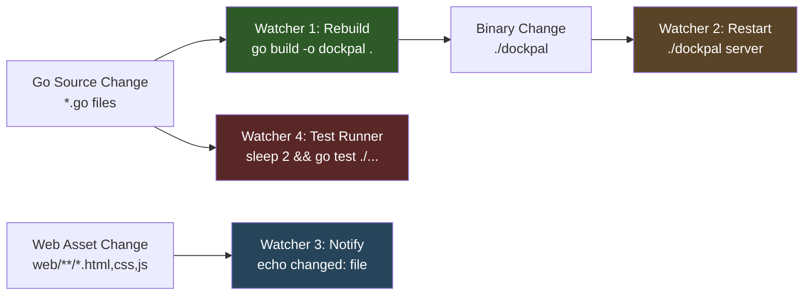
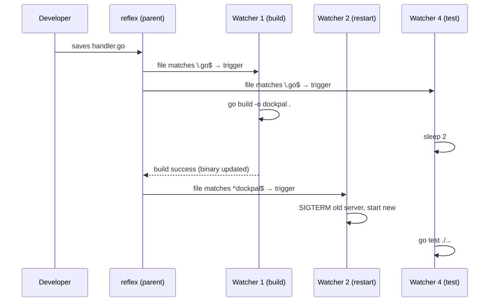
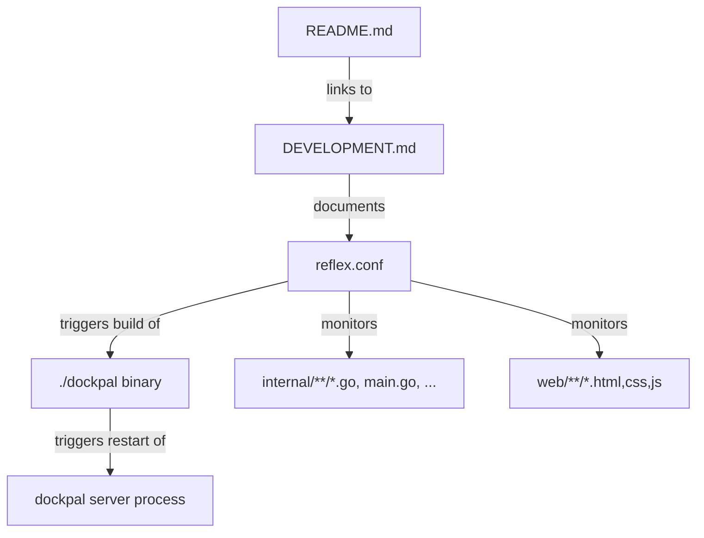

# Design Document

## Overview

This feature adds a `reflex.conf` configuration file and accompanying developer documentation to automate the DockPal development feedback loop. Reflex (github.com/cespare/reflex v0.3.2) is a lightweight Go file-watching tool that monitors directories and reruns commands when files matching specified patterns change.

The design produces four watchers:

1. **Go Source Rebuild** — recompiles the binary on `*.go` changes
2. **Server Auto-Restart** — restarts `./dockpal server` when the binary changes
3. **Web Asset Notification** — prints changed file paths for `.html`, `.css`, `.js` in `web/`
4. **Test Runner** — runs `go test ./...` after Go source changes (with delay)

No application code is modified. The deliverables are:
- `reflex.conf` at project root
- Documentation section in `DEVELOPMENT.md` (linked from README)
- Individual inline commands for selective execution

### Design Decisions

| Decision | Rationale |
|----------|-----------|
| Single `reflex.conf` over Makefile targets | Declarative, portable, no Make dependency; team shares identical watcher config via version control |
| `DEVELOPMENT.md` over inline README section | README is already long (user-facing); development workflow details belong in a dedicated contributor file |
| Regex patterns (`-r`) over glob patterns (`-g`) | Regex supports recursive matching and exclusion patterns (`-R`) natively; glob requires `**` which reflex doesn't support |
| 2-second delay on test watcher via `sleep 2` | Ensures rebuild completes before tests run against stale binary; reflex has no native inter-watcher dependency mechanism |
| `{}` substitution in web watcher | Provides immediate feedback on which specific file changed |

## Architecture

### Watcher Dependency Chain



Key observations:
- Watcher 2 triggers from the **binary file** change, not from Go source — this creates a natural sequencing where restart only happens after a successful build.
- Watcher 4 uses an explicit `sleep 2` to avoid racing with Watcher 1's build.
- Watcher 3 is independent of the Go build chain.

### Reflex Process Model

When `reflex -c reflex.conf` runs, it spawns one goroutine per config entry. Each watcher independently monitors the filesystem using inotify (Linux) or kqueue (macOS). Reflex's built-in batching (500ms default) handles rapid successive file changes.



### File Layout

```
dockpal/
├── reflex.conf          # NEW — watcher configuration
├── DEVELOPMENT.md       # NEW — developer setup & workflow docs
├── README.md            # MODIFIED — add link to DEVELOPMENT.md
└── ...
```

## Components and Interfaces

### Component 1: `reflex.conf`

Location: project root (`/reflex.conf`)

The configuration file uses reflex's native config syntax where each line (or continuation block) is equivalent to a `reflex` CLI invocation without the `reflex` prefix. Lines starting with `#` are comments.

#### Watcher Entry Structure

Each entry consists of:
```
[flags] [pattern flags] -- command
```

Flags used:
- `-r 'REGEX'` — regex pattern to match files
- `-R 'REGEX'` — inverse regex to exclude files
- `-s` — start-service mode (for long-running processes)
- `-d none` — no decoration prefix (optional, for cleaner output)

#### Entry 1: Go Source Rebuild

```conf
# Watcher: Go Source Rebuild — monitors *.go files recursively
-r '\.go$' -R '^vendor/' -R '_generated\.go$' -R '\.pb\.go$' -- \
    sh -c 'echo "Building..." && go build -o dockpal . && echo "Build succeeded at $(date +%H:%M:%S)"'
```

Pattern analysis:
- `-r '\.go$'` — matches any file ending in `.go` (recursive by default)
- `-R '^vendor/'` — excludes `vendor/` directory tree
- `-R '_generated\.go$'` — excludes generated files
- `-R '\.pb\.go$'` — excludes protobuf generated files

Command behavior:
- Prints "Building..." before compilation starts
- On success: prints timestamp message (Requirement 2.4)
- On failure: `go build` writes compiler errors to stderr which reflex passes through to terminal (Requirement 2.3); the existing binary remains unchanged because `go build -o` only writes on success

Debounce: Reflex's default 500ms batching satisfies Requirement 2.1's debounce period.

#### Entry 2: Server Auto-Restart

```conf
# Watcher: Server Auto-Restart — monitors the compiled dockpal binary
-sr '^dockpal$' -- ./dockpal server
```

Pattern analysis:
- `-s` — start-service mode: runs command immediately, sends SIGTERM + restarts on change
- `-r '^dockpal$'` — matches only the binary file at project root (anchored to avoid matching paths like `internal/dockpal_test.go`)

Lifecycle:
- Reflex starts `./dockpal server` immediately on launch
- When `./dockpal` binary changes (after rebuild), reflex sends SIGTERM to the running process
- After the process exits (or after shutdown-timeout), reflex starts a new instance
- The `-s` flag handles Requirement 3.2 (SIGTERM) and 3.5 (start without termination on first run)

#### Entry 3: Web Asset Notification

```conf
# Watcher: Web Asset Notification — monitors .html, .css, .js in web/
-r '^web/.*\.(html|css|js)$' -R '^web/assets/vendor/' -- \
    echo "⟳ changed: {}"
```

Pattern analysis:
- `-r '^web/.*\.(html|css|js)$'` — matches HTML, CSS, JS files under `web/` recursively
- `-R '^web/assets/vendor/'` — excludes vendored frontend libraries

Command: Uses `{}` substitution (Requirement 4.3) to show the specific file path.

#### Entry 4: Test Runner

```conf
# Watcher: Test Runner — runs test suite on Go source changes
-r '\.go$' -R '^vendor/' -R '_generated\.go$' -R '\.pb\.go$' -- \
    sh -c 'sleep 2 && go test ./...'
```

Pattern analysis: Same as Watcher 1 (monitors identical Go source files).

Command: `sleep 2` provides the delay required by Requirement 5.2 to allow the rebuild watcher to complete before tests execute.

### Component 2: `DEVELOPMENT.md`

Location: project root (`/DEVELOPMENT.md`)

Structure:
```markdown
# Development Guide

## Prerequisites
- Go 1.25+
- Docker (running)
- reflex file watcher

## Installing Reflex
go install github.com/cespare/reflex@latest

## Running All Watchers
reflex -c reflex.conf
(must be run from project root)

## Watchers Overview
| Watcher | Purpose | Pattern |
|---------|---------|---------|
| Go Source Rebuild | Recompiles binary on Go file changes | `\.go$` (excluding vendor/, *_generated.go, *.pb.go) |
| Server Auto-Restart | Restarts dev server when binary updates | `^dockpal$` |
| Web Asset Notification | Prints changed frontend file paths | `^web/.*\.(html|css|js)$` (excluding web/assets/vendor/) |
| Test Runner | Runs full test suite after Go changes | `\.go$` (with 2s delay for rebuild) |

## Running Individual Watchers
(inline commands for each)

## Workflow Tips
```

### Component 3: README Modification

Location: existing `README.md`

Change: Add a "Development" subsection after the "Manual Install" section that links to `DEVELOPMENT.md`:

```markdown
### Development

See [DEVELOPMENT.md](DEVELOPMENT.md) for setting up the file-watching development workflow with reflex.
```

## Data Models

This feature introduces no runtime data models. The only structured data is the `reflex.conf` file which follows reflex's line-oriented configuration format:

### Reflex Config Entry Schema

```
Entry := [Flags] '--' Command
Flags := Flag*
Flag  := '-r' REGEX | '-R' REGEX | '-g' GLOB | '-G' GLOB | '-s' | '-d' MODE
Command := shell command (may use {} substitution)
```

Each entry is self-contained with no cross-references between entries (Requirement 7.2).

### File Relationships



## Error Handling

### Build Failures (Watcher 1)

- `go build` exits non-zero → reflex prints stderr (compiler errors) to terminal
- Existing binary is preserved (Go only writes output file on success)
- Watcher 2 is NOT triggered (binary file unchanged)
- Developer sees error output immediately in terminal

### Server Crash on Start (Watcher 2)

- If `./dockpal server` exits quickly with non-zero code, reflex (in `-s` mode) displays the process output including stderr
- Reflex does NOT restart the process again until the next file change triggers it
- This satisfies Requirement 3.4 (display stderr on early exit)

### Missing Web Files (Watcher 3)

- Requirement 4.4 specifies that if no watchable files exist in `web/`, the watcher should error
- Reflex itself does not validate file existence — it watches directories regardless
- This edge case is handled by reflex's behavior: if `web/` directory doesn't exist, reflex will fail to watch it and print an error
- If `web/` exists but contains no matching files, reflex simply never triggers the command (silent no-op)
- Documentation will note this behavior

### Test Failures (Watcher 4)

- `go test ./...` exits non-zero → reflex prints test failure output to terminal
- The 2-second sleep ensures tests don't run against a stale binary in most cases
- Edge case: if build takes longer than 2 seconds, tests may run against old binary — this is acceptable for a development workflow and documented as a known limitation

### Reflex Installation Missing

- If developer runs `reflex -c reflex.conf` without reflex installed, shell returns "command not found"
- `DEVELOPMENT.md` lists reflex installation as the first prerequisite step

## Correctness Properties

*A property is a characteristic or behavior that should hold true across all valid executions of a system — essentially, a formal statement about what the system should do. Properties serve as the bridge between human-readable specifications and machine-verifiable correctness guarantees.*

This feature primarily produces **configuration files and documentation** — declarative artifacts with minimal runtime logic. Most acceptance criteria are classified as SMOKE or EXAMPLE tests (static config validation, documentation existence checks). However, the regex patterns used in `reflex.conf` constitute a small testable surface where property-based validation adds value.

### Property 1: Regex pattern correctness for file matching

*For any* valid Go source file path (matching `*.go` and not in `vendor/`, not ending in `_generated.go` or `.pb.go`), the Go Source Rebuild watcher's include pattern SHALL match the path AND the exclusion patterns SHALL NOT match the path. Conversely, for any path in excluded directories or matching excluded suffixes, at least one exclusion pattern SHALL match.

**Validates: Requirements 2.2**

## Testing Strategy

### Why Property-Based Testing Does Not Apply

This feature produces **configuration files and documentation** — declarative artifacts with no runtime logic, no input/output functions, and no data transformations. There are no pure functions to test, no input spaces to explore, and no universal properties to verify across generated inputs.

Appropriate testing approaches for this feature:

### Manual Verification Checklist

1. **Syntax validation**: Run `reflex -c reflex.conf` and confirm all 4 watchers start without parse errors
2. **Rebuild watcher**: Edit a `.go` file → confirm binary rebuilds and success message appears
3. **Restart watcher**: After rebuild → confirm server restarts (check port 3012 responds)
4. **Web notification**: Edit `web/pages/dashboard.html` → confirm terminal shows "changed: web/pages/dashboard.html"
5. **Test runner**: Edit a `.go` file → confirm tests run after ~2s delay
6. **Exclusion patterns**: Edit a file in `vendor/` → confirm no watcher triggers
7. **Selective execution**: Run each inline command from docs independently

### Automated Smoke Tests (CI)

Since reflex requires filesystem watching (inotify), full integration testing requires a running environment. However, basic validation can be automated:

1. **Config syntax check**: `reflex -c reflex.conf --help` (validates parsing without starting watchers — note: reflex doesn't have a dry-run mode, so this is limited)
2. **Documentation link check**: Verify `DEVELOPMENT.md` exists and README contains a link to it
3. **Pattern regex validation**: Each regex in `reflex.conf` can be validated with Go's `regexp.Compile` to ensure no syntax errors

### Unit Tests for Regex Patterns

The regex patterns used in `reflex.conf` can be independently validated:

```go
// In a test file, verify patterns compile and match expected files
func TestReflexPatterns(t *testing.T) {
    goPattern := regexp.MustCompile(`\.go$`)
    assert.True(t, goPattern.MatchString("main.go"))
    assert.True(t, goPattern.MatchString("internal/auth/handler.go"))
    assert.False(t, goPattern.MatchString("README.md"))

    vendorExclude := regexp.MustCompile(`^vendor/`)
    assert.True(t, vendorExclude.MatchString("vendor/lib/foo.go"))
    assert.False(t, vendorExclude.MatchString("internal/vendor/x.go"))

    binaryPattern := regexp.MustCompile(`^dockpal$`)
    assert.True(t, binaryPattern.MatchString("dockpal"))
    assert.False(t, binaryPattern.MatchString("dockpal-linux-amd64"))

    webPattern := regexp.MustCompile(`^web/.*\.(html|css|js)$`)
    assert.True(t, webPattern.MatchString("web/pages/dashboard.html"))
    assert.True(t, webPattern.MatchString("web/assets/styles.css"))
    assert.False(t, webPattern.MatchString("web/embed.go"))

    webVendorExclude := regexp.MustCompile(`^web/assets/vendor/`)
    assert.True(t, webVendorExclude.MatchString("web/assets/vendor/alpine.js"))
}
```

These tests validate that the regex patterns in `reflex.conf` correctly match and exclude the intended files, catching typos or regex errors during CI without needing a running reflex instance.
