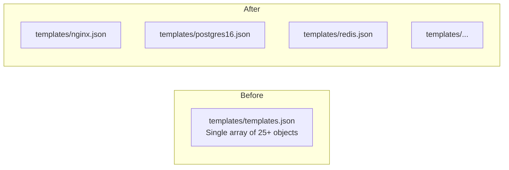
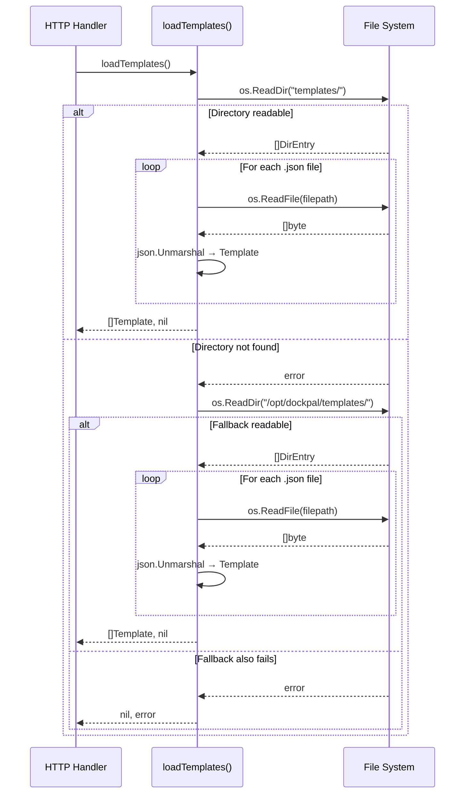
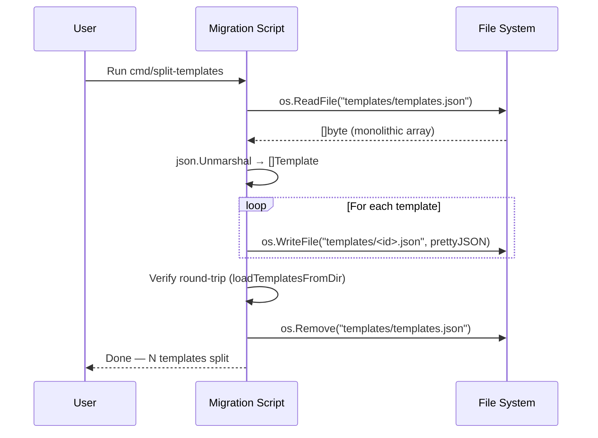

# Design Document: Split Templates JSON

## Overview

The current `templates/templates.json` file is a monolithic JSON array containing all 25+ Docker container/compose templates. This design splits it into individual JSON files per template (e.g., `templates/nginx.json`, `templates/postgres16.json`) with filenames derived from each template's `id` field. The `loadTemplates()` function in `internal/server/routes.go` will be updated to read all `.json` files from the `templates/` directory and aggregate them into the same `[]Template` slice, maintaining full backward compatibility with the existing API.

A one-time migration script handles the split from the monolithic file into individual files.

New templates are added via the repository — contributors create a new `<id>.json` file in the `templates/` directory and submit a pull request. There is no UI-based upload mechanism; the source of truth for templates lives in version control.

This improves maintainability — individual templates can be added, removed, or edited without touching a large monolithic file — and makes version control diffs cleaner.

## Architecture

```mermaid
graph TD
    A[API Request: GET /api/templates] --> B[loadTemplates]
    B --> C{Read templates/ directory}
    C --> D[List all .json files]
    D --> E[For each file: ReadFile + Unmarshal]
    E --> F[Aggregate into []Template]
    F --> G[Return to handler]
    
    H[Fallback: /opt/dockpal/templates/] --> I{Directory exists?}
    I -->|Yes| J[Same directory scan logic]
    I -->|No| K[Return error]
    J --> F
```



## Sequence Diagrams

### Template Loading Flow



### Migration Flow



## Components and Interfaces

### Component 1: Template Loader (updated `loadTemplates`)

**Purpose**: Reads individual template JSON files from a directory and returns an aggregated slice.

**Interface**:
```go
// loadTemplates reads all individual .json template files from the templates
// directory and returns them as a unified slice. Falls back to
// /opt/dockpal/templates/ if the local directory is unavailable.
func loadTemplates() ([]Template, error)

// loadTemplatesFromDir reads all .json files in the given directory,
// unmarshals each into a Template, and returns the collected slice.
func loadTemplatesFromDir(dir string) ([]Template, error)
```

**Responsibilities**:
- Scan a directory for `.json` files
- Unmarshal each file into a `Template` struct
- Skip non-`.json` files and subdirectories
- Aggregate results into a single slice
- Fall back to system-wide directory on local read failure

### Component 2: Migration Script (one-time)

**Purpose**: Splits the existing `templates/templates.json` into individual files.

**Interface**:
```go
// cmd/split-templates/main.go — one-time migration utility
// Reads templates/templates.json, writes individual files, removes the original.
func main()
```

**Responsibilities**:
- Read the monolithic `templates/templates.json`
- For each template, write `templates/<id>.json` with pretty-printed JSON
- Validate that all written files can be read back and unmarshaled
- Remove the original `templates/templates.json` after successful split

## Data Models

### Template (unchanged)

```go
type Template struct {
    ID          string         `json:"id"`
    Name        string         `json:"name"`
    Description string         `json:"description"`
    Category    string         `json:"category"`
    Icon        string         `json:"icon"`
    EnvRequired []string       `json:"env_required,omitempty"`
    Ports       []TemplatePort `json:"ports,omitempty"`
    Compose     string         `json:"compose"`
}

type TemplatePort struct {
    Label         string `json:"label"`
    Default       int    `json:"default"`
    ContainerPort int    `json:"container_port"`
}
```

**Validation Rules** (enforced by convention for contributors):
- `ID` must be non-empty and match the filename (without `.json` extension)
- `ID` should be lowercase alphanumeric with hyphens (e.g., `nginx`, `postgres16`, `uptime-kuma`)
- `Name` must be non-empty
- `Description` must be non-empty
- `Category` must be one of: `web`, `database`, `cache`, `monitoring`, `automation`, `storage`, `devtools`, `messaging`, `security`, `analytics`
- `Icon` must be non-empty (single emoji character expected)
- `Compose` must be non-empty (valid docker compose YAML)
- `Ports` (if present): each entry must have non-empty `Label`, `Default` > 0, `ContainerPort` > 0

### Individual File Format

Each file (e.g., `templates/nginx.json`) contains a single JSON object (not an array):

```json
{
  "id": "nginx",
  "name": "Nginx",
  "description": "Web server & reverse proxy",
  "category": "web",
  "icon": "🌐",
  "ports": [
    {
      "label": "HTTP",
      "default": 80,
      "container_port": 80
    }
  ],
  "compose": "services:\n  nginx:\n    image: nginx:alpine\n    ..."
}
```

## Algorithmic Pseudocode

### loadTemplatesFromDir Algorithm

```go
func loadTemplatesFromDir(dir string) ([]Template, error) {
    // Precondition: dir is a non-empty string path
    
    entries, err := os.ReadDir(dir)
    if err != nil {
        return nil, fmt.Errorf("reading templates directory %s: %w", dir, err)
    }

    var templates []Template

    for _, entry := range entries {
        // Skip directories and non-JSON files
        if entry.IsDir() {
            continue
        }
        if !strings.HasSuffix(entry.Name(), ".json") {
            continue
        }

        filePath := filepath.Join(dir, entry.Name())
        data, err := os.ReadFile(filePath)
        if err != nil {
            return nil, fmt.Errorf("reading template file %s: %w", filePath, err)
        }

        var tmpl Template
        if err := json.Unmarshal(data, &tmpl); err != nil {
            return nil, fmt.Errorf("parsing template file %s: %w", filePath, err)
        }

        templates = append(templates, tmpl)
    }

    // Postcondition: len(templates) == number of valid .json files in dir
    return templates, nil
}
```

### Updated loadTemplates Algorithm

```go
func loadTemplates() ([]Template, error) {
    // Try local templates directory first
    templates, err := loadTemplatesFromDir("templates")
    if err == nil && len(templates) > 0 {
        return templates, nil
    }

    // Fallback to system-wide directory
    templates, err = loadTemplatesFromDir("/opt/dockpal/templates")
    if err != nil {
        return nil, fmt.Errorf("no templates available: %w", err)
    }
    if len(templates) == 0 {
        return nil, fmt.Errorf("no template files found in fallback directory")
    }

    return templates, nil
}
```

### Migration Script Algorithm

```go
func main() {
    // Step 1: Read monolithic file
    data, err := os.ReadFile("templates/templates.json")
    // handle error...

    // Step 2: Unmarshal array
    var templates []Template
    json.Unmarshal(data, &templates)

    // Step 3: Write individual files
    for _, tmpl := range templates {
        filename := filepath.Join("templates", tmpl.ID+".json")
        content, _ := json.MarshalIndent(tmpl, "", "  ")
        os.WriteFile(filename, content, 0644)
    }

    // Step 4: Verify round-trip
    loaded, err := loadTemplatesFromDir("templates")
    if len(loaded) != len(templates) {
        // abort, don't delete original
    }

    // Step 5: Remove original
    os.Remove("templates/templates.json")
}
```

## Key Functions with Formal Specifications

### Function: loadTemplatesFromDir

```go
func loadTemplatesFromDir(dir string) ([]Template, error)
```

**Preconditions:**
- `dir` is a non-empty string representing a filesystem path
- The process has read permissions on the directory (if it exists)

**Postconditions:**
- If directory doesn't exist or can't be read → returns `nil, error`
- If directory is readable → returns slice containing one `Template` per valid `.json` file
- Each returned `Template` has all fields populated from its source file
- Non-`.json` files and subdirectories are silently skipped
- If any `.json` file fails to parse → returns `nil, error` (fail-fast)
- Order of templates in returned slice is filesystem-dependent (not guaranteed)

**Loop Invariants:**
- All previously processed entries produced valid `Template` values
- `templates` slice length equals number of successfully parsed files so far

### Function: loadTemplates

```go
func loadTemplates() ([]Template, error)
```

**Preconditions:**
- At least one of `templates/` (relative) or `/opt/dockpal/templates/` exists and contains `.json` files

**Postconditions:**
- Returns non-empty `[]Template` from the first readable directory with templates
- Falls back to `/opt/dockpal/templates/` only if local directory fails or is empty
- Returns error only if both directories are unavailable or empty

## Example Usage

```go
// Loading templates (unchanged API for handlers)
templates, err := loadTemplates()
if err != nil {
    c.JSON(http.StatusInternalServerError, gin.H{"error": err.Error()})
    return
}
c.JSON(http.StatusOK, templates)

// Loading from a specific directory (for testing)
templates, err := loadTemplatesFromDir("testdata/templates")
if err != nil {
    t.Fatal(err)
}
```

## Correctness Properties

### Property 1: Round-trip equivalence

For any valid `[]Template` slice, marshaling each template to an individual JSON file and re-loading via `loadTemplatesFromDir` produces a set-equivalent `[]Template` (same elements, order-independent).

**Validates: Requirements 2.3, 4.3**

### Property 2: ID-filename consistency

For every file `templates/<name>.json`, the contained template's `id` field equals `<name>`.

**Validates: Requirements 1.2, 1.3**

### Property 3: No data loss

The union of all individual template files contains exactly the same templates as the original monolithic file — no template is lost or duplicated during migration.

**Validates: Requirements 4.3, 4.4**

### Property 4: Isolation

Adding, modifying, or removing one `.json` file affects only that template — no other templates in the loaded slice are impacted.

**Validates: Requirements 2.1, 2.3**

### Property 5: Backward-compatible API

The `/api/templates` endpoint returns the same JSON structure (array of template objects) regardless of whether templates are stored as a monolithic file or individual files.

**Validates: Requirements 5.1, 5.2**

## Error Handling

### Error Scenario 1: Template directory not found

**Condition**: Neither `templates/` nor `/opt/dockpal/templates/` exists or is readable
**Response**: Return HTTP 500 with error message "no templates available"
**Recovery**: Admin creates the directory and adds template files; no restart needed (templates are loaded per-request)

### Error Scenario 2: Malformed JSON in a template file

**Condition**: A `.json` file in the templates directory contains invalid JSON
**Response**: `loadTemplatesFromDir` returns error identifying the problematic file
**Recovery**: Fix or remove the malformed file

### Error Scenario 3: Empty templates directory

**Condition**: Directory exists but contains no `.json` files
**Response**: Local directory is treated as "failed", fallback is attempted
**Recovery**: Add template files to the directory

### Error Scenario 4: File permission denied

**Condition**: A `.json` file exists but is not readable by the process
**Response**: Return error identifying the unreadable file
**Recovery**: Fix file permissions (`chmod 644`)

## Testing Strategy

### Unit Testing Approach

- Test `loadTemplatesFromDir` with a temp directory containing valid `.json` files
- Test `loadTemplatesFromDir` with empty directory (returns empty slice)
- Test `loadTemplatesFromDir` with non-existent directory (returns error)
- Test `loadTemplatesFromDir` skips non-`.json` files and subdirectories
- Test `loadTemplatesFromDir` fails on malformed JSON (returns error with filename)
- Test `loadTemplates` fallback behavior (local → system-wide)

### Property-Based Testing Approach

**Property Test Library**: `rapid` (Go property-based testing library)

- **Round-trip property**: Generate random `[]Template` slices, write each to a temp dir as `<id>.json`, load via `loadTemplatesFromDir`, assert set-equivalence
- **ID-filename property**: Generate random templates, write to files, verify each file's content has `id` matching the filename stem
- **Isolation property**: Load templates, remove one file, reload — verify only that template is missing

### Integration Testing Approach

- Run the migration script against a copy of the real `templates/templates.json`
- Verify the number of output files matches the number of templates in the original
- Verify the API response is identical before and after migration

## Performance Considerations

- Reading 25+ small JSON files is negligible overhead compared to a single file read
- Templates are loaded per-request (no caching), which is acceptable given the small file count
- If template count grows significantly (100+), consider adding an in-memory cache with file-watcher invalidation

## Dependencies

- Standard library only: `os`, `path/filepath`, `encoding/json`, `strings`, `fmt`
- No new external dependencies required
