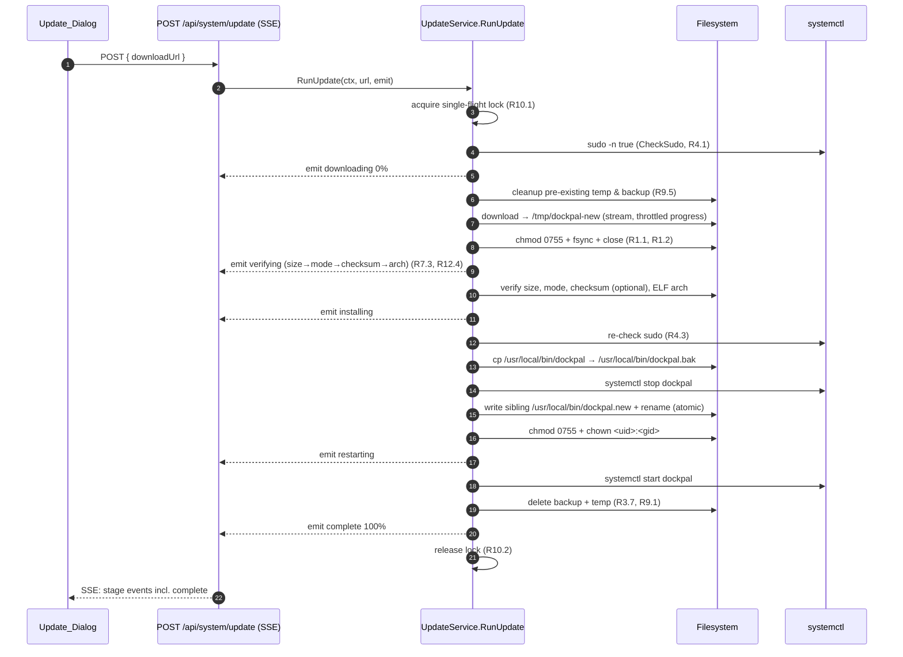
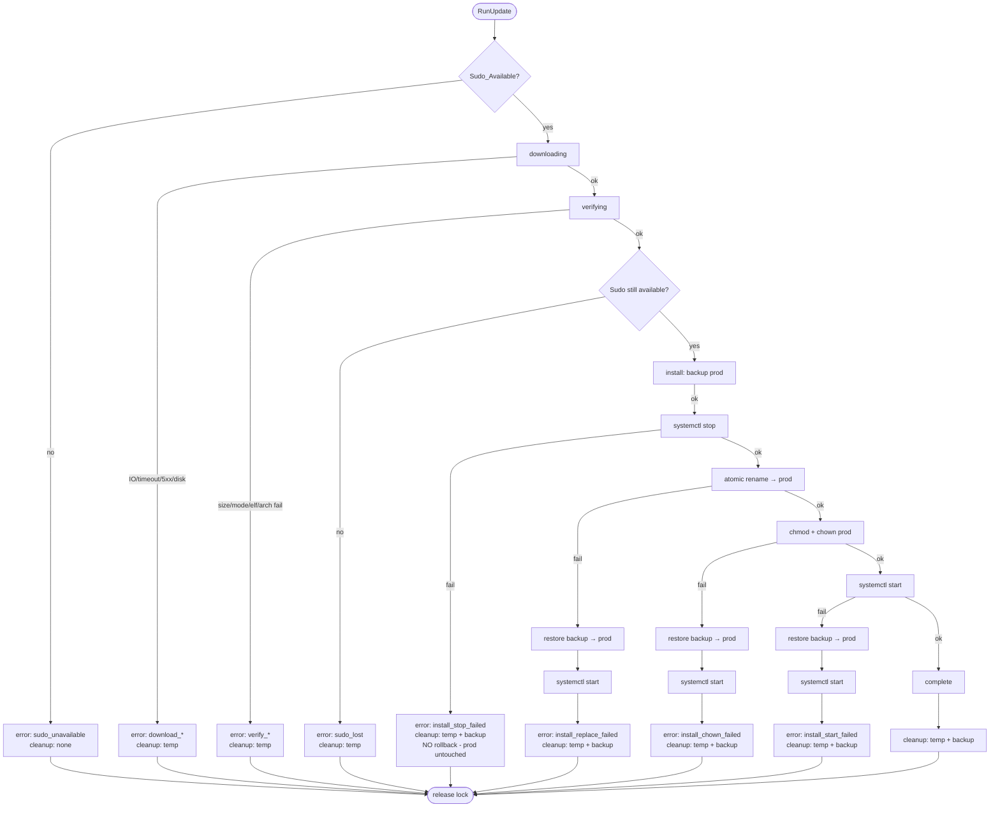
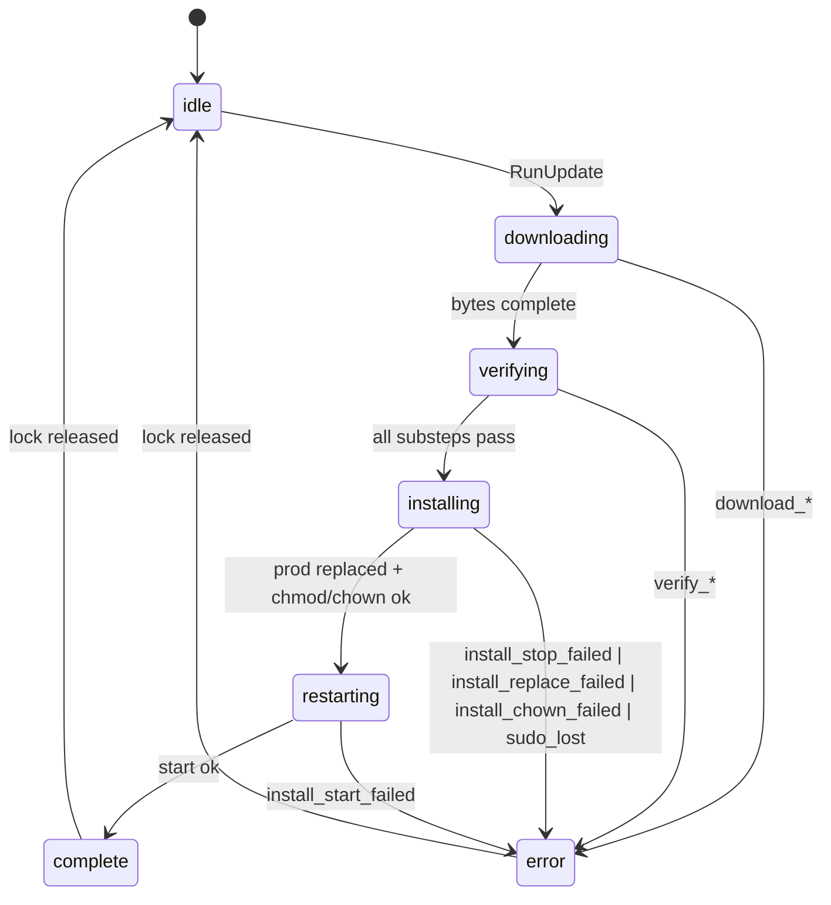

# Design Document: Update Mechanism

## Overview

This design rebuilds the dockpal binary update mechanism in `internal/update/service.go` and adjusts the progress event contract consumed by `Update_Dialog`. It addresses the verification ordering bug in v0.3.3, missing fsync on the temp binary, lack of integrity checks, no rollback when `systemctl start` fails, and the absence of stage reporting for the verification step.

The scope of this design is:

- Refactor `UpdateService` into a single orchestrating method that walks the staged pipeline (download → verify → install → restart) and emits structured `UpdateProgress` events through a callback.
- Add comprehensive verification: size bounds, executable bit, optional SHA256 against a checksum asset (R2.3/R2.4 keep this `WHERE`-gated and optional, no release workflow change), and ELF arch check.
- Make installation atomic with rollback: backup the production binary, write the new binary as a sibling and `rename`, restore the backup on any failure after the service has been stopped.
- Guarantee cleanup on every exit path (R9) using a deferred cleanup ledger.
- Single-flight the update endpoint with a service-level lock (R10).
- Extend `UpdateProgress` with optional `errorCode` and `stageDetail` fields (R12) without breaking older `Update_Dialog` builds.

Out of scope:

- The release workflow (`.github/workflows/release.yml`) is not modified. SHA256 publication remains optional, and the verifier degrades gracefully when no checksum asset is published (R2.4).
- `VersionService`, `VersionCheckScheduler`, `cache.go`, and the GitHub API client are not part of this design.
- A new dialog component is not designed here. Only the JSON event contract that the existing dialog consumes is revised.

Traceability: this overview maps to all twelve requirements in `requirements.md`.

## Architecture

### Pipeline (happy path)



### Error and rollback paths



### Update_Stage state machine



The state machine is monotonic with respect to stage ordering during a successful run: `idle → downloading → verifying → installing → restarting → complete`. Any step may transition to `error`; once in `error` or `complete`, the only transition is back to `idle` when the lock is released (R10.2).

Traceability: R7.1 (ordering), R7.5 (`complete` at 100), R7.6 (error has code+message), R10.1–R10.3 (lock and `idle` sentinel), R3 (rollback paths), R5 (download error paths), R4 (sudo gates).

## Components and Interfaces

### UpdateService refactor (`internal/update/service.go`)

```go
// State enum for the single-flight lock (R10).
type UpdateState int32

const (
    UpdateIdle    UpdateState = iota
    UpdateRunning
)

// ProgressEmitter is the callback the orchestrator uses to publish events.
// The HTTP handler supplies an emitter that serializes to SSE.
type ProgressEmitter func(UpdateProgress)

type UpdateService struct {
    httpClient     *http.Client
    currentVersion string
    binPath        string         // /usr/local/bin/dockpal
    tempPath       string         // /tmp/dockpal-new
    backupPath     string         // /usr/local/bin/dockpal.bak (R3.1, default)
    maxBinarySize  int64          // 200 MiB (default, R2.1)
    minBinarySize  int64          // 1 MiB
    throttle       time.Duration  // 100ms throttle for downloading events (R7.7)

    // Single-flight (R10).
    mu    sync.Mutex
    state UpdateState
}
```

#### Public methods

- `NewUpdateService(currentVersion string) *UpdateService` — constructor with defaults.
- `NewUpdateServiceWithPaths(currentVersion, binPath, tempPath, backupPath string) *UpdateService` — overrides for tests.
- `RunUpdate(ctx context.Context, downloadURL string, emit ProgressEmitter) error` — orchestrator. Walks the full pipeline, emits progress, returns the terminal error (or nil on success). Acquires the single-flight lock; returns `ErrUpdateAlreadyRunning` and emits `update_already_running` if the lock is held (R10.1).
- `Status() UpdateProgress` — returns the most recently emitted event, or `{status: "idle"}` when no update is running (R10.3).
- `CheckSudoAccess() (bool, error)` — keeps the existing semantics; reused at the start (R4.1) and re-checked just before install (R4.3).

#### Internal methods (private, all called from `RunUpdate`)

- `cleanupStaleArtifacts()` — deletes any pre-existing `tempPath` and `backupPath` before starting (R9.5).
- `downloadToTemp(ctx, url, emit) error` — streams the response body to `tempPath` with a 64 KiB buffer (R5.2), emits throttled `downloading` events (R5.3, R5.4, R7.7), `chmod 0755` + `Sync` + `Close` on the temp file (R1.1, R1.2). Maps HTTP/IO/timeout/disk errors to `download_http_status`, `download_io_failed`, `download_timeout`, `download_disk_full` (R5.5–R5.8). Deletes partial bytes on any failure.
- `verifyTempBinary(ctx, expectedAssetName string, emit) error` — emits `verifying` with `stageDetail` set to one of `size`, `mode`, `checksum`, `arch` (R12.4) and `percentage` in 0..99 (R7.3). Substeps in this order:
  1. `size` — `os.Stat` and check `[minBinarySize, maxBinarySize]` (R2.1, R2.6).
  2. `mode` — confirm at least one executable bit (R1.3, R2.2).
  3. `checksum` — `WHERE` a checksum asset is reachable (R2.3): download the checksum file, parse it via `parseChecksumFile`, compare to streamed SHA256 of `tempPath` (R2.7). When no checksum asset is published, log and skip; emit a `verifying`/`checksum` event with a message stating "no checksum published" (R2.4).
  4. `arch` — `verifyELFArch(tempPath)` (R2.5, R2.8, R2.9).
- `installAtomic(ctx, emit) error` — sequence below; each substep is a labeled checkpoint that the rollback decision tree in **Error Handling** keys off:
  1. Re-check sudo (R4.3) → on failure emit `sudo_lost`.
  2. `cp <binPath> <backupPath>` (preserving owner, R3.1, R3.3 source).
  3. `systemctl stop dockpal` → on failure: leave everything, emit `install_stop_failed`, no rollback (R3.4).
  4. Write sibling `/usr/local/bin/dockpal.new` from `tempPath`, then `os.Rename` to `binPath` (R3.2). On failure: `rollback()` then emit `install_replace_failed` (R3.5).
  5. `chmod 0755 <binPath>` and `chown <uid>:<gid> <binPath>` using uid/gid captured from `os.Stat(backupPath)` before step 2. On failure: `rollback()` then emit `install_chown_failed`.
- `restartService(ctx, emit) error` — emits `restarting`, runs `systemctl start dockpal`. On failure: `rollback()`, retry start with restored binary, emit `install_start_failed` (R3.6).
- `rollback(reason string)` — `os.Rename(backupPath, binPath)` to atomically restore (no copy, so we keep the original inode and ownership). Logs `rollback_outcome` (R11.4).
- `cleanup(success bool)` — on success: delete `tempPath` and `backupPath` (R3.7, R9.1). On failure paths: delete according to the cleanup table in **Error Handling**.

### Constants

```go
const (
    StatusIdle        = "idle"        // R10.3, R12.2
    StatusDownloading = "downloading" // existing
    StatusVerifying   = "verifying"   // R7.1, R12.2 (new in domain)
    StatusInstalling  = "installing"  // existing
    StatusRestarting  = "restarting"  // existing
    StatusComplete    = "complete"    // existing
    StatusError       = "error"       // existing

    // Verification substeps for stageDetail (R12.4).
    StageDetailSize     = "size"
    StageDetailMode     = "mode"
    StageDetailChecksum = "checksum"
    StageDetailArch     = "arch"

    ProductionBinaryPath = "/usr/local/bin/dockpal"
    TempBinaryPath       = "/tmp/dockpal-new"
    BackupBinaryPath     = "/usr/local/bin/dockpal.bak" // R3.1, default
    StagingBinarySuffix  = ".new"                       // /usr/local/bin/dockpal.new

    DownloadTimeout      = 5 * time.Minute  // R5.1
    ProgressThrottle     = 100 * time.Millisecond // R7.7
    DownloadBufferSize   = 64 * 1024 // 64 KiB (R5.2)

    MinBinarySize int64  = 1 << 20             // 1 MiB
    MaxBinarySize int64  = 200 * (1 << 20)     // 200 MiB (R2.1)

    // ELF magic and e_machine values (R2.5).
    elfMagic uint32 = 0x464C457F // "\x7fELF" little-endian

    EM_386     uint16 = 3
    EM_ARM     uint16 = 40
    EM_X86_64  uint16 = 62
    EM_AARCH64 uint16 = 183
)
```

### Helpers

#### `verifyELFArch(path string) error`

Reads the first 20 bytes of the file. Parses ELF magic at offset 0, ELF class at offset 4, endianness at offset 5, `e_machine` (16-bit) at offset 18.

Decision table for `runtime.GOARCH` → expected `e_machine` (R2.5):

| GOARCH  | ELF class | e_machine          |
|---------|-----------|--------------------|
| amd64   | ELFCLASS64| EM_X86_64 (62)     |
| arm64   | ELFCLASS64| EM_AARCH64 (183)   |
| arm     | ELFCLASS32| EM_ARM (40)        |
| 386     | ELFCLASS32| EM_386 (3)         |

Errors:
- Not ELF magic → `verify_not_elf` (R2.9).
- Mismatched `e_machine` or class → `verify_arch_mismatch` (R2.8).

#### `parseChecksumFile(content []byte, assetName string) (string, error)`

Parses GNU coreutils `sha256sum` format: `<64-hex>  <filename>` (two spaces, the second is the binary/text indicator). Lines are normalized by trimming the leading `*` if present (binary mode) and the leading `./`.

Algorithm:

1. Split on `\n`, ignore empty and `#`-prefixed lines.
2. For each line, split on whitespace; require exactly 2 fields, the first 64 hex chars, the second equal to `assetName`.
3. Return the hex digest (lower-cased) when matched.
4. Return `("", errAssetNotInChecksumFile)` when no line matches `assetName`.
5. Return `("", errMalformedChecksumLine)` when any non-empty, non-comment line cannot be parsed.

Round-trip property: for any list of (hex, name) pairs with unique names, formatting with `<hex>  <name>\n` and parsing for any one of those names returns the original hex.

#### URL validator

`ValidateDownloadURL` already exists. The design keeps it and adds two refinements:

- Map specific rejection causes to `Error_Code` (R6.3, R6.4): `url_credentials_present`, `url_scheme_not_https`, `url_host_not_allowed`, `url_resolves_private_ip` (the requirements name only `url_credentials_present` explicitly, but the design lists the rest for log fidelity; the dialog treats unspecified `url_*` codes as Permanent_Error).
- Keep the host allowlist: `github.com`, `*.github.com`, `objects.githubusercontent.com`, `*.githubusercontent.com` (R6.2).

Traceability: R1, R2, R3, R4, R5, R6, R7, R10, R11, R12.

## Data Models

### `UpdateProgress`

```go
type UpdateProgress struct {
    Status      string `json:"status"`                // R7, R12.2 — see status domain below
    Message     string `json:"message"`               // R7.6
    Percentage  int    `json:"percentage"`            // R7.2..R7.5, clamped 0..100

    // R12.3, R12.5 — populated only when Status == StatusError.
    ErrorCode   string `json:"errorCode,omitempty"`

    // R12.4, R12.5 — populated for verifying substeps and optional elsewhere.
    StageDetail string `json:"stageDetail,omitempty"`
}
```

`Status` domain (R12.2): `idle | downloading | verifying | installing | restarting | complete | error`.

### `Error_Code` constants (single source of truth)

```go
// Sudo (R4)
const (
    ErrSudoUnavailable = "sudo_unavailable"
    ErrSudoLost        = "sudo_lost"
)

// URL validation (R6)
const (
    ErrURLCredentialsPresent  = "url_credentials_present"
    ErrURLSchemeNotHTTPS      = "url_scheme_not_https"
    ErrURLHostNotAllowed      = "url_host_not_allowed"
    ErrURLResolvesPrivateIP   = "url_resolves_private_ip"
    ErrAssetNotFoundForOSArch = "asset_not_found_for_platform"
)

// Download (R5)
const (
    ErrDownloadHTTPStatus = "download_http_status"
    ErrDownloadIOFailed   = "download_io_failed"
    ErrDownloadTimeout    = "download_timeout"
    ErrDownloadDiskFull   = "download_disk_full"
)

// Verify (R1, R2)
const (
    ErrTempChmodFailed     = "temp_chmod_failed"
    ErrVerifySizeOOR       = "verify_size_out_of_range"
    ErrVerifyChecksum      = "verify_checksum_mismatch"
    ErrVerifyArchMismatch  = "verify_arch_mismatch"
    ErrVerifyNotELF        = "verify_not_elf"
)

// Install (R3)
const (
    ErrInstallStopFailed    = "install_stop_failed"
    ErrInstallReplaceFailed = "install_replace_failed"
    ErrInstallChownFailed   = "install_chown_failed"
    ErrInstallStartFailed   = "install_start_failed"
)

// Concurrency (R10)
const ErrUpdateAlreadyRunning = "update_already_running"
```

### Transient vs Permanent classification

This table is the source of truth for `Update_Dialog`. The dialog treats anything not listed as Permanent (fail-safe).

| Error_Code                    | Class      | Source     |
|-------------------------------|------------|------------|
| `download_http_status` (5xx/429) | Transient | R8.5       |
| `download_http_status` (4xx)  | Permanent  | implied    |
| `download_io_failed`          | Transient  | R8.5       |
| `download_timeout`            | Transient  | R8.5       |
| `download_disk_full`          | Transient  | R8.5       |
| `install_stop_failed`         | Transient  | R8.5       |
| `install_start_failed`        | Transient  | R8.5       |
| `install_replace_failed`      | Permanent  | not in R8.5; rollback already restored, retry would re-stop service unnecessarily |
| `install_chown_failed`        | Permanent  | same rationale as replace |
| `verify_size_out_of_range`    | Permanent  | R8.6       |
| `verify_checksum_mismatch`    | Permanent  | R8.6       |
| `verify_arch_mismatch`        | Permanent  | R8.6       |
| `verify_not_elf`              | Permanent  | R8.6       |
| `temp_chmod_failed`           | Permanent  | R8.6       |
| `sudo_unavailable`            | Permanent  | R8.6       |
| `sudo_lost`                   | Permanent  | R8.6       |
| `url_credentials_present`     | Permanent  | R8.6       |
| `url_scheme_not_https`        | Permanent  | derived    |
| `url_host_not_allowed`        | Permanent  | derived    |
| `url_resolves_private_ip`     | Permanent  | derived    |
| `asset_not_found_for_platform`| Permanent  | R8.6       |
| `update_already_running`      | Transient  | retrying after current run finishes is correct |

Note: `download_http_status` is split by status code at classification time. When `status >= 500` or `status == 429`, the dialog renders Retry (R8.5). For 4xx, Close.

### Lock state

```go
// updateState is held under UpdateService.mu; never accessed without the lock.
// state == UpdateRunning during the lifetime of a RunUpdate call,
// from the moment cleanupStaleArtifacts begins until the final emit.
```

`Status()` returns a snapshot: when `state == UpdateIdle`, returns `{status: "idle"}`; otherwise returns the last event held in the service (a `*UpdateProgress` field updated by `RunUpdate` itself before each emit). This is a sentinel state distinct from any active stage (R10.3).

Traceability: R1.4, R2.6–R2.9, R3.4–R3.7, R4.2–R4.3, R5.5–R5.8, R6.3, R6.6, R7.6, R8.5–R8.6, R10, R12.

---

I will now run the prework tool to formalize the testing classification before writing the Correctness Properties section.


## Correctness Properties

*A property is a characteristic or behavior that should hold true across all valid executions of a system — essentially, a formal statement about what the system should do. Properties serve as the bridge between human-readable specifications and machine-verifiable correctness guarantees.*

The properties below are the consolidated output of the prework analysis. Redundant criteria have been merged into umbrella properties (for example all cleanup/rollback acceptance criteria collapse into one replay-based invariant). Each property is universally quantified and references the requirements clauses it validates.

### Property 1: URL validation accepts only safe download sources

*For any* URL, `ValidateDownloadURL` SHALL accept it if and only if all four of these hold: scheme is `https`, host equals an allowlisted github host, no userinfo component is present, and no resolved IP address is loopback, private, link-local, or multicast. Otherwise it SHALL reject and produce one of `url_scheme_not_https`, `url_host_not_allowed`, `url_credentials_present`, or `url_resolves_private_ip`.

**Validates: Requirements 6.1, 6.2, 6.3, 6.4**

### Property 2: Release asset selection matches platform suffix

*For any* list of `GitHubAsset` and any `(GOOS, GOARCH)` pair, the selector SHALL return the asset whose `Name` contains the suffix `-<GOOS>-<arch'>` (with `arm` mapped to `armv7`) when at least one such asset exists, and SHALL return the named error `asset_not_found_for_platform` without falling back to any other asset when none match.

**Validates: Requirements 6.5, 6.6**

### Property 3: Checksum file parser round-trip

*For any* set of (hex digest, asset name) pairs with unique names, formatting them in `sha256sum` format (`<hex>  <name>\n`) and then calling `parseChecksumFile(content, n)` SHALL return the original hex digest associated with `n` for every `n` in the set. This validates the parser-level correctness used by Property 6 (the matching step in R2.7).

**Validates: Requirements 2.3**

### Property 4: Size bounds in verification

*For any* file at `tempPath` with size `s`, `verifyTempBinary` SHALL pass the size substep if and only if `MinBinarySize <= s <= MaxBinarySize`. When `s` is outside the range, it SHALL emit an event with `errorCode == verify_size_out_of_range` whose message includes `s` and the allowed range.

**Validates: Requirements 2.1, 2.6**

### Property 5: Executable bit verification

*For any* file mode `m`, `verifyTempBinary` SHALL pass the mode substep if and only if `m & 0o111 != 0` (at least one of user/group/other has the executable bit set).

**Validates: Requirements 1.3, 2.2**

### Property 6: Checksum verification matches published digest

*For any* downloaded file `f` and any published checksum `h` for the matching asset name, `verifyTempBinary` SHALL pass the checksum substep if and only if `sha256(f) == h`. When unequal, it SHALL emit an event with `errorCode == verify_checksum_mismatch` whose message includes both digests in lower-case hexadecimal.

**Validates: Requirements 2.3, 2.7**

### Property 7: ELF arch verification

*For any* 20-byte ELF header prefix and any host `runtime.GOARCH`, `verifyELFArch` SHALL accept if and only if the magic equals `\x7fELF` and the `(class, e_machine)` pair equals the expected pair from the GOARCH→ELF table. Non-ELF magic SHALL produce `verify_not_elf`; mismatched class or `e_machine` SHALL produce `verify_arch_mismatch`.

**Validates: Requirements 2.5, 2.8, 2.9**

### Property 8: Sudo gating

*For any* run, when the first `CheckSudoAccess` returns false the orchestrator SHALL emit `sudo_unavailable` and SHALL NOT make any HTTP request. When the first check returns true and the second check (just before install) returns false, the orchestrator SHALL emit `sudo_lost` and SHALL NOT modify the production binary.

**Validates: Requirements 4.1, 4.2, 4.3**

### Property 9: Percentage clamping

*For any* `(written, contentLength)` pair with `0 <= written` and `contentLength >= 0`, the percentage helper SHALL return a value in `[0, 100]`. When `contentLength == 0` (Content-Length absent), it SHALL never return `100` while bytes remain to be transferred.

**Validates: Requirements 5.3, 5.4, 7.2**

### Property 10: Stage ordering, monotonic progress, error envelope

*For any* run (with arbitrary error injection at any internal step), the projection of emitted events onto the `Status` field SHALL be a prefix of the canonical sequence `[downloading, verifying, installing, restarting, complete]` followed by at most one `error` event. For any two non-error events `a` and `b` with `a` emitted before `b`, `a.percentage <= b.percentage`. The terminal event has `percentage == 100` if it is `complete`. Any event with `Status == "error"` has a non-empty `ErrorCode` and a non-empty `Message`; any event with `Status != "error"` has `ErrorCode == ""`. Any event with `Status == "verifying"` has `StageDetail` set to one of `size`, `mode`, `checksum`, `arch`.

**Validates: Requirements 7.1, 7.3, 7.4, 7.5, 7.6, 12.3, 12.4**

### Property 11: Cleanup and rollback invariants

*For any* run with an error injected at internal step `X` ∈ {url_invalid, sudo_first, download_io, download_5xx, download_timeout, disk_full, verify_size, verify_mode, verify_checksum, verify_arch, sudo_second, install_stop, install_replace, install_chown, install_start, success}, after `RunUpdate` returns the (fake) filesystem state SHALL match the row of the cleanup table in **Error Handling** keyed by `X`. Specifically: the production binary contains the old contents whenever the table says "unchanged" or "restored"; `tempPath` does not exist; `backupPath` does not exist except in the `install_stop` row.

**Validates: Requirements 3.1, 3.2, 3.3, 3.4, 3.5, 3.6, 3.7, 5.5, 5.6, 5.7, 5.8, 9.1, 9.2, 9.3, 9.4, 9.5**

### Property 12: Single-flight concurrency

*For any* `N` concurrent calls to `RunUpdate` on the same `UpdateService`, exactly one call SHALL execute the pipeline and the remaining `N-1` calls SHALL each return immediately with `errorCode == update_already_running` and SHALL NOT touch the filesystem or perform an HTTP request. After the executing call terminates (complete or error), a subsequent call SHALL be able to acquire the lock and run.

**Validates: Requirements 10.1, 10.2**

### Property 13: Backward-compatible JSON shape

*For any* `UpdateProgress` value where `ErrorCode == ""` and `StageDetail == ""`, marshaling to JSON SHALL produce an object whose keys are exactly `{status, message, percentage}` (no `errorCode` or `stageDetail` keys, and no `null` values). Round-tripping such a value through marshal → unmarshal SHALL yield an equal value.

**Validates: Requirements 12.1, 12.5**

### Property 14: Temp file mode is set before verification reads it

*For any* successful invocation of `downloadToTemp`, the resulting file at `tempPath` SHALL have a mode whose user/group/other executable bit set is at least `0o111`, observable by `os.Stat` after `downloadToTemp` returns and before any verification step runs.

**Validates: Requirements 1.1**

## Error Handling

### Error code → log fields → user-facing message

| Error_Code                    | Log fields (in addition to `attempt_id`)                          | User-facing message template                                        |
|-------------------------------|--------------------------------------------------------------------|----------------------------------------------------------------------|
| `sudo_unavailable`            | —                                                                  | "Update requires passwordless sudo. Configure sudoers and retry."   |
| `sudo_lost`                   | —                                                                  | "Sudo access was revoked during the update. Retry."                 |
| `url_credentials_present`     | `url`                                                              | "The download URL contains credentials and was rejected."           |
| `url_scheme_not_https`        | `url`, `scheme`                                                    | "Only https download URLs are accepted."                            |
| `url_host_not_allowed`        | `url`, `host`                                                      | "Downloads are only allowed from github.com."                       |
| `url_resolves_private_ip`     | `url`, `host`, `resolved_ips`                                      | "Download host resolves to a private/internal IP and was rejected." |
| `asset_not_found_for_platform`| `goos`, `goarch`, `available_assets`                               | "No release asset found for this platform."                         |
| `download_http_status`        | `status_code`, `url`                                               | "Download failed with HTTP status N."                               |
| `download_io_failed`          | `bytes_written`, `err`                                             | "Download was interrupted by a network error."                      |
| `download_timeout`            | `bytes_written`, `elapsed`                                         | "Download exceeded the 5-minute timeout."                           |
| `download_disk_full`          | `bytes_written`                                                    | "Disk full while downloading the update."                           |
| `temp_chmod_failed`           | `path`, `err`                                                      | "Failed to set permissions on the temp binary."                     |
| `verify_size_out_of_range`    | `size`, `min`, `max`                                               | "Downloaded binary size N is outside allowed range."                |
| `verify_checksum_mismatch`    | `expected_sha256`, `actual_sha256`                                 | "Downloaded binary failed checksum verification."                   |
| `verify_arch_mismatch`        | `host_goarch`, `binary_e_machine`                                  | "Downloaded binary is for a different CPU architecture."            |
| `verify_not_elf`              | `path`                                                             | "Downloaded file is not a valid ELF executable."                    |
| `install_stop_failed`         | `systemctl_output`                                                 | "Failed to stop dockpal service. Update aborted; running version unchanged." |
| `install_replace_failed`      | `err`, `rollback_outcome`                                          | "Failed to install new binary. Previous version restored."          |
| `install_chown_failed`        | `uid`, `gid`, `rollback_outcome`                                   | "Failed to set ownership on new binary. Previous version restored." |
| `install_start_failed`        | `systemctl_output`, `rollback_outcome`                             | "Failed to start dockpal with the new binary. Previous version restored and started." |
| `update_already_running`      | —                                                                  | "An update is already running. Please wait for it to finish."       |

The `rollback_outcome` field is one of `restored_and_started`, `restored_but_start_failed`, `not_attempted` (R11.4). Credentials and full file contents are never logged at any level (R11.5).

### Rollback decision tree

The orchestrator follows R3.4–R3.6:

| Failure point                  | Rollback action                                  | Source        |
|--------------------------------|--------------------------------------------------|---------------|
| Before backup                  | none — production binary untouched               | R3.1 (precondition) |
| `systemctl stop dockpal` fails | none — service may still be running on old prod  | R3.4          |
| Replace (rename) fails         | `Rename(backup, prod)` then attempt start        | R3.5          |
| `chmod`/`chown` fails          | `Rename(backup, prod)` then attempt start        | derived from R3.3 |
| `systemctl start dockpal` fails| `Rename(backup, prod)` then retry start          | R3.6          |

Using `os.Rename(backup, prod)` rather than `cp` for restoration preserves the original inode and ownership, which is important when the chown step has already run with potentially-wrong ownership on the new file.

### Cleanup invariants per exit path

This table is the source of truth used by Property 11.

| Exit class (`X`)        | tempPath after | backupPath after | productionBinary after            | Rollback step ran |
|-------------------------|----------------|-------------------|-----------------------------------|--------------------|
| `success`               | absent         | absent            | new                               | n/a                |
| `url_invalid`           | absent         | absent            | unchanged                         | no                 |
| `sudo_first` (R4.2)     | absent         | absent            | unchanged                         | no                 |
| `download_5xx`          | absent         | absent            | unchanged                         | no                 |
| `download_io`           | absent         | absent            | unchanged                         | no                 |
| `download_timeout`      | absent         | absent            | unchanged                         | no                 |
| `disk_full`             | absent         | absent            | unchanged                         | no                 |
| `verify_size`           | absent         | absent            | unchanged                         | no                 |
| `verify_mode`           | absent         | absent            | unchanged                         | no                 |
| `verify_checksum`       | absent         | absent            | unchanged                         | no                 |
| `verify_arch`           | absent         | absent            | unchanged                         | no                 |
| `verify_not_elf`        | absent         | absent            | unchanged                         | no                 |
| `sudo_second` (R4.3)    | absent         | absent            | unchanged                         | no                 |
| `install_stop` (R3.4)   | present†       | absent            | unchanged                         | no                 |
| `install_replace` (R3.5)| absent         | absent            | unchanged (restored from backup)  | yes                |
| `install_chown`         | absent         | absent            | unchanged (restored from backup)  | yes                |
| `install_start` (R3.6)  | absent         | absent            | unchanged (restored from backup)  | yes (twice — restore + retry start) |

† R3.4 says the temp binary, the production binary, and the backup binary are left **unchanged** when stop fails. The cleanup invariant for this row therefore keeps `tempPath` present (it has not been consumed) and the backup absent (we have not yet copied it). Note: this contradicts R9.5's "delete pre-existing temp at next run" only if the user retries; the next attempt will start by deleting it (R9.5). This is documented behavior, not a bug.

Pre-existing temp/backup files from a prior aborted attempt are deleted at the start of each new attempt (R9.5).

## HTTP API Contract

### Existing endpoint (unchanged path/method)

`POST /api/system/update` — admin-only (existing auth check preserved). Request body:

```json
{ "downloadUrl": "https://github.com/.../dockpal-linux-amd64" }
```

The handler is at `internal/server/routes.go: HandleUpdate`. It already streams Server-Sent Events with `Content-Type: text/event-stream` and emits one `data: <json>\n\n` frame per `UpdateProgress`. This design keeps that transport.

### New handler shape

```go
func HandleUpdate(c *gin.Context, updateService *update.UpdateService, database *db.DB) {
    // existing auth + admin check + body bind
    // existing SSE headers
    emit := func(p update.UpdateProgress) {
        data, _ := json.Marshal(p)
        c.Writer.Write([]byte("data: "))
        c.Writer.Write(data)
        c.Writer.Write([]byte("\n\n"))
        c.Writer.Flush()
    }
    _ = updateService.RunUpdate(c.Request.Context(), req.DownloadURL, emit)
}
```

The handler is now a thin adapter; staging logic lives in `RunUpdate`. The SSE stream is closed by `RunUpdate` returning. The handler does not need to call `CheckSudoAccess`, `DownloadUpdate`, `VerifyBinary`, or `InstallBinary` separately anymore — those become internals of `UpdateService`.

### Event payload contract for `Update_Dialog`

Each SSE `data:` frame is one JSON object matching the `UpdateProgress` struct:

```json
{ "status": "verifying", "message": "Verifying SHA256...", "percentage": 35, "stageDetail": "checksum" }
```

```json
{ "status": "error", "message": "Downloaded binary failed checksum verification", "percentage": 0, "errorCode": "verify_checksum_mismatch" }
```

The dialog reads `errorCode` and looks it up in the Transient/Permanent classification table from **Data Models** to decide between Retry and Close (R8.2–R8.6).

### Status polling

A read-only endpoint can be added later if the dialog needs to recover after a page reload. It is not in scope for this design; clients that lose the SSE connection mid-update can either reconnect (the SSE handler can be re-entered with `update_already_running` returned) or treat the loss as `error: download_io_failed` and offer Retry. The lock is correctly held until `RunUpdate` returns regardless of client connection state.

Traceability: R7 (events), R8 (dialog behavior), R10 (single-flight visible to API), R12 (payload).

## Testing Strategy

Property-based testing (PBT) applies to most of the verifier and the orchestrator (pure-ish logic with rich input variation). PBT is **not** appropriate for:

- The actual `systemctl` calls and DNS resolution — those are mocked via injected interfaces.
- The SSE handler — single integration test with `httptest.NewRecorder` is enough.

The repository already standardizes on `pgregory.net/rapid` (see `internal/registry/crypto_prop_test.go`, `internal/server/templates_prop_test.go`) and `testing/quick`. New property tests in `internal/update/` will use `pgregory.net/rapid` for stateful generators (header bytes, scheduled error injection, concurrent goroutines) and `testing/quick` for pure-function properties. The user instruction mentioned `gopter`; switching libraries for one package would be inconsistent with the rest of the repo, so this is flagged in **Open Questions / Risks** below for confirmation.

### Test organization

```
internal/update/
  service.go                         (existing, refactored)
  service_test.go                    (existing example tests, kept)
  service_prop_test.go               (NEW — properties below)
  verify_elf.go                      (NEW — verifyELFArch helper)
  verify_elf_prop_test.go            (NEW)
  checksum.go                        (NEW — parseChecksumFile)
  checksum_prop_test.go              (NEW)
  url_validator_prop_test.go         (NEW — URL validator properties)
  fakefs_test.go                     (NEW — testing-only fake fs interface used in P11/P12)
```

### Property tests (rapid / testing/quick)

| # | File                          | Property | Library | Validates |
|---|-------------------------------|----------|---------|-----------|
| 1 | `url_validator_prop_test.go`  | P1 — URL validator accept/reject classification | rapid | R6.1, R6.2, R6.3, R6.4 |
| 2 | `service_prop_test.go`        | P2 — Asset selection by suffix | testing/quick | R6.5, R6.6 |
| 3 | `checksum_prop_test.go`       | P3 — Checksum file parser round-trip | testing/quick | R2.3 |
| 4 | `service_prop_test.go`        | P4 — Size bounds | testing/quick | R2.1, R2.6 |
| 5 | `service_prop_test.go`        | P5 — Executable bit | testing/quick | R1.3, R2.2 |
| 6 | `service_prop_test.go`        | P6 — Checksum match | rapid | R2.3, R2.7 |
| 7 | `verify_elf_prop_test.go`     | P7 — ELF arch verification | rapid | R2.5, R2.8, R2.9 |
| 8 | `service_prop_test.go`        | P8 — Sudo gating | rapid | R4.1, R4.2, R4.3 |
| 9 | `service_prop_test.go`        | P9 — Percentage clamping | testing/quick | R5.3, R5.4, R7.2 |
| 10| `service_prop_test.go`        | P10 — Stage ordering and monotonic progress | rapid | R7.1, R7.3, R7.4, R7.5, R7.6, R12.3, R12.4 |
| 11| `service_prop_test.go`        | P11 — Cleanup and rollback invariants | rapid | R3.1–R3.7, R5.5–R5.8, R9.1–R9.5 |
| 12| `service_prop_test.go`        | P12 — Single-flight concurrency | rapid | R10.1, R10.2 |
| 13| `service_prop_test.go`        | P13 — Backward-compatible JSON shape | testing/quick | R12.1, R12.5 |
| 14| `service_prop_test.go`        | P14 — Temp file mode after download | rapid | R1.1 |

Configuration:

- Each property runs at least 100 iterations (`rapid.Check` defaults to 100; for `testing/quick` use `&quick.Config{MaxCount: 100}`).
- Each test carries a comment `// Feature: update-mechanism, Property N: <property text>` for traceability.

### Unit tests (`testing` only, no PBT)

- `Test_DownloadFsync_Example`: download a fixed payload, verify SHA256 of the temp file matches (R1.2).
- `Test_TempChmodFailed_Example`: inject a chmod failure, assert event has code `temp_chmod_failed` and includes path (R1.4).
- `Test_NoChecksumPublished_Example`: serve no checksum asset; assert run proceeds and emits a `verifying` event message containing "no checksum" (R2.4).
- `Test_DownloadTimeout_Example`: stalling httptest server; assert run errors with `download_timeout` within roughly the timeout (R5.1).
- `Test_ProgressThrottle_Example`: short fast stream, count `downloading` events, assert ≤ ceil(duration / 100ms) + 2 (R7.7).
- `Test_StatusIdle_Example`: fresh service, `Status() == {"status":"idle"}` (R10.3).
- `Test_LogFields_Example`: capture log records during a scripted run, assert presence of `attempt_id`, `stage`, `percentage`, and (on error) `error_code` (R11.1, R11.2, R11.3, R11.4); assert no token/credential strings appear (R11.5).
- `Test_StatusDomainExtended_Example`: emit `verifying` and `idle` events, assert JSON marshals as expected (R12.2).

### Integration smoke tests (single execution; not PBT)

- `Test_SmokeDownloadAndVerify_Integration`: spin up `httptest.Server` serving a known good ELF binary fixture (one per arch via build tag) plus a sha256sum file. Run the download and verify steps end-to-end. Skip the install step (it requires sudo). Assert: file exists, mode includes 0755, size in range, checksum matches, ELF arch matches.
- `Test_SmokeAssetNotFound_Integration`: serve a release with mismatching asset names, assert `asset_not_found_for_platform`.

Install-step integration is not automated because it requires real sudo and a real systemd unit. P11 covers the install/rollback logic against a fake filesystem and a fake systemd interface.

### Test doubles

- `fsBackend` interface — wraps `os.Rename`, `os.Stat`, `os.Remove`, `os.Chmod`, `os.Chown`, `io.WriteFile`. Production uses an `osFS` impl; tests use `memFS` from `fakefs_test.go`.
- `serviceController` interface — `Stop(ctx)`, `Start(ctx)`. Production uses `systemctlController`; tests use `scriptedController`.
- `sudoChecker` interface — `Check() (bool, error)`. Production reuses the existing `sudo -n true` impl; tests use `scriptedChecker`.
- `resolver` interface — `LookupIP(host) ([]net.IP, error)`. Production uses `net.LookupIP`; URL validator tests use a stub.

These are minimal interfaces introduced to make P8, P11, and P12 reachable without real privileges or networking.

### Coverage matrix

| Requirement | Covered by                                          |
|-------------|------------------------------------------------------|
| 1.1         | P14, integration smoke                                |
| 1.2         | `Test_DownloadFsync_Example`                          |
| 1.3, 2.2    | P5                                                    |
| 1.4         | `Test_TempChmodFailed_Example`                        |
| 2.1, 2.6    | P4                                                    |
| 2.3, 2.7    | P3 + P6                                               |
| 2.4         | `Test_NoChecksumPublished_Example`                    |
| 2.5, 2.8, 2.9 | P7                                                  |
| 3.1–3.7, 9.1–9.5, 5.5–5.8 | P11                                     |
| 4.1, 4.2, 4.3 | P8                                                  |
| 5.1         | `Test_DownloadTimeout_Example`                        |
| 5.2         | code review (buffer constant) + integration smoke     |
| 5.3, 5.4, 7.2 | P9                                                  |
| 6.1–6.4     | P1                                                    |
| 6.5, 6.6    | P2 + `Test_SmokeAssetNotFound_Integration`            |
| 7.1, 7.3, 7.4, 7.5, 7.6, 12.3, 12.4 | P10                       |
| 7.7         | `Test_ProgressThrottle_Example`                       |
| 8.1–8.7     | frontend tests (out of scope here); contract documented in **Data Models** |
| 10.1, 10.2  | P12                                                   |
| 10.3        | `Test_StatusIdle_Example`                             |
| 11.1–11.5   | `Test_LogFields_Example`                              |
| 12.1, 12.5  | P13                                                   |
| 12.2        | `Test_StatusDomainExtended_Example`                   |

## Migration / Backward Compatibility

The progress payload is a strict extension of the existing one (R12). The dialog parses three known fields today; the new `errorCode` and `stageDetail` use `omitempty` so a payload without them is byte-identical to the existing shape.

For dialogs that do not yet know about the `verifying` stage, the `status` field remains a plain JSON string. Such dialogs will fall through their switch statement to a default branch — the recommended frontend pattern is "render `message` as-is with the `percentage` bar". No dialog will crash on an unknown `status` value because no enum check is performed at the wire level.

The HTTP path and method (`POST /api/system/update`) and request body shape (`{ "downloadUrl": string }`) are unchanged. SSE framing is unchanged. The handler's auth and admin check are unchanged.

The service file (`/usr/local/bin/dockpal`) and the temp path (`/tmp/dockpal-new`) are unchanged. The new `dockpal.bak` and `dockpal.new` paths only exist transiently during an install and are cleaned up on every exit path. No installer or systemd-unit changes are required.

The release workflow (`.github/workflows/release.yml`) is unchanged. SHA256 checksum publication remains optional (R2.3 `WHERE`-clause). Existing releases without a checksum file will continue to update successfully (R2.4).

Traceability: R12 (compatibility), R8 (dialog renders unknown stages as-is by displaying message + percentage).

## Open Questions / Risks

These need user confirmation before Phase 3 (Tasks):

1. **Property-based testing library**. The user instruction mentioned `gopter`, but the existing repo PBT tests use `pgregory.net/rapid` and `testing/quick` (the dependency `pgregory.net/rapid v1.2.0` is already in `go.mod`; no `gopter` dependency exists). This design plans to use `pgregory.net/rapid` for new tests for consistency. Confirm or instruct otherwise.

2. **Restart race between `cp` and `systemctl start`**. After `os.Rename` of the staging file to `/usr/local/bin/dockpal`, the kernel sees a complete file at the destination immediately (rename is atomic). systemd `start` then `exec`s the new path. No goroutine hold is needed because rename publishes the new inode atomically. Confirm this reasoning is acceptable, or specify additional `fsync` of the parent directory after rename (POSIX-strict behavior).

3. **`chown` source of uid/gid**. The plan is to call `os.Stat(backupPath)` (which equals the pre-existing prod ownership) and pass the resulting `uid:gid` to `sudo chown <uid>:<gid> /usr/local/bin/dockpal`. This avoids `--reference` (a GNU extension; works on Linux but not all sudo deployments). Confirm or specify `chown --reference=/usr/local/bin/dockpal.bak`.

4. **xattrs / ACLs / capabilities**. dockpal does not currently use file capabilities, SELinux contexts, or POSIX ACLs on its binary. The design ignores those during rollback (`os.Rename` of the backup preserves inode and therefore preserves any xattrs that were on the backup, but the new binary loses any xattrs that were freshly applied to it before rollback). Confirm this is acceptable.

5. **`install_replace_failed` and `install_chown_failed` classification**. These are listed as Permanent in the dialog table because rollback already restored the previous version and a retry would re-stop a now-running healthy service. R8.5 lists `install_stop_failed` and `install_start_failed` as Transient but is silent on `install_replace_failed` and `install_chown_failed`. Confirm the design's choice to classify them as Permanent.

6. **Backup path location**. `BackupBinaryPath = /usr/local/bin/dockpal.bak` per user decision. This sits in the same directory as the production binary (same filesystem, so `os.Rename` is atomic). Confirm there is no policy preventing extra files in `/usr/local/bin/` (e.g., AppArmor rules).

7. **Status endpoint for SSE reconnection**. The design notes that a reconnecting client receives `update_already_running` from a fresh `RunUpdate` call. Confirm that exposing `GET /api/system/update/status` (returning `Status()`) is out of scope for this iteration.

---

**Phase 2 (Design) complete.** This document has been generated from the approved requirements without changing any implementation files. Please review the design above — particularly the Open Questions / Risks section — and approve to proceed to Phase 3 (Tasks).
